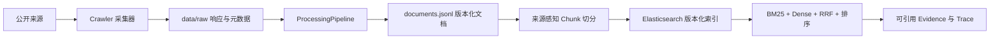

# CodeRadar

CodeRadar 是面向 AI 编程助手竞品的多源采集、结构化处理和证据检索系统。系统采集 Cursor、GitHub Copilot、Trae、通义灵码和 CodeGeeX 的公开来源，生成版本化结构文档，并通过 Mini-RAG（轻量检索增强生成，Mini Retrieval-Augmented Generation）提供混合检索、证据引用、冲突检测和检索评测。

## 系统结构

```text
CodeRadar/
├── config/          # 竞品来源、D1—D7 标签与 Mini-RAG 参数
├── crawler/         # HTTP、GitHub、RSS、论坛、定价和官网采集
├── processing/      # 清洗、规范化、标签、去重和版本管理
├── schemas/         # 原始记录与结构化文档契约
├── mini_rag/        # 切分、嵌入、索引、检索、排序、证据和评测
├── backend/         # FastAPI 系统与 /api/rag 路由
├── scripts/         # 数据、审计、索引和评测命令
├── tests/           # 离线测试和显式网络测试
└── data/
    ├── raw/         # 响应载荷与同名 .meta.json 元数据
    ├── cleaned/     # documents.jsonl
    ├── samples/     # 检索评测集与复核表
    ├── runtime/     # 查询轨迹与评测结果
    └── snapshots/   # ETag、Last-Modified 等采集状态
```

下面的数据流图展示原始数据、结构化文档和索引之间的职责边界。



`data/raw` 用于审计、重新清洗和规则重建；`documents.jsonl` 是 Mini-RAG 的直接输入；Elasticsearch 保存 Chunk 检索单元。RRF 指倒数排名融合（Reciprocal Rank Fusion）。

## 当前数据快照

当前 `data/cleaned/documents.jsonl` 的文件大小为 4,412,343 字节，SHA-256（Secure Hash Algorithm 256-bit，256 位安全散列算法）为 `0893637a61c62b55dcba8bb40d11bb0f38e6a7dd20eaf227eb4e8bb561c57c5f`。

| 指标 | 值 |
| --- | ---: |
| 原始载荷 | 1,549 |
| 原始元数据 | 1,549 |
| 结构化文档版本 | 1,077 |
| 当前版本 | 1,067 |
| 历史版本 | 10 |
| `needs_review=true` | 245 |
| 空能力标签 | 244 |

`data/raw` 还包含一个目录占位文件 `.gitkeep`，因此文件总数为 3,099。结构化文档按竞品分布如下：GitHub Copilot 486、通义灵码 217、Cursor 126、Trae 155、CodeGeeX 93。

## 环境安装

项目使用 Python 3.11.9，本地虚拟环境固定为 `.venv`。

```powershell
Set-Location D:\26Spring\project\CodeRadar
& 'D:\Python 3.11.9\python.exe' -m venv .venv
& .\.venv\Scripts\python.exe -m pip install --upgrade pip
& .\.venv\Scripts\python.exe -m pip install -r ..\docs\requirement.txt
& .\.venv\Scripts\python.exe -m playwright install chromium
& .\.venv\Scripts\python.exe -m pip check
```

根目录 `docs/requirement.txt` 是本地完整依赖清单。`requirements-api.txt` 是容器 API 的 CPU 基线依赖；`requirements.txt` 引用根目录清单。

从 `.env.example` 创建本地配置：

```powershell
if (-not (Test-Path .env)) { Copy-Item .env.example .env }
notepad .env
```

`GITHUB_TOKEN` 用于提高公开 GitHub API（Application Programming Interface，应用程序编程接口）限额，只需要公开仓库读取权限。`.env` 不进入 Git。

## 配置与采集

```powershell
& .\.venv\Scripts\python.exe -m scripts.data_pipeline doctor
& .\.venv\Scripts\python.exe -m scripts.data_pipeline crawl `
  --competitors cursor,github_copilot `
  --since-days 90 `
  --dry-run
```

当前竞品配置版本为 2，包含 5 个竞品。每个竞品显式定义 12 类来源，共 49 个启用项和 11 个带原因的禁用项。RSS（Really Simple Syndication，简易信息聚合）用于采集产品发布型 Feed，当前 TRAE 已启用该来源。`github` 任务可以生成 `github_release` 和 `github_issue` 两种结构化来源。

执行定向采集与处理：

```powershell
& .\.venv\Scripts\python.exe -m scripts.data_pipeline crawl `
  --competitors all `
  --sources rss,review,community `
  --since-days 120 `
  --force

& .\.venv\Scripts\python.exe -m scripts.data_pipeline process --rebuild
& .\.venv\Scripts\python.exe -m scripts.audit_documents
& .\.venv\Scripts\python.exe -m scripts.audit_evidence_coverage `
  --competitors all `
  --event-types product_release,risk_experience `
  --window-days 120
```

`crawl` 写入原始载荷和元数据。`process --rebuild` 只读取本地 `data/raw`，原子重建 `documents.jsonl`。普通 `process` 支持幂等增量版本合并。文档审计检查结构化契约和原始数据追溯，证据覆盖审计检查产品发布与风险体验事件在指定时间窗内的竞品覆盖情况。

事件类型固定为 E1 价格变化、E2 产品发布、E3 风险与体验；能力维度固定为 D1—D7。字段与枚举见 [监控维度设计](docs/AI编程助手监控维度设计.md)。

## Mini-RAG 索引

```powershell
docker compose up -d elasticsearch
& .\.venv\Scripts\python.exe -m scripts.build_index
```

全量构建创建新的版本化物理索引，并在成功后切换读取别名 `coderadar_chunks_current`。增量同步命令为：

```powershell
& .\.venv\Scripts\python.exe -m scripts.build_index --incremental --delete-missing
```

默认参数使用 1,200 个目标字符、1,800 个最大字符、160 个重叠字符和 80 个最小字符。检索分别召回 20 个 BM25 候选和 20 个稠密候选，经 RRF 融合、词法或 Cross-Encoder（交叉编码器）重排序，再按语义 0.70、时间 0.12、版本 0.08、证据 0.10 计算最终分数。

当前本机存在 3,337-Chunk 的物理索引，但读取别名仍指向 2,688-Chunk 物理索引。本轮 1,077 个文档版本尚未重建索引；使用当前结构化数据进行分析前，需要全量构建并确认别名指向新索引。

## 查询和 API

命令行查询：

```powershell
& .\.venv\Scripts\python.exe .\rag_query.py `
  'Cursor 最近有哪些 Agent 能力更新' `
  --competitor Cursor `
  --event-types product_release `
  --top-k 8
```

启动 FastAPI：

```powershell
& .\.venv\Scripts\python.exe -m uvicorn backend.main:app `
  --host 127.0.0.1 `
  --port 8000
```

当前注册的接口包括 `/health`、`/ready` 和 `/api/rag` 下的查询、证据、轨迹、索引、评测及引用校验接口。完整契约见 [API 接口文档](docs/API接口文档.md)。

Docker 启动命令：

```powershell
docker compose up -d --build
Invoke-RestMethod http://127.0.0.1:8000/ready
```

当前运行容器健康，Elasticsearch 集群为 green。`ready` 说明当前别名可查询且嵌入兼容，不表示别名已覆盖最新结构化数据。

## 评测

```powershell
& .\.venv\Scripts\python.exe -m scripts.validate_evaluation_set
& .\.venv\Scripts\python.exe -m scripts.evaluate_rag `
  --config config\mini_rag.formal.yaml `
  --output data\runtime\mini_rag_evaluation.json
```

保存的正式评测包含 50 个 AI 预复核候选案例，人工复核状态为 `pending`。保存结果使用 BGE-M3 嵌入和多语言 MiniLM Cross-Encoder，Recall@10 为 0.826473，MRR（Mean Reciprocal Rank，平均倒数排名）为 1.0，nDCG@10（Normalized Discounted Cumulative Gain，归一化折损累计增益）为 0.938511。详细实验边界见 [Mini-RAG 检索评测报告](docs/Mini-RAG检索评测报告.md)。

## 测试

```powershell
& .\.venv\Scripts\python.exe -m pytest -m 'not network' -q
```

主体代码最近一次离线全量回归为 258 项通过、1 项未选择（deselected）。显式网络测试默认关闭：

```powershell
$env:CODERADAR_RUN_NETWORK_TESTS = '1'
& .\.venv\Scripts\python.exe -m pytest tests\test_network_smoke.py -m network -q
Remove-Item Env:CODERADAR_RUN_NETWORK_TESTS
```

## 文档导航

- [部署文档](docs/部署文档.md)
- [用户使用手册](docs/用户使用手册.md)
- [测试与验证报告](docs/测试报告.md)
- [能力评分规则](docs/能力评分规则.md)
- [监控维度设计](docs/AI编程助手监控维度设计.md)
