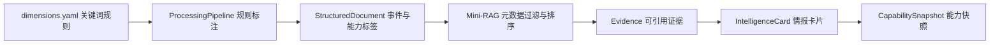

# CodeRadar 监控维度设计

## 1. 维度模型

CodeRadar 使用“事件类型 + 能力维度”的双层标签模型。事件类型描述发生了什么，能力维度描述该事件影响产品的哪个方面。结构化文档、Mini-RAG（轻量检索增强生成，Mini Retrieval-Augmented Generation）过滤器、情报卡片和能力快照统一使用这些枚举值。

下表给出三个事件类型。事件代码用于报告展示，枚举值用于 JSON（JavaScript Object Notation，JavaScript 对象表示法）数据和接口参数。

| 代码 | 枚举值 | 含义 | 主要来源 |
| --- | --- | --- | --- |
| E1 | `pricing_change` | 套餐、价格、额度和计费规则变化 | 定价页、官方公告 |
| E2 | `product_release` | 功能、模型、插件和版本发布 | 更新日志、GitHub Release、产品文档、RSS 和 Atom 订阅源 |
| E3 | `risk_experience` | 稳定性、安全、隐私和开发者体验风险 | 状态页、GitHub Issue、评测、社区、安全页面 |

部分结构化文档保留空事件类型。该状态适用于来源能够提供背景证据、但不满足 E1—E3 固定映射条件的记录。

RSS（简易信息聚合，Really Simple Syndication）和 Atom（Atom 聚合格式，Atom Syndication Format）用于发布可订阅的更新条目。当前事件标签器将 `rss` 和 `atom` 来源类型固定映射为 `product_release`。`evaluation` 评测来源和 `community` 社区来源固定映射为 `risk_experience`，用于记录体验、稳定性和风险证据。

## 2. 能力维度

能力维度由 `config/dimensions.yaml` 定义。规则标签器根据中英文关键词生成多标签结果，并记录置信度、命中原因和 `needs_review` 人工复核标记。

| 代码 | 枚举值 | 固定术语 | 观测范围 |
| --- | --- | --- | --- |
| D1 | `code_intelligence` | 代码智能与生成质量 | 补全、生成、修复、重构、测试 |
| D2 | `agent_context` | 项目级上下文与 Agent 自主性 | 代码库理解、多文件操作、终端和自主执行 |
| D3 | `ide_ecosystem` | IDE、工具链与开发生态 | 集成开发环境、插件、Git、MCP 和工具链 |
| D4 | `model_extensibility` | 模型接入与扩展能力 | 模型选择、自带密钥和自定义模型 |
| D5 | `performance_cost` | 性能、稳定性与成本效率 | 延迟、可用性、价格、额度和计费 |
| D6 | `security_compliance` | 安全、隐私与企业合规 | 权限、审计、沙箱、漏洞和隐私 |
| D7 | `education_fit` | 用户体验与教育场景适配 | 学习、教程、讲解、学生和初学者体验 |

该表中的固定术语在项目文档、接口和能力快照中保持一致。IDE 指集成开发环境（Integrated Development Environment）；MCP 指模型上下文协议（Model Context Protocol）。

## 3. 当前标签分布

当前 `data/cleaned/documents.jsonl` 包含 1,077 个文档版本，其中 1,067 个版本带有 `is_current=true`，10 个版本属于历史版本。一个文档可以命中多个能力维度，因此下表按全部文档版本统计，计数之和大于文档版本总数。

| 维度 | 文档版本数 |
| --- | ---: |
| D1 代码智能与生成质量 | 311 |
| D2 项目级上下文与 Agent 自主性 | 462 |
| D3 IDE、工具链与开发生态 | 409 |
| D4 模型接入与扩展能力 | 418 |
| D5 性能、稳定性与成本效率 | 223 |
| D6 安全、隐私与企业合规 | 176 |
| D7 用户体验与教育场景适配 | 56 |

当前有 244 个文档版本未命中能力维度，245 个文档版本带有 `needs_review=true`。未命中维度与需要复核均属于数据质量状态，使用方应结合 `label_confidence` 和 `label_reasons` 判断是否进入正式分析。

## 4. 标签在系统中的流转

下面的流程图展示标签从配置到分析制品的流转。图中的每个下游对象都使用同一组枚举值，因此过滤、引用和评分可以追溯到结构化文档。

流程的关键边界是证据继承：情报卡片只能引用 Mini-RAG 返回的 Chunk 标识，能力快照再根据卡片中的证据覆盖率、置信度和评分规则生成维度结果。

## 5. 人工复核规则

人工复核以原始响应、结构化正文和标签理由为依据。以下情形需要优先检查：

1. `needs_review=true`；
2. `dimension_tags` 为空但正文包含明确能力描述；
3. 事件类型与来源语义不一致；
4. 同一文档版本出现相互矛盾的维度判断；
5. 下游卡片引用的维度与证据原文不一致。

标签规则修改后，使用 `python -m scripts.data_pipeline process --rebuild` 从 `data/raw` 重建结构化数据，再执行文档审计和索引全量构建。该顺序保证文档标签、Chunk 元数据和检索过滤条件一致。
