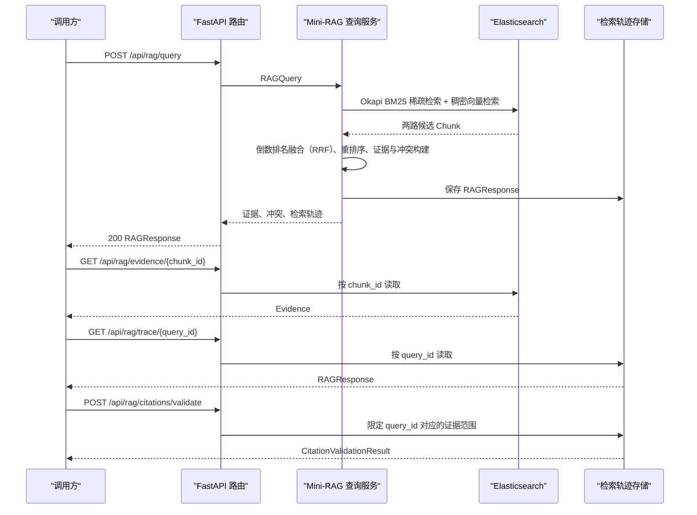

# CodeRadar Mini 检索增强生成应用程序接口文档

## 1. 接口范围

CodeRadar 通过 FastAPI 提供完整的 REST API 面，包括 Mini-RAG 证据检索、LangChain Multi-Agent 分析、正式 CRUD 接口（情报卡片/能力快照/对比矩阵/简报/竞品/维度）、用户认证与历史记录、管理后台和异步工作流。服务使用超文本传输协议（HTTP）传输 JavaScript 对象表示法（JSON）数据，默认本机基础地址为 `http://127.0.0.1:8001`（Docker Compose 将容器内 8000 映射到宿主机 8001）。请求体媒体类型为 `application/json`；JSON 响应显式返回 `Content-Type: application/json; charset=utf-8`。

FastAPI 同时生成以下接口说明入口：

- `GET /docs`：Swagger UI 交互式接口页面。
- `GET /redoc`：ReDoc 接口页面。
- `GET /openapi.json`：OpenAPI 接口描述。

## 2. 接口交互流程

下图展示查询、证据读取、检索轨迹和引用校验之间的关系。



查询服务将 Okapi BM25 概率相关性算法的稀疏检索结果与稠密向量检索结果合并，再使用倒数排名融合（Reciprocal Rank Fusion，RRF）和排序管线生成证据。`query_id` 用于读取同一次查询的完整轨迹并约束可引用的 `chunk_id`；`chunk_id` 用于直接回读索引中的可定位证据。

## 3. 路由与状态码

下表汇总应用显式实现的全部业务路由及状态码。

| 方法 | 路径 | 请求模型 | 成功响应 | 应用状态码 |
| --- | --- | --- | --- | --- |
| `GET` | `/health` | 无 | `{"status":"ok"}` | `200` |
| `GET` | `/ready` | 无 | `IndexStatusResponse` | `200` 就绪；`503` 降级 |
| `POST` | `/api/rag/query` | `RAGQuery` | `RAGResponse` | `200`、`400`、`422`、`503` |
| `GET` | `/api/rag/evidence/{chunk_id}` | 路径参数 `chunk_id` | `Evidence` | `200`、`400`、`404`、`503` |
| `GET` | `/api/rag/trace/{query_id}` | 路径参数 `query_id` | `RAGResponse` | `200`、`404` |
| `GET` | `/api/rag/index/status` | 无 | `IndexStatusResponse` | `200` |
| `POST` | `/api/rag/rebuild` | `IndexRequest` | `IndexBuildResponse` | `200`、`400`、`422`、`503` |
| `POST` | `/api/rag/index/incremental` | `IndexRequest` | `IndexBuildResponse` | `200`、`400`、`422`、`503` |
| `POST` | `/api/rag/evaluate` | `EvaluationRequest` | `EvaluationResult` 或分组结果对象 | `200`、`400`、`422`、`503` |
| `POST` | `/api/rag/citations/validate` | `CitationValidationRequest` | `CitationValidationResult` | `200`、`400`、`422`、`503` |

`GET /health` 检查 API 进程存活状态。`GET /ready` 和 `GET /api/rag/index/status` 读取 Elasticsearch 健康状态、读取别名、物理索引和 Chunk 数量。后端检查失败时，两个接口均返回 `status="degraded"`；`/ready` 同时将 HTTP 状态码设为 `503`，`/api/rag/index/status` 保持 `200` 以返回完整诊断对象。

### 3.1 错误响应

服务层异常通过 `detail` 字段返回：

```json
{
  "detail": "错误说明"
}
```

错误类型与状态码的映射如下：

| 状态码 | 触发条件 |
| --- | --- |
| `400 Bad Request` | 服务层参数或状态值无效，包括超过配置的 `top_k` 上限、未知 `query_id` 及消融实验配置不满足运行条件。 |
| `404 Not Found` | `chunk_id` 未命中索引，或 `query_id` 未命中已加载的检索轨迹。 |
| `422 Unprocessable Content` | FastAPI/Pydantic 请求校验失败，或索引构建所指文档文件不存在。 |
| `503 Service Unavailable` | Elasticsearch、Embedding 或重排序组件不可用，索引批处理包含失败项，或就绪检查返回降级状态。 |

正式 API 面（第 11 节）使用 **Problem Details** 格式（RFC 9457）：

```json
{
  "type": "about:blank",
  "title": "Not Found",
  "status": 404,
  "detail": "Card not found",
  "instance": "/api/cards/non-existent"
}
```

错误类型映射：

| 状态码 | Problem `title` | 触发条件 |
|--------|-----------------|----------|
| `400` | `Bad Request` | 参数校验无效 |
| `401` | `Unauthorized` | 缺少或无效的 API-Key / 登录态 |
| `403` | `Forbidden` | API-Key 权限不足或用户非管理员 |
| `404` | `Not Found` | 请求的资源不存在 |
| `422` | `Unprocessable Content` | 请求体 Pydantic 校验失败 |
| `429` | `Too Many Requests` | 超出限流配额 |
| `503` | `Service Unavailable` | 后端服务不可用 |

Mini-RAG 路由和 `/auth` 路由仍使用 `detail` 字段的简约错误格式。正式 API 路由全量使用 Problem Details。

请求模型校验错误使用 FastAPI 的 `detail` 数组，数组元素包含 `type`、`loc`、`msg`、`input` 和可选 `ctx`。全量或增量索引报告中 `failed_count` 大于零时，`503` 响应的 `detail` 值为完整 `IndexBuildResponse`。

## 4. 查询接口

### 4.1 `POST /api/rag/query`

该接口执行查询解析、双路召回、RRF 融合、重排序、时间与版本排序、证据等级排序、引用构建和冲突检测。

`RAGQuery` 请求字段如下：

| 字段 | 类型 | 必填 | 默认值 | 约束与作用 |
| --- | --- | --- | --- | --- |
| `question` | `string` | 是 | — | 去除首尾空白后至少包含一个字符。 |
| `competitor` | `string \| null` | 否 | `null` | 竞品过滤。已定义别名会归一化为标准竞品名。 |
| `event_types` | `EventType[]` | 否 | `[]` | 事件类型多值过滤。 |
| `dimension_tags` | `DimensionTag[]` | 否 | `[]` | 能力维度多值过滤。 |
| `product_versions` | `string[]` | 否 | `[]` | 产品版本多值过滤；单个字符串或数字也会转为单元数组。 |
| `start_time` | `date-time \| null` | 否 | `null` | 发布时间闭区间下界。 |
| `end_time` | `date-time \| null` | 否 | `null` | 发布时间闭区间上界，不得早于 `start_time`。 |
| `evidence_levels` | `EvidenceLevel[]` | 否 | `[]` | 证据等级多值过滤。 |
| `source_types` | `SourceType[]` | 否 | `[]` | 来源类型多值过滤。 |
| `current_only` | `boolean` | 否 | `false` | 为 `true` 时仅检索 `is_current=true` 的 Chunk。 |
| `top_k` | `integer` | 否 | `8` | Pydantic 取值范围为 1—100；服务配置 `maximum_top_k` 默认为 50，超过该配置时返回 `400`。 |

查询文本可触发竞品、事件、能力维度、版本和相对时间解析。请求中显式出现的过滤字段覆盖文本推断值，包括显式的 `current_only=false`。

以下请求限定竞品、事件、当前版本和返回数量：

```json
{
  "question": "Cursor 最近有哪些 Agent 能力更新",
  "competitor": "Cursor",
  "event_types": ["product_release"],
  "current_only": true,
  "top_k": 8
}
```

枚举值如下：

| 模型 | 可用值 | 支持的代码或别名 |
| --- | --- | --- |
| `EventType` | `pricing_change`、`product_release`、`risk_experience` | `E1`、`E2`、`E3` |
| `DimensionTag` | `code_intelligence`、`agent_context`、`ide_ecosystem`、`model_extensibility`、`performance_cost`、`security_compliance`、`education_fit` | `D1`—`D7` |
| `EvidenceLevel` | `A`、`B`、`C`、`D` | 小写输入会转为大写 |
| `SourceType` | `official_page`、`official_changelog`、`pricing`、`github_release`、`github_issue`、`rss` | `official`、`changelog`、`release`、`issue` |

### 4.2 `RAGResponse`

`RAGResponse` 返回查询标识、生效过滤、证据、冲突与检索轨迹：

| 字段 | 类型 | 说明 |
| --- | --- | --- |
| `query_id` | `string` | 以 `qry_` 开头的查询标识，用于轨迹读取和引用校验。 |
| `query` | `string` | 去除首尾空白后的原始问题。 |
| `parsed_filters` | `object` | 查询解析与显式参数合并后实际生效的非空过滤条件。 |
| `evidence` | `Evidence[]` | 按综合分数返回的去重证据。 |
| `conflicts` | `Conflict[]` | 同一竞品、实体和事实字段在有效时间重叠时的多值冲突。 |
| `retrieval_trace` | `RetrievalTrace` | 各阶段候选数量、延迟、警告和运行配置。 |

`Evidence` 的字段如下：

| 字段 | 类型 | 说明 |
| --- | --- | --- |
| `citation_id` | `string` | 由 Chunk、字符区间和引文稳定生成的引用标识。 |
| `chunk_id` | `string` | 索引检索单元标识。 |
| `document_id` | `string` | 稳定文档实体标识。 |
| `version_id` | `string` | 文档内容版本标识。 |
| `content` | `string` | Chunk 原文。 |
| `quote` | `string \| null` | 可定位引文；当未设置摘要长度时与 `content` 一致。 |
| `title` | `string` | 来源文档标题。 |
| `url` | `string` | 来源统一资源定位符（Uniform Resource Locator，URL）。 |
| `heading_path` | `string[]` | Chunk 所在标题路径。 |
| `char_start` | `integer` | Chunk 在结构化文档正文中的起始字符偏移，从 0 开始。 |
| `char_end` | `integer` | Chunk 的结束字符偏移，不包含该位置。 |
| `competitor` | `string` | 竞品名。 |
| `source_type` | `SourceType` | 来源类型。 |
| `evidence_level` | `EvidenceLevel` | 证据权威等级。 |
| `event_type` | `EventType \| null` | 事件类型。 |
| `dimension_tags` | `DimensionTag[]` | 能力维度标签。 |
| `product_version` | `string \| null` | 归一化产品版本。 |
| `publish_time` | `date-time \| null` | 来源发布时间。 |
| `valid_from` | `date-time \| null` | 文档版本有效区间起点。 |
| `valid_to` | `date-time \| null` | 文档版本有效区间终点。 |
| `is_current` | `boolean` | 该文档版本是否为当前有效版本。 |
| `bm25_rank` | `integer \| null` | BM25 候选排名，从 1 开始。 |
| `dense_rank` | `integer \| null` | 稠密向量候选排名，从 1 开始。 |
| `rrf_score` | `number \| null` | RRF 融合分数。 |
| `rerank_score` | `number \| null` | 交叉编码器（Cross-Encoder）或词项重叠重排序分数。 |
| `temporal_score` | `number \| null` | 时间新鲜度分数。 |
| `version_score` | `number \| null` | 产品版本与当前性分数。 |
| `evidence_score` | `number \| null` | 证据等级分数。 |
| `final_score` | `number \| null` | 排序管线综合分数。 |
| `retrieval_methods` | `string[]` | 命中该 Chunk 的检索方法集合。 |
| `metadata` | `object` | 包含 `section_type`、`source_locator` 和来源特定字段的扩展元数据。 |

`Conflict` 的字段如下：

| 字段 | 类型 | 说明 |
| --- | --- | --- |
| `conflict_id` | `string` | 冲突标识。 |
| `field` | `string` | 出现多值的结构化事实字段。 |
| `competitor` | `string \| null` | 冲突所属竞品。 |
| `values` | `string[]` | 至少两个不同值。 |
| `chunk_ids` | `string[]` | 至少两个参与冲突的 Chunk。 |
| `product_versions` | `(string \| null)[]` | 参与 Chunk 的产品版本。 |
| `publish_times` | `(date-time \| null)[]` | 参与 Chunk 的发布时间。 |
| `preferred_chunk_id` | `string \| null` | 按当前性、证据等级、发布时间和检索分数选出的优先 Chunk。 |
| `reason` | `string` | 优先 Chunk 的选择依据。 |

`RetrievalTrace` 的字段如下：

| 字段 | 类型 | 说明 |
| --- | --- | --- |
| `bm25_candidates` | `integer` | BM25 召回数量。 |
| `dense_candidates` | `integer` | 稠密向量召回数量。 |
| `fused_candidates` | `integer` | 融合后候选数量。 |
| `reranked_candidates` | `integer` | 排序管线处理的候选数量。 |
| `returned_candidates` | `integer` | 返回证据数量。 |
| `latency_ms` | `number` | 完整查询延迟，单位为毫秒。 |
| `stage_latency_ms` | `object<string, number>` | `bm25`、`dense`、`fusion`、`ranking`、`evidence` 阶段延迟。 |
| `warnings` | `string[]` | 模型重排序未按配置运行时的警告。 |
| `retrieval_config` | `object` | 索引别名与物理索引、Embedding 模型与维度、RRF 参数、重排序 Provider、模型、实际后端与错误、排序权重、候选窗口和消融配置。 |

## 5. 证据与轨迹接口

### 5.1 `GET /api/rag/evidence/{chunk_id}`

该接口按 `chunk_id` 从当前读取别名中读取 Chunk，并转换为 `Evidence`。直接回读结果不包含查询阶段分数，因此相关排名字段可为 `null`。未命中时返回 `404` 和 `{"detail":"evidence not found"}`。

### 5.2 `GET /api/rag/trace/{query_id}`

该接口返回查询时保存的完整 `RAGResponse`。进程启动时会从 `data/runtime/retrieval_traces.jsonl` 加载已保存记录，内存默认保留最近 1000 个不同 `query_id`。JSON Lines（JSONL）文件按查询追加写入。未命中时返回 `404` 和 `{"detail":"query trace not found"}`。

## 6. 索引管理接口

### 6.1 `GET /api/rag/index/status`

`IndexStatusResponse` 字段如下：

| 字段 | 类型 | 说明 |
| --- | --- | --- |
| `status` | `string` | `ready` 或 `degraded`。 |
| `index` | `string` | 稳定读取别名。 |
| `physical_index` | `string \| null` | 别名当前指向的版本化物理索引。 |
| `indexed_chunks` | `integer \| null` | 当前读取索引中的 Chunk 数量。 |
| `embedding_model` | `string` | 服务当前的 Embedding 模型标识。 |
| `embedding_dimension` | `integer` | 当前向量维度。 |
| `index_embedding_model` | `string \| null` | 当前物理索引 Mapping 记录的 Embedding 模型标识。 |
| `index_embedding_dimension` | `integer \| null` | 当前物理索引 Mapping 记录的向量维度。 |
| `embedding_compatible` | `boolean` | 查询端与索引端的模型标识和向量维度是否一致。 |
| `backend` | `object` | Elasticsearch 健康对象或异常说明。 |

`embedding_compatible=false` 时，状态为 `degraded`。该状态阻止查询端使用与索引不同的向量空间产生不可解释的稠密检索结果。

### 6.2 `POST /api/rag/rebuild`

该接口加载结构化 JSONL 文档，生成 Chunk 和 Embedding，创建时间版本化物理索引，并在全部写入成功后原子切换读取别名。

### 6.3 `POST /api/rag/index/incremental`

该接口将 Chunk 同步到当前物理索引。内容和索引元数据一致的 Chunk 计入 `skipped_count`；内容变化的 Chunk 重新生成 Embedding。`delete_missing=true` 会删除本次输入中缺失的已索引 Chunk。读取别名不存在且 `fail_on_missing_index=true` 时返回 `503`。

两个写入接口共用 `IndexRequest`：

| 字段 | 类型 | 默认值 | 说明 |
| --- | --- | --- | --- |
| `documents_path` | `string \| null` | `null` | JSONL 文档路径；为空时使用配置中的 `data.documents_path`。 |
| `delete_missing` | `boolean` | `false` | 仅增量接口使用该值控制缺失 Chunk 删除。 |

`IndexBuildResponse` 字段如下：

| 字段 | 类型 | 说明 |
| --- | --- | --- |
| `documents` | `integer` | 成功加载的结构化文档数量。 |
| `chunks` | `integer` | 分块后的 Chunk 数量。 |
| `report` | `IndexingReportResponse` | 本次索引操作报告。 |

`IndexingReportResponse` 字段如下：

| 字段 | 类型 | 说明 |
| --- | --- | --- |
| `index_name` | `string` | 被写入的物理索引名。 |
| `input_count` | `integer` | 输入 Chunk 数量。 |
| `indexed_count` | `integer` | 新建或更新数量。 |
| `skipped_count` | `integer` | 完全一致而跳过的数量。 |
| `deleted_count` | `integer` | 增量同步删除的数量。 |
| `failed_count` | `integer` | 写入或删除失败数量。 |
| `embedding_model` | `string` | 索引 Embedding 模型标识。 |
| `embedding_dimension` | `integer` | 索引向量维度。 |
| `created_index` | `boolean` | 本次操作是否创建了物理索引。 |
| `alias` | `string \| null` | 全量构建成功后激活的读取别名。 |
| `errors` | `string[]` | 批处理错误列表。 |

## 7. 引用校验接口

### 7.1 `POST /api/rag/citations/validate`

`CitationValidationRequest` 包含以下字段：

| 字段 | 类型 | 约束 |
| --- | --- | --- |
| `query_id` | `string` | 必填，至少一个字符，必须命中检索轨迹。 |
| `citations` | `object[]` | 必填，至少一项。 |

每个引用对象使用 `chunk_id` 识别证据。可选字段包括 `url`、`quote` 或 `content`、`document_id`、`version_id`、`title`、`product_version`、`competitor`、`char_start`、`char_end` 和 `publish_time`。校验器检查 Chunk 是否属于该 `query_id` 的返回证据，并检查 URL、引文子串、定位偏移和已提供元数据。缺少引文会产生 `warnings`；引文无法在原文中定位会产生 `errors`。

```json
{
  "query_id": "qry_<查询返回的标识>",
  "citations": [
    {
      "chunk_id": "chunk_<查询返回的标识>",
      "url": "https://example.com/source",
      "quote": "从该 Chunk 原文中取得的完整子串"
    }
  ]
}
```

`CitationValidationResult` 的字段如下：

| 字段 | 类型 | 说明 |
| --- | --- | --- |
| `valid` | `boolean` | `errors` 为空时为 `true`。 |
| `errors` | `string[]` | 引用范围、URL、引文或元数据不一致说明。 |
| `warnings` | `string[]` | 缺少引文或 C/D 级证据的不确定性提示。 |
| `validated_chunk_ids` | `string[]` | 通过校验的 Chunk 标识。 |
| `conflicts` | `Conflict[]` | 该查询已检测的结构化事实冲突。 |

引用内容错误属于业务校验结果，接口使用 `200` 返回 `valid=false`。`query_id` 不存在时返回 `400`。

## 8. 评测接口

### 8.1 `POST /api/rag/evaluate`

`EvaluationRequest` 包含以下字段：

| 字段 | 类型 | 默认值 | 说明 |
| --- | --- | --- | --- |
| `cases` | `EvaluationCase[]` | — | 必填，至少一个已标注用例。 |
| `run_ablations` | `boolean` | `false` | 为 `true` 时运行 A—F 六组消融实验。 |

`EvaluationCase` 字段如下：

| 字段 | 类型 | 必填 | 说明 |
| --- | --- | --- | --- |
| `case_id` | `string` | 否 | 为空时由问题和相关标识稳定生成。 |
| `question` | `string` | 是 | 评测查询，至少一个字符。 |
| `relevant_document_ids` | `string[]` | 否 | 相关文档标注；也接受别名 `expected_document_ids`。 |
| `relevant_chunk_ids` | `string[]` | 否 | 相关 Chunk 标注；也接受别名 `expected_chunk_ids`。该数组非空时按 Chunk 评测。 |
| `relevance_grades` | `object<string, number>` | 否 | 标识到分级相关性的映射。 |
| `expected_competitor` | `string \| null` | 否 | 预期竞品。 |
| `expected_event_type` | `EventType \| null` | 否 | 预期事件类型。 |
| `expected_dimension_tags` | `DimensionTag[]` | 否 | 预期能力维度。 |
| `expected_version` | `string \| null` | 否 | 预期产品版本。 |
| `expected_evidence_quote` | `string \| null` | 否 | 应在返回证据中出现的原文。 |
| `query_filters` | `object` | 否 | 传入 `RAGQuery` 的过滤字段；评测器将 `top_k` 至少设为 10。 |

`run_ablations=false` 时返回一个 `EvaluationResult`；为 `true` 时返回以 `A`—`F` 为键、以 `EvaluationResult` 为值的对象。A—F 组依次启用 BM25、稠密向量、RRF、Cross-Encoder、时间与版本排序、证据等级排序。D—F 需要配置 Cross-Encoder Provider；`lexical` 配置下请求六组消融会返回 `400`。

`EvaluationResult` 字段如下：

| 字段 | 类型 | 说明 |
| --- | --- | --- |
| `evaluation_id` | `string` | 由评测时间、配置和用例标识生成的评测标识。 |
| `metrics` | `object<string, number>` | 用例指标的算术平均及运行级指标。 |
| `case_count` | `integer` | 用例数量。 |
| `latencies_ms` | `number[]` | 每个用例的查询延迟。 |
| `details` | `EvaluationCaseResult[]` | 逐用例结果。 |
| `config` | `object` | 索引版本、Embedding、候选窗口、RRF、重排序、排序权重和消融组配置。 |
| `started_at` | `date-time \| null` | 协调世界时（Coordinated Universal Time，UTC）评测开始时间。 |
| `completed_at` | `date-time \| null` | UTC 评测完成时间。 |

`EvaluationCaseResult` 字段如下：

| 字段 | 类型 | 说明 |
| --- | --- | --- |
| `case_id` | `string` | 用例标识。 |
| `retrieved_chunk_ids` | `string[]` | 按顺序返回的 Chunk 标识。 |
| `metrics` | `object<string, number>` | 该用例的检索、过滤与引用指标。 |
| `latency_ms` | `number` | 该用例查询延迟。 |
| `citation_valid` | `boolean \| null` | 引用自校验与预期引文检查结果。 |
| `errors` | `string[]` | 查询或引用自校验错误。 |

当标注字段齐备时，评测器会计算 Recall@5、Recall@10、平均倒数排名（Mean Reciprocal Rank，MRR）、归一化折损累计增益（Normalized Discounted Cumulative Gain，nDCG）@10、元数据过滤准确率、非当前版本误召回率、引用准确率、冲突检测指标、查询成功率及延迟统计。接口只返回根据本次输入用例计算的数值。

## 9. 认证与安全

### 9.1 双层认证机制

CodeRadar 实现双层认证：

| 层级 | 机制 | 适用场景 |
|------|------|----------|
| **API-Key 认证** | `X-API-Key` 请求头 | 脚本、外部调用、`POST /api/workflows` 等工作流提交 |
| **用户认证** | JWT + HttpOnly Cookie | 浏览器前端用户会话 |

`CODERADAR_AUTH_ENABLED=true` 时（默认），所有非认证路由均需要 `X-API-Key` 请求头。浏览器前端通过登录接口获取 HttpOnly Cookie，后续请求无需手动携带 API-Key。

### 9.2 限流与审计

- **读限流**：`CODERADAR_READ_RATE_PER_MINUTE`（默认 120）
- **写限流**：`CODERADAR_WRITE_RATE_PER_MINUTE`（默认 30）
- **认证限流**：`CODERADAR_AUTH_RATE_PER_MINUTE`（默认 10）
- **操作审计**：所有管理操作写入 `operation_log` 表

### 9.3 错误响应

Mini-RAG 接口使用 `detail` 字段返回错误。正式 API 面（`formal_api.py`）使用 **Problem Details** 格式（RFC 9457）：

```json
{
  "type": "about:blank",
  "title": "Not Found",
  "status": 404,
  "detail": "Card not found",
  "instance": "/api/cards/non-existent"
}
```

## 10. 用户认证接口

前缀：`/api/auth`

| 方法 | 路径 | 说明 | 成功响应 |
|------|------|------|----------|
| `POST` | `/api/auth/register` | 注册新用户 | `{"message":"ok","user_id":"..."}` / `201` |
| `POST` | `/api/auth/login` | 用户登录，设置 HttpOnly Cookie | `{"message":"ok","username":"..."}` / `200` |
| `POST` | `/api/auth/logout` | 退出登录，清除 Cookie | `{"message":"ok"}` / `200` |
| `GET` | `/api/auth/me` | 查询当前登录用户信息 | `AuthUser` / `200` |

### 10.1 注册

```json
{
  "username": "coderadar_test1",
  "password": "CodeRadar@2026-1"
}
```

密码要求至少 8 位，含大小写字母和数字。用户名全局唯一，注册时自动生成 `user_id`。

### 10.2 登录

登录成功后在响应头设置 HttpOnly Cookie `session`，有效期由 `CODERADAR_SESSION_TTL_SECONDS` 控制（默认 7 天）。后续浏览器请求自动携带该 Cookie。

### 10.3 查询当前用户（需 Cookie）

```http
GET /api/auth/me
Cookie: session=<JWT>
```

响应示例：

```json
{
  "user_id": "usr_abc123",
  "username": "coderadar_test1",
  "is_active": true,
  "is_admin": true,
  "created_at": "2026-07-20T10:00:00Z"
}
```

## 11. 正式 API 面（CRUD 接口）

前缀：无（根路径 `/api/*`）

正式 API 面通过 `formal_api.py` 提供情报卡片、能力快照、对比矩阵、简报、竞品和维度的持久化 CRUD 接口。所有数据写入 SQLite，API 或 Worker 重启后仍可查询。

### 11.1 情报卡片

| 方法 | 路径 | 说明 |
|------|------|------|
| `GET` | `/api/cards` | 分页查询情报卡片，支持竞品/事件/维度过滤 |
| `GET` | `/api/cards/{card_id}` | 查询单张卡片详情 |
| `GET` | `/api/cards/{card_id}/evidence` | 查询卡片关联的证据列表 |

`GET /api/cards` 支持以下查询参数：

| 参数 | 类型 | 说明 |
|------|------|------|
| `competitor` | `string` | 竞品过滤 |
| `event_type` | `string` | 事件类型（`pricing_change`/`product_release`/`risk_experience`） |
| `status` | `string` | 卡片状态（`success`/`review_required`） |
| `page` | `integer` | 页码，从 1 开始，默认 1 |
| `page_size` | `integer` | 每页条数，默认 20，最大 100 |
| `sort_by` | `string` | 排序字段（`created_at`/`confidence`/`priority_score`） |
| `sort_order` | `string` | 排序方向（`asc`/`desc`） |

`CardSummary` 响应字段：

| 字段 | 类型 | 说明 |
|------|------|------|
| `card_id` | `string` | 卡片标识 |
| `competitor` | `string` | 竞品 |
| `title` | `string` | 卡片标题 |
| `event_type` | `string` | 事件类型 |
| `confidence` | `number` | 置信度（0-1） |
| `priority_score` | `number` | 优先级分数 |
| `evidence_count` | `integer` | 关联证据数量 |
| `status` | `string` | 卡片状态 |
| `created_at` | `string` | 创建时间 |

`CardDetailResponse` 额外包含 `content`（完整发现描述）、`findings`（发现列表）、`related_cards`（关联卡片摘要）。

### 11.2 证据查询

| 方法 | 路径 | 说明 |
|------|------|------|
| `GET` | `/api/evidence/{chunk_id}` | 按 Chunk 读取原始证据，同时返回引用该证据的卡片 ID 列表 |

`EvidenceDetailResponse` 字段包含 `chunk_id`、`content`、`url`、`document_id`、`version_id`、`competitor`、`source_type`、`evidence_level`、`publish_time`、`dimension_tags`、`linked_card_ids`。

### 11.3 能力快照

| 方法 | 路径 | 说明 |
|------|------|------|
| `GET` | `/api/snapshots` | 分页查询能力快照，支持竞品/版本过滤 |
| `GET` | `/api/snapshots/{snapshot_id}` | 查询快照详情，含 D1–D7 维度评分明细 |
| `GET` | `/api/snapshots/{snapshot_id}/cards` | 查询生成该快照的情报卡片集合 |

`GET /api/snapshots` 支持 `competitor`、`snapshot_version`、`page`、`page_size` 过滤参数。

`SnapshotDetailResponse` 包含：
- `competitor`、`snapshot_version`、`scoring_version`、`generated_at`
- `scores`：D1–D7 各维度的 `score`、`confidence`、`evidence_count`、`status`
- `provenance`：来源追溯信息

### 11.4 对比矩阵

| 方法 | 路径 | 说明 |
|------|------|------|
| `GET` | `/api/comparisons` | 分页查询历史对比矩阵 |
| `GET` | `/api/comparisons/latest` | 查询最新对比矩阵 |
| `GET` | `/api/comparisons/{comparison_id}` | 查询指定对比矩阵 |
| `POST` | `/api/comparisons` | 触发重新生成对比矩阵（幂等） |

`POST /api/comparisons` 请求体：

| 字段 | 类型 | 必填 | 说明 |
|------|------|------|------|
| `competitors` | `string[]` | 否 | 竞品列表，为空时使用全部活跃竞品 |
| `scoring_version` | `string` | 否 | 评分版本，为空时使用当前冻结版本 |

### 11.5 简报

| 方法 | 路径 | 说明 |
|------|------|------|
| `GET` | `/api/briefings` | 分页查询简报，支持竞品过滤 |
| `GET` | `/api/briefings/{briefing_id}` | 查询简报详情 |
| `GET` | `/api/briefings/{briefing_id}/content` | 返回简报的 Markdown 原文（`Content-Type: text/markdown`） |

`GET /api/briefings` 支持 `competitor`、`page`、`page_size` 过滤参数。

### 11.6 竞品管理

| 方法 | 路径 | 说明 |
|------|------|------|
| `GET` | `/api/competitors` | 查询所有活跃竞品 |
| `POST` | `/api/competitors` | 创建新竞品 |
| `PUT` | `/api/competitors/{competitor_id}` | 更新竞品配置（名称、图标、活跃状态） |
| `DELETE` | `/api/competitors/{competitor_id}` | 软停用竞品（`204 No Content`） |

### 11.7 维度定义

| 方法 | 路径 | 说明 |
|------|------|------|
| `GET` | `/api/dimensions` | 读取冻结的 D1–D7 维度定义、权重和评分规则 |

## 12. 随问问答接口

前缀：`/api/ask`

| 方法 | 路径 | 请求模型 | 说明 |
|------|------|----------|------|
| `POST` | `/api/ask` | `AskRequest` | 提交一次证据问答请求 |
| `GET` | `/api/ask/history` | 无 | 分页查询当前用户的问答历史 |
| `GET` | `/api/ask/history/{ask_id}` | 路径参数 | 查询单条问答历史详情 |

### 12.1 `POST /api/ask`

请求体：

| 字段 | 类型 | 必填 | 默认值 | 说明 |
|------|------|------|--------|------|
| `question` | `string` | 是 | — | 查询问题 |
| `competitor` | `string \| null` | 否 | `null` | 竞品过滤 |
| `event_types` | `string[]` | 否 | `[]` | 事件类型过滤 |
| `dimension_tags` | `string[]` | 否 | `[]` | 能力维度过滤 |
| `top_k` | `integer` | 否 | `8` | 返回证据数量 |

响应包含 `ask_id`、`question`、`evidence[]`、`parsed_filters` 和 `generated_at`。

## 13. 管理后台接口

前缀：`/api/admin`

管理接口需要 `is_admin=true` 的用户权限（通过用户认证 Cookie 或 API-Key 鉴权）。

### 13.1 管理概览

| 方法 | 路径 | 说明 |
|------|------|------|
| `GET` | `/api/admin/overview` | 管理面板概览：用户数、文档数、卡片数、系统状态 |

### 13.2 文档管理

| 方法 | 路径 | 说明 |
|------|------|------|
| `GET` | `/api/admin/documents` | 分页查询管理文档列表，支持竞品/来源/状态过滤 |
| `POST` | `/api/admin/documents/{document_id}/review` | 审核文档（批准/拒绝/标记复核） |

管理文档列表包含 `document_id`、`competitor`、`source_type`、`title`、`status`、`version_id`、`created_at`、`chunk_count` 等信息。

## 14. 异步工作流接口

前缀：`/api/workflows`

工作流将 Multi-Agent 分析（Price/Product/Risk 并行 + 可选的 Compare/Briefing）包装为异步任务。Worker 进程以单例租约方式消费任务。

| 方法 | 路径 | 说明 |
|------|------|------|
| `POST` | `/api/workflows` | 提交异步工作流，返回 `202 Accepted` |
| `GET` | `/api/workflows/{workflow_id}` | 查询工作流状态、进度、分支错误和最终结果 |
| `POST` | `/api/workflows/{workflow_id}/cancel` | 请求取消排队或运行中的工作流 |
| `POST` | `/api/workflows/{workflow_id}/retry` | 只重试失败或未完成分支 |

### 14.1 `POST /api/workflows`

请求体（以 `MultiAgentAnalysisRequest` 为准）：

| 字段 | 类型 | 必填 | 说明 |
|------|------|------|------|
| `competitor` | `string` | 是 | 竞品标识 |
| `question` | `string` | 是 | 分析问题 |
| `correlation_id` | `string` | 否 | 调用方去重标识 |
| `include_snapshot` | `boolean` | 否 | 是否生成能力快照 |
| `include_briefing` | `boolean` | 否 | 是否生成简报 |

响应 `202 Accepted` 包含：

```json
{
  "workflow_id": "wf_abc123",
  "status": "queued",
  "created_at": "2026-07-20T10:00:00Z",
  "location": "/api/workflows/wf_abc123"
}
```

### 14.2 `GET /api/workflows/{workflow_id}`

响应包含：

| 字段 | 类型 | 说明 |
|------|------|------|
| `workflow_id` | `string` | 工作流标识 |
| `status` | `string` | `queued`/`running`/`completed`/`failed`/`cancelled`/`timed_out` |
| `progress` | `object` | `total_branches`、`completed_branches`、`failed_branches` |
| `branch_results` | `object[]` | 各分支状态（`price`/`product`/`risk`/`compare`/`briefing`） |
| `results` | `object \| null` | 完成后的最终结果集 |
| `created_at` | `string` | 创建时间 |
| `started_at` | `string \| null` | Worker 开始处理时间 |
| `completed_at` | `string \| null` | 完成时间 |
| `error` | `string \| null` | 全局错误信息 |

### 14.3 取消与重试

- `POST /api/workflows/{workflow_id}/cancel`：设置状态为 `cancelled`，已运行的分支结果保留。
- `POST /api/workflows/{workflow_id}/retry`：只重试状态为 `failed` 或 `pending` 的分支，已成功的分支不重复执行。

## 15. Agent 分析接口

前缀：`/api/agent`

同步 Agent 分析接口，返回即时结果。

| 方法 | 路径 | 说明 |
|------|------|------|
| `POST` | `/api/agent/price` | 运行 Price Agent（E1 价格变化分析） |
| `POST` | `/api/agent/product` | 运行 Product Agent（E2 产品发布分析） |
| `POST` | `/api/agent/sentiment-risk` | 运行 Risk Agent（E3 风险事件分析） |
| `POST` | `/api/agent/compare` | 运行 Compare Agent（生成能力快照+对标矩阵） |
| `POST` | `/api/agent/briefing` | 运行 Briefing Agent（生成 Markdown 简报） |
| `GET` | `/api/agent/cards` | 从 SQLite 查询持久化情报卡片 |
| `GET` | `/api/agent/cards/{card_id}` | 查询单张卡片详情 |
| `GET` | `/api/agent/snapshots` | 从 SQLite 查询持久化能力快照 |

## 16. 路由汇总

| 方法 | 路径 | 说明 |
|------|------|------|
| `GET` | `/health` | API 进程存活检查 |
| `GET` | `/ready` | 就绪检查（含 ES+别名+索引+Embedding 兼容） |
| **认证** | | |
| `POST` | `/api/auth/register` | 注册新用户 |
| `POST` | `/api/auth/login` | 用户登录 |
| `POST` | `/api/auth/logout` | 退出登录 |
| `GET` | `/api/auth/me` | 查询当前用户 |
| **Mini-RAG 检索** | | |
| `POST` | `/api/rag/query` | 混合检索 |
| `GET` | `/api/rag/evidence/{chunk_id}` | 按 Chunk 读取原始证据 |
| `GET` | `/api/rag/trace/{query_id}` | 读取检索轨迹 |
| `GET` | `/api/rag/index/status` | 索引状态 |
| `POST` | `/api/rag/rebuild` | 全量重建索引 |
| `POST` | `/api/rag/index/incremental` | 增量索引 |
| `POST` | `/api/rag/citations/validate` | 引用校验 |
| `POST` | `/api/rag/evaluate` | 检索评测 |
| **Agent 分析** | | |
| `POST` | `/api/agent/price` | Price Agent |
| `POST` | `/api/agent/product` | Product Agent |
| `POST` | `/api/agent/sentiment-risk` | Risk Agent |
| `POST` | `/api/agent/compare` | 能力比对 |
| `POST` | `/api/agent/briefing` | 生成简报 |
| `GET` | `/api/agent/cards` | 卡片列表 |
| `GET` | `/api/agent/cards/{card_id}` | 卡片详情 |
| `GET` | `/api/agent/snapshots` | 快照列表 |
| **正式 API（CRUD）** | | |
| `GET` | `/api/cards` | 分页查询卡片 |
| `GET` | `/api/cards/{card_id}` | 卡片详情 |
| `GET` | `/api/cards/{card_id}/evidence` | 卡片证据 |
| `GET` | `/api/evidence/{chunk_id}` | 证据反查 |
| `GET` | `/api/snapshots` | 分页查询快照 |
| `GET` | `/api/snapshots/{snapshot_id}` | 快照详情 |
| `GET` | `/api/snapshots/{snapshot_id}/cards` | 快照关联卡片 |
| `GET` | `/api/comparisons` | 对比矩阵列表 |
| `POST` | `/api/comparisons` | 生成对比矩阵 |
| `GET` | `/api/comparisons/latest` | 最新对比矩阵 |
| `GET` | `/api/comparisons/{comparison_id}` | 指定对比矩阵 |
| `GET` | `/api/briefings` | 简报列表 |
| `GET` | `/api/briefings/{briefing_id}` | 简报详情 |
| `GET` | `/api/briefings/{briefing_id}/content` | Markdown 原文 |
| `GET` | `/api/competitors` | 竞品列表 |
| `POST` | `/api/competitors` | 创建竞品 |
| `PUT` | `/api/competitors/{competitor_id}` | 更新竞品 |
| `DELETE` | `/api/competitors/{competitor_id}` | 停用竞品 |
| `GET` | `/api/dimensions` | 维度定义 |
| **随问问答** | | |
| `POST` | `/api/ask` | 问答查询 |
| `GET` | `/api/ask/history` | 问答历史 |
| `GET` | `/api/ask/history/{ask_id}` | 问答详情 |
| **异步工作流** | | |
| `POST` | `/api/workflows` | 提交工作流 |
| `GET` | `/api/workflows/{workflow_id}` | 查询工作流 |
| `POST` | `/api/workflows/{workflow_id}/cancel` | 取消工作流 |
| `POST` | `/api/workflows/{workflow_id}/retry` | 重试工作流 |
| **管理后台** | | |
| `GET` | `/api/admin/overview` | 管理概览 |
| `GET` | `/api/admin/documents` | 文档列表 |
| `POST` | `/api/admin/documents/{document_id}/review` | 审核文档 |
| **基准评测** | | |
| `GET` | `/api/benchmarks/tasks` | 查询基准任务 |
| `GET` | `/api/benchmarks/results` | 查询手工运行结果 |
| `POST` | `/api/benchmarks/runs/import` | 导入运行结果 |
| `GET` | `/api/benchmarks/compare` | 基准对比 |
