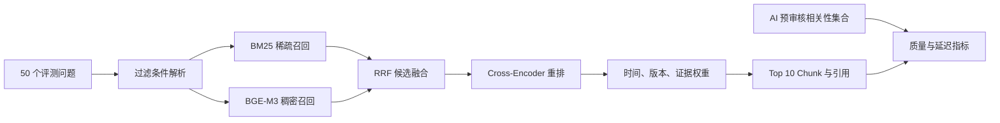
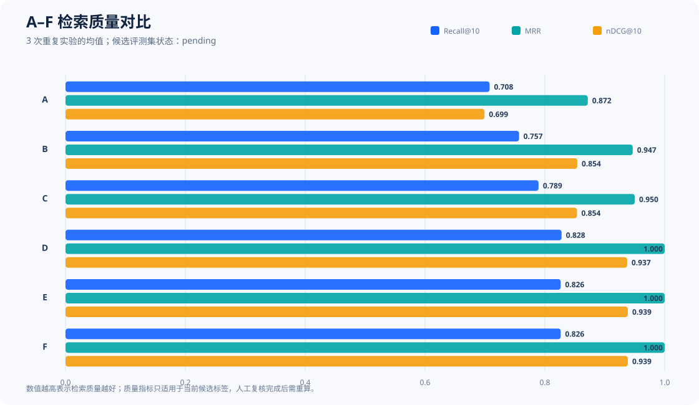
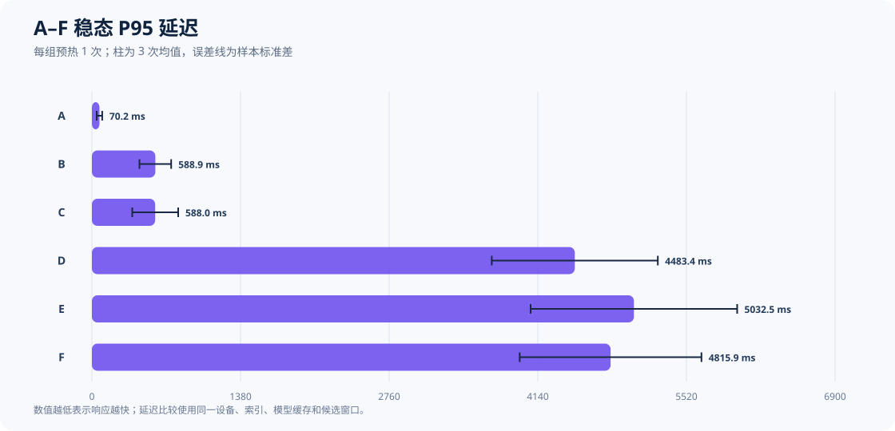

# CodeRadar Mini-RAG 检索评测报告

- 评测日期：2026-07-17
- 正式语料：885 个文档版本，2,688 个 Chunk
- 评测集：50 个问题，人工智能（Artificial Intelligence，AI）相关性预审核完成，人工复核状态为 `pending`
- 重复实验：3 次，每次包含 A—F 六组固定消融

## 技术摘要

CodeRadar 的 Mini 检索增强生成（Retrieval-Augmented Generation，Mini-RAG）检索链路完成了正式语料重建、全量数据预审核、相关性预标注、静态一致性校验、标准评测和三次 A—F 消融实验。数据采集的 16 个来源任务共生成 696 条原始记录，失败数为 0。结构化语料包含 885 个文档版本，其中 881 个为当前版本、4 个为历史版本，并切分为 2,688 个 Chunk。

正式检索配置使用 BAAI General Embedding M3（BGE-M3）生成 1,024 维向量，使用 `cross-encoder/mmarco-mMiniLMv2-L12-H384-v1` 进行交叉编码重排。50 个问题的 AI 相关性预审核产生 948 个“问题—Chunk”候选对，其中 460 个为 1—3 级相关，跨问题去重后覆盖 330 个相关 Chunk。静态校验结果为 `valid=true`，索引缺失数为 0。

完整检索组 F 的三次实验质量指标完全一致：Recall@5 为 0.6856，Recall@10 为 0.8265，平均倒数排名（Mean Reciprocal Rank，MRR）为 1.0000，归一化折损累计增益（Normalized Discounted Cumulative Gain，NDCG@10）为 0.9385，引用准确率为 0.9400，查询成功率为 1.0000。交叉编码重排使 Recall@10 从 C 组的 0.7895 增至 D 组的 0.8279，同时使第 95 百分位（P95）延迟均值从 588.0 ms 增至 4,483.4 ms。当前指标使用 AI 预审核候选标签，人工相关性复核仍是正式验收条件。

## 1. 数据范围与可追溯性

### 1.1 采集和结构化结果

采集任务覆盖 Cursor、GitHub Copilot、Trae、通义灵码和 CodeGeeX。以下表格列出 2026-07-17 强制采集的来源任务结果；每个任务失败时均由流水线独立记录，不影响其他来源继续执行。

| 竞品 | 来源任务 | 原始记录数 | 状态 |
|---|---|---:|---|
| Cursor | 官网 | 1 | 成功 |
| Cursor | Changelog | 68 | 成功 |
| Cursor | Pricing | 1 | 成功 |
| GitHub Copilot | 官网 | 1 | 成功 |
| GitHub Copilot | Changelog | 58 | 成功 |
| GitHub Copilot | Pricing | 1 | 成功 |
| GitHub Copilot | GitHub Release/Issue | 385 | 成功 |
| Trae | 官网 | 1 | 成功 |
| Trae | Changelog | 1 | 成功 |
| Trae | Pricing | 1 | 成功 |
| Trae | GitHub Release/Issue | 100 | 成功 |
| 通义灵码 | 官网 | 1 | 成功 |
| 通义灵码 | Changelog | 8 | 成功 |
| 通义灵码 | Pricing | 1 | 成功 |
| CodeGeeX | 官网 | 1 | 成功 |
| CodeGeeX | GitHub Release/Issue | 67 | 成功 |
| **合计** | **16 个来源任务** | **696** | **失败 0** |

结构化重建扫描 1,435 条原始记录，处理 1,390 条，跳过 45 条，生成 1,775 个候选版本；版本合并结果为新增 885、内容未变化 890。`documents.jsonl` 的 SHA-256 为 `9780973870c4c8adade2d70b724767f342e0a46924206c6b5531d71c5cd083b0`。

当前语料分布如下。文档版本均保留 `raw_record_id` 和 `raw_path`，可回溯至原始响应及其 Meta 文件。

| 维度 | 分类 | 文档版本数 |
|---|---|---:|
| 竞品 | GitHub Copilot | 447 |
| 竞品 | 通义灵码 | 205 |
| 竞品 | Trae | 107 |
| 竞品 | CodeGeeX | 68 |
| 竞品 | Cursor | 58 |
| 来源 | GitHub Release | 375 |
| 来源 | Official Changelog | 314 |
| 来源 | GitHub Issue | 188 |
| 来源 | Official Page | 4 |
| 来源 | Pricing | 4 |
| 语言 | 英文 | 575 |
| 语言 | 中文 | 310 |

语料包含 881 个当前版本和 4 个历史版本。发布时间缺失 7 条，产品版本缺失 322 条，结构化字段 `needs_review=true` 为 203 条。这些缺失项主要受源站是否提供明确时间或版本号影响，流水线保留缺失状态，避免推断不存在的源数据。

### 1.2 全量 AI 数据预审核

全量预审核运行 `20260717-full-885-v2` 对 885 个文档版本逐条检查 Schema、版本区间、原始 Payload 与 Meta、SHA-256、规范 URL、E1—E3 事件标签、D1—D7 能力标签、正文噪声、未来时间和敏感信息候选。每个 `version_id` 对应一条审核记录。

| 审核决策 | 文档版本数 | 占比 |
|---|---:|---:|
| `PASS` | 617 | 69.72% |
| `NEEDS_REVIEW` | 268 | 30.28% |
| `FAIL` | 0 | 0.00% |

审核发现允许同一文档同时命中多个规则，因此下表计数不能相加后解释为文档数。

| 发现代码 | 数量 | 机器检查含义 |
|---|---:|---|
| `NO_DIMENSION_LABEL` | 202 | D1—D7 未命中，需确认内容确实不属于能力维度 |
| `CONTENT_TOO_SHORT` | 132 | 正文长度不足，需确认页面是否只含摘要或抓取不完整 |
| `SENSITIVE_LONG_NUMBER` | 19 | 长数字候选，需区分 Issue 编号、时间戳与真实敏感标识 |
| `SENSITIVE_EMAIL` | 16 | 邮箱候选，需确认是否为公开项目联系信息 |
| `NOISE_REPEATED_LINE` | 12 | 重复行候选，需检查模板噪声 |
| `SENSITIVE_LOCAL_USER_PATH` | 2 | 本机用户路径候选，需检查个人目录信息 |
| `NEEDS_BROWSER` | 1 | 静态正文不足，页面需要浏览器渲染复核 |
| `SENSITIVE_PHONE` | 1 | 电话格式候选，需结合上下文确认 |

语料保留源站原文，敏感信息候选进入人工复核队列。审核明细、复核队列、摘要和 Manifest 位于 `data/runtime/ai_precheck/20260717-full-885-v2/`。AI 决策用于缩小人工审查范围，不构成人工验收结论。

### 1.3 相关性评测集

评测集包含 50 个问题，覆盖五个竞品、五类来源和 E1—E3 事件类型。问题分布如下。

| 分层维度 | 分布 |
|---|---|
| 竞品 | Cursor 8；GitHub Copilot 18；Trae 7；CodeGeeX 7；通义灵码 10 |
| 来源 | Official Page 8；Pricing 6；Official Changelog 18；GitHub Release 4；GitHub Issue 14 |
| 事件 | 未限定 8；E1 Pricing 6；E2 Release 22；E3 Risk/Experience 14 |
| 能力维度 | Agent 14；性能与成本 9；安全合规 8；IDE 生态 7；教育适配 3；模型扩展 3；代码智能 2；未限定 4 |

AI 相关性预审核先合并 Okapi BM25 概率相关性算法、稠密向量检索和混合检索各 Top 20 候选，并补入评测集种子 Chunk。评分由本地 Cross-Encoder、词项覆盖、预期引文命中和三路召回一致性组成，组合权重依次为 0.60、0.25、0.10 和 0.05。评分结果按 0—3 级写入候选审计；1—3 级进入评测集相关集合，0 级保留在审计明细中。

| 相关性等级 | 候选对数 | 解释 |
|---|---:|---|
| 0 | 488 | AI 判定不相关 |
| 1 | 332 | 弱相关 |
| 2 | 69 | 中度相关 |
| 3 | 59 | 高度相关或预期引文直接命中 |
| **合计** | **948** | **460 个正例候选对** |

460 表示“问题—Chunk”正例对数；同一个 Chunk 可以服务多个问题。跨问题去重后共有 330 个相关 Chunk。数据集 SHA-256 为 `5bdff42353ad91912e75930ef9478dd663aed19f6c5704bfb9af762b79a7ce43`，`ai_review_status=complete`，`human_review_status=pending`。

每个问题的正例数最小为 1、中位数为 6、均值为 9.2、最大为 32。19 个问题包含超过 10 个正例，因此 Top 10 结果无法召回这些问题的全部正例。按每个问题计算 `min(10 / 正例数, 1)` 后，Recall@10 的理论均值上限为 0.8600；F 组的 0.8265 达到该上限的 96.10%。该上限反映当前候选标签密度，不代表人工金标准的最终上限。

## 2. 系统与实验方法

### 2.1 检索工作流

查询首先解析竞品、来源、事件、能力维度、当前版本和时间等过滤条件。系统并行执行 BM25 与 BGE-M3 稠密向量召回，再使用倒数排名融合（Reciprocal Rank Fusion，RRF）合并候选。Cross-Encoder 对融合候选进行语义重排，时间、版本和证据权重形成最终排序，系统返回可定位的 Chunk 引文和检索轨迹。

下图展示正式实验中从查询到指标计算的数据流。图中的相关性集合来自 AI 预审核评测集，索引和结果文件均通过 SHA-256 与物理索引名绑定。



该流程将召回、融合、重排和业务权重拆分为可独立开关的阶段，因此 A—F 实验能够测量各阶段对质量和延迟的实际影响。

### 2.2 正式索引和参数

| 参数 | 正式实验值 |
|---|---|
| Elasticsearch 物理索引 | `coderadar_chunks_v20260717032357564091` |
| 索引 Chunk 数 | 2,688 |
| 写入失败数 | 0 |
| Embedding | `sentence-transformers/BAAI/bge-m3` |
| 向量维度 | 1,024 |
| Reranker | `cross-encoder/mmarco-mMiniLMv2-L12-H384-v1` |
| BM25 候选窗口 | 20 |
| Dense 候选窗口 | 20 |
| RRF 融合窗口 | 30 |
| Rerank 窗口 | 20 |
| `rrf_k` | 60 |
| 最终返回 | Top 10 |
| 排序权重 | 语义 0.70；时间 0.12；版本 0.08；证据 0.10 |
| 时间半衰期 | 180 天 |
| 配置 SHA-256 | `a31260ba912fccceebe76c1249638fd02984ee4aad8330f037311aa81371c2d9` |

静态校验逐条确认评测集相关 Chunk 存在于正式索引，结果为 50 个问题、330 个去重相关 Chunk、错误数 0、`valid=true`。

### 2.3 A—F 消融设计

| 组别 | BM25 | Dense | RRF | Cross-Encoder | 时间/版本 | 证据权重 |
|---|:---:|:---:|:---:|:---:|:---:|:---:|
| A | ✓ |  |  |  |  |  |
| B |  | ✓ |  |  |  |  |
| C | ✓ | ✓ | ✓ |  |  |  |
| D | ✓ | ✓ | ✓ | ✓ |  |  |
| E | ✓ | ✓ | ✓ | ✓ | ✓ |  |
| F | ✓ | ✓ | ✓ | ✓ | ✓ | ✓ |

每组先执行 1 个预热查询，再执行 50 个计时查询。完整 A—F 流程顺序运行 3 次，共形成 900 个正式消融查询。三次运行分别耗时 460.843 s、381.241 s 和 448.191 s。质量指标取三次均值；延迟同时报告均值、样本标准差和范围。

### 2.4 指标定义

| 指标 | 定义 |
|---|---|
| Recall@5 / Recall@10 | Top K 中命中的 1—3 级相关 Chunk 数占该问题全部相关 Chunk 数的比例 |
| MRR | 首个相关 Chunk 排名的倒数，对 50 个问题取均值 |
| NDCG@10 | 使用 0—3 级相关性计算 Top 10 排序质量 |
| 引用准确率 | 返回证据中是否存在可定位的预期引文或有效相关证据 |
| 元数据过滤准确率 | 返回结果是否满足竞品、来源、事件、维度和当前版本等过滤条件 |
| 历史版本误召回率 | 要求当前版本时返回历史版本的比例 |
| 查询成功率 | 无运行错误并产生完整检索结果的问题比例 |
| 平均延迟 / P95 延迟 | 预热后单问题检索耗时的均值和第 95 百分位 |

### 2.5 运行环境

| 项目 | 环境 |
|---|---|
| 操作系统 | Windows 10.0.26200，64 位 |
| Python | 3.11.9 |
| CPU | Intel Core Ultra 7 155H，16 核、22 逻辑处理器 |
| 内存 | 31.5 GiB |
| PyTorch | 2.13.0+cpu |
| Sentence Transformers | 5.6.0 |
| CUDA | 不可用，正式实验使用 CPU |
| Docker Server | 29.2.1 |
| Elasticsearch | 9.4.1，单节点，状态 green |

正式模型均从本地缓存加载。Hugging Face Hub 未认证提示不影响本地权重加载或实验结果。

## 3. 实验结果

### 3.1 完整检索标准评测

标准评测使用完整检索配置和 50 个问题，50 个查询全部成功，运行错误数为 0。

| 指标 | 结果 |
|---|---:|
| Recall@5 | 0.685576 |
| Recall@10 | 0.826473 |
| MRR | 1.000000 |
| NDCG@10 | 0.938511 |
| 引用准确率 | 0.940000 |
| 元数据过滤准确率 | 1.000000 |
| 历史版本误召回率 | 0.000000 |
| 查询成功率 | 1.000000 |
| 平均延迟 | 3,215.95 ms |
| P50 延迟 | 2,825.76 ms |
| P95 延迟 | 5,421.44 ms |
| 最大延迟 | 15,577.12 ms |

### 3.2 三次 A—F 消融汇总

下表报告三次运行的质量均值。三次质量值完全一致，因此质量标准差均为 0；延迟列使用“均值 ± 样本标准差”。

| 组别 | Recall@5 | Recall@10 | MRR | NDCG@10 | 引用准确率 | 元数据准确率 | 平均延迟 ms | P95 延迟 ms |
|---|---:|---:|---:|---:|---:|---:|---:|---:|
| A | 0.513606 | 0.707819 | 0.871667 | 0.699291 | 0.8600 | 1.0000 | 44.39 ± 13.26 | 70.18 ± 25.38 |
| B | 0.611228 | 0.756984 | 0.946667 | 0.854142 | 0.9600 | 1.0000 | 348.52 ± 60.06 | 588.89 ± 147.18 |
| C | 0.595124 | 0.789490 | 0.950000 | 0.853616 | 0.9600 | 1.0000 | 397.70 ± 104.41 | 587.98 ± 213.60 |
| D | 0.685576 | 0.827902 | 1.000000 | 0.937392 | 0.9400 | 1.0000 | 2,467.34 ± 504.20 | 4,483.44 ± 770.79 |
| E | 0.685576 | 0.826473 | 1.000000 | 0.938511 | 0.9400 | 1.0000 | 2,632.33 ± 329.42 | 5,032.46 ± 958.95 |
| F | 0.685576 | 0.826473 | 1.000000 | 0.938511 | 0.9400 | 1.0000 | 2,698.24 ± 517.50 | 4,815.88 ± 843.94 |

以下质量图同时展示 Recall@10、MRR 和 NDCG@10。横轴越接近 1 表示检索质量越高，图中数值为三次运行均值。



质量图显示 Dense 检索在三项指标上均高于 BM25；RRF 主要提高 Recall@10；Cross-Encoder 使 MRR 达到 1.0000，并明显提高 Recall 和 NDCG。E、F 两组的质量指标相同，当前 50 个问题未形成可观测的证据权重增益。

以下延迟图展示稳态 P95 延迟的三次均值和样本标准差。横轴越短表示响应越快；误差条反映本地 CPU 推理的运行波动。



延迟图显示 A—C 组保持在 0.6 s 以内，D—F 组位于 4.5—5.1 s。Cross-Encoder 是正式配置的主要延迟来源。E、F 的误差区间与 D 大量重叠，因此当前三次运行不能支持时间、版本或证据权重造成稳定延迟差异的结论。

### 3.3 阶段贡献

| 变化 | ΔRecall@5 | ΔRecall@10 | ΔMRR | ΔNDCG@10 | Δ引用准确率 | ΔP95 ms |
|---|---:|---:|---:|---:|---:|---:|
| A → B：BM25 改为 Dense | +0.097622 | +0.049165 | +0.075000 | +0.154850 | +0.1000 | +518.71 |
| B → C：加入 BM25 与 RRF | -0.016105 | +0.032506 | +0.003333 | -0.000525 | 0.0000 | -0.91 |
| C → D：加入 Cross-Encoder | +0.090452 | +0.038412 | +0.050000 | +0.083776 | -0.0200 | +3,895.46 |
| D → E：加入时间与版本权重 | 0.000000 | -0.001429 | 0.000000 | +0.001118 | 0.0000 | +549.02 |
| E → F：加入证据权重 | 0.000000 | 0.000000 | 0.000000 | 0.000000 | 0.0000 | -216.58 |

Cross-Encoder 提供最大的 Top 5 召回和排序增益，其 P95 延迟是 C 组的 7.625 倍。引用准确率从 C 组的 0.96 变为 D 组的 0.94，说明语义重排提高总体排序质量的同时改变了三个问题的首批证据组成。时间、版本和证据权重在当前评测集上的质量差异小于 0.002。

## 4. 结果诊断与适用边界

### 4.1 未完全召回和引用失败

F 组有 28 个问题达到 Recall@10=1，22 个问题低于 1。未完全召回问题主要集中在正例数量较多的 GitHub Issue、GitHub Copilot 产品能力、Trae Issue 和 CodeGeeX Issue。Recall@10 最低的五个问题如下。

| 问题 ID | Recall@5 | Recall@10 | 引用有效 |
|---|---:|---:|:---:|
| `trae_code_folding` | 0.1563 | 0.3125 | 否 |
| `copilot_codex_jetbrains` | 0.2000 | 0.4000 | 是 |
| `codegeex_rider_2026` | 0.2000 | 0.4000 | 否 |
| `codegeex_wsl_path` | 0.2174 | 0.4348 | 是 |
| `codegeex_path_escape` | 0.2381 | 0.4762 | 是 |

三个引用失败问题为 `copilot_issue_custom_models`、`trae_code_folding` 和 `codegeex_rider_2026`。所有问题的运行错误列表均为空，引用失败属于返回证据与预期引文不匹配，不属于服务异常。

### 4.2 AI 相关性标签的不确定性

当前相关性集合由本地模型和规则组合生成，332 个弱相关候选占全部正例的 72.17%。弱相关候选扩大了每个问题的相关集合，并使 19 个问题的正例数超过 Top 10 容量。人工复核需要确认以下内容：

1. 问题本身是否有效且无歧义；
2. 1 级候选是否足以支持回答，而非仅共享词项；
3. 0 级 Top-N 候选中是否存在漏标相关证据；
4. 预期引文是否能在对应 Chunk 中逐字定位；
5. 第二位复核者对至少 20% 问题进行盲审，并记录分歧。

人工复核完成后，评测集 Manifest 的 `human_review_status` 才能进入完成状态，并需重新运行静态校验、标准评测和三次消融。

### 4.3 历史版本与冲突

语料包含 4 个通义灵码历史版本，正式索引可区分 `is_current` 与有效时间区间。A—F 六组的历史版本误召回率均为 0，说明当前版本过滤在现有问题上生效。评测集仍需增加“历史版本作为正确答案”的显式问题，才能测量历史查询召回能力。

冲突检测需要同一事实在多个来源或版本中出现不一致值。当前 50 个问题未提供经人工确认的冲突事实集合，因此本报告不计算冲突准确率。人工验收应选择价格、版本发布日期或能力状态等可核对事实建立冲突样本。

### 4.4 延迟适用范围

延迟来自 Windows CPU 单机、本地模型缓存和单节点 Elasticsearch。D—F 组 P95 的样本标准差为 770.79—958.95 ms，表明本地调度和 CPU 推理存在波动。该结果用于同机配置比较，不能直接外推至 GPU、并发请求或生产网络环境。

## 5. 运行服务状态

正式实验索引 `coderadar_chunks_v20260717032357564091` 保留在 Elasticsearch 中，包含 2,688 个 Chunk。项目本地 API 当前使用 Hash Embedding 运行索引 `coderadar_chunks_v20260717053141962952`，别名 `coderadar_chunks_current` 指向该索引。

`GET /ready` 返回 `status=ready`、`indexed_chunks=2688`、Embedding 兼容状态为 `true`，Elasticsearch 集群状态为 `green`。API 冒烟查询“Cursor 最近有哪些 Agent 能力更新”返回 8 条证据，所有证据的竞品字段均为 Cursor，警告数为 0。

## 6. 可复现实验命令

以下命令从 `D:\26Spring\project\CodeRadar` 运行。采集阶段会访问外部站点；其余命令使用已保存语料、Elasticsearch 和本地模型缓存。

### 6.1 重爬、处理与全量预审核

```powershell
Set-Location D:\26Spring\project\CodeRadar

.\.venv\Scripts\python.exe -m scripts.data_pipeline doctor

.\.venv\Scripts\python.exe -m scripts.data_pipeline crawl `
  --competitors all `
  --since-days 365 `
  --force `
  --log-level INFO

.\.venv\Scripts\python.exe -m scripts.data_pipeline process --rebuild
.\.venv\Scripts\python.exe -m scripts.audit_documents

$stamp = Get-Date -Format 'yyyyMMdd-HHmmss'
.\.venv\Scripts\python.exe -m scripts.ai_precheck_documents `
  --audit-run-id "full-$stamp"
```

### 6.2 评测集、正式索引和 AI 相关性预审核

```powershell
.\.venv\Scripts\python.exe -m scripts.prepare_evaluation_set

docker compose up -d --wait elasticsearch
docker compose stop api

$env:HF_HOME = Join-Path (Get-Location).Path '.cache\huggingface'
.\.venv\Scripts\python.exe -m scripts.build_index `
  --config config\mini_rag.formal.yaml

$stamp = Get-Date -Format 'yyyyMMdd-HHmmss'
.\.venv\Scripts\python.exe -m scripts.ai_review_relevance `
  --config config\mini_rag.formal.yaml `
  --top-n 20 `
  --run-id "relevance-$stamp"

.\.venv\Scripts\python.exe -m scripts.validate_evaluation_set `
  --config config\mini_rag.formal.yaml `
  --output data\runtime\evaluation_set_validation.json
```

`prepare_evaluation_set` 适用于人工复核开始前的候选集生成。人工复核进行期间应保留评测 CSV、复核 CSV 和 Manifest 的固定副本。

### 6.3 标准评测和三次消融

```powershell
.\.venv\Scripts\python.exe -m scripts.evaluate_rag `
  --config config\mini_rag.formal.yaml `
  --quiet `
  --output data\runtime\mini_rag_evaluation.json

1..3 | ForEach-Object {
  .\.venv\Scripts\python.exe -m scripts.evaluate_rag `
    --config config\mini_rag.formal.yaml `
    --ablations `
    --quiet `
    --output "data\runtime\mini_rag_ablations.run$_.json"
}

.\.venv\Scripts\python.exe -m scripts.summarize_rag_benchmark `
  data\runtime\mini_rag_ablations.run1.json `
  data\runtime\mini_rag_ablations.run2.json `
  data\runtime\mini_rag_ablations.run3.json `
  --output data\runtime\mini_rag_ablations_summary.json `
  --assets-dir docs\assets
```

### 6.4 恢复本地 API 与回归测试

```powershell
.\.venv\Scripts\python.exe -m scripts.build_index
docker compose up -d --build --wait --wait-timeout 180 api
curl.exe -sS http://localhost:8000/ready

.\.venv\Scripts\python.exe -m pip check
.\.venv\Scripts\python.exe -m pytest -m "not network" -q
```

## 7. 证据文件与哈希

| 证据 | 路径 | SHA-256 |
|---|---|---|
| 结构化语料 | `data/cleaned/documents.jsonl` | `9780973870c4c8adade2d70b724767f342e0a46924206c6b5531d71c5cd083b0` |
| AI 预审核 | `data/runtime/ai_precheck/20260717-full-885-v2/` | Manifest 内分别记录明细、队列和摘要哈希 |
| AI 相关性审计 | `data/runtime/ai_relevance/20260717-ai-50/candidates.jsonl` | `84008cf725c672698e74f0c75f9a15474cb32416fe54017ee8926ceab1b614fe` |
| 评测数据集 | `data/samples/测试数据集.csv` | `5bdff42353ad91912e75930ef9478dd663aed19f6c5704bfb9af762b79a7ce43` |
| 静态校验 | `data/runtime/evaluation_set_validation.json` | `45662f18605c49ce6ed970b534764fa20bfe2daf8508cabd542e4b61bede1232` |
| 标准评测 | `data/runtime/mini_rag_evaluation.json` | `eb7f89e8a0414ff3a4ad35f169e96d53157ae322a26ccc018bae9ab53d921229` |
| 消融运行 1 | `data/runtime/mini_rag_ablations.run1.json` | `015606ac762b161c9621d2b0401406c4b525778f3e94322f71781dddc03cd94e` |
| 消融运行 2 | `data/runtime/mini_rag_ablations.run2.json` | `802e6498585124dd94d745b5c144e6364f329c74ab607f6315291899f996f67b` |
| 消融运行 3 | `data/runtime/mini_rag_ablations.run3.json` | `d4e90b7e6fe7f3a7a653a5291e6abfe3cfbff193389b4613a3a826f5fc14f985` |
| 消融汇总 | `data/runtime/mini_rag_ablations_summary.json` | `0e11ce707d513c23d807a995a059c320ff65e6be76f625442269d74206a435d9` |

## 8. 结论与验收状态

数据采集和结构化链路满足当前机器验收条件：16 个来源任务全部成功，885 个文档版本均可追溯到原始记录，正式索引 2,688 个 Chunk 全部写入，静态校验无缺失。全量 AI 数据预审核覆盖 885/885 个版本，形成 268 条人工复核队列。

检索实验表明 Dense、RRF 和 Cross-Encoder 均产生可测量贡献。完整 F 组实现 MRR 1.0000、NDCG@10 0.9385、引用准确率 0.9400和查询成功率 1.0000。Cross-Encoder 提供主要质量增益，同时将 P95 延迟提高到约 4.5—5.1 s。当前问题集未显示时间、版本和证据权重的稳定增益，需要通过历史版本题、冲突题和更细粒度证据题扩充评测覆盖。

机器检查结论为通过。人工验收状态保持 `pending`，范围包括 268 条复核队列、617 条 `PASS` 中至少 50 条分层抽查、50 个相关性问题及其 Top-N 漏标检查、4 个历史版本和敏感信息候选。具体操作步骤见项目级人工验收清单 `D:\26Spring\project\docs\check.md`。
