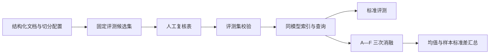

# CodeRadar Mini-RAG 检索评测报告

## 1. 评测对象

Mini-RAG 是轻量检索增强生成（Mini Retrieval-Augmented Generation）证据服务。保存的正式评测使用 `config/mini_rag.formal.yaml`，其检索链路包括 Okapi BM25 词法召回、BGE-M3 稠密向量召回、RRF（Reciprocal Rank Fusion，倒数排名融合）、Cross-Encoder（交叉编码器）重排序、时间与版本排序以及证据等级排序。

当前保存的评测集包含 50 个案例，数据集 SHA-256（Secure Hash Algorithm 256-bit，256 位安全散列算法）为 `5bdff42353ad91912e75930ef9478dd663aed19f6c5704bfb9af762b79a7ce43`。评测标签状态为 `pending`，标签来源为 AI 预复核候选标签，因此结果用于工程比较和人工复核，不构成人工金标准结论。

## 2. 实验配置

下表给出保存实验的可复现参数。

| 参数 | 值 |
| --- | --- |
| 物理索引 | `coderadar_chunks_v20260717032357564091` |
| 嵌入模型 | `sentence-transformers/BAAI/bge-m3` |
| 嵌入维度 | 1,024 |
| 重排序模型 | `cross-encoder/mmarco-mMiniLMv2-L12-H384-v1` |
| BM25 候选数 | 20 |
| 稠密候选数 | 20 |
| 融合候选数 | 30 |
| 重排序候选数 | 20 |
| RRF 常数 | 60 |
| 返回评测深度 | 10 |
| 消融重复次数 | 3 |

最终排序权重为语义 0.70、时间 0.12、版本 0.08、证据 0.10，时间半衰期为 180 天。A—F 每组在计时前执行一次预热，延迟口径为预热后的稳态查询延迟。

## 3. 标准评测结果

保存的 `data/runtime/mini_rag_evaluation.json` 记录 50 个案例的完整检索结果。

| 指标 | 结果 |
| --- | ---: |
| Recall@5 | 0.685576 |
| Recall@10 | 0.826473 |
| MRR | 1.000000 |
| nDCG@10 | 0.938511 |
| 引用正确率 | 0.940000 |
| 元数据过滤准确率 | 1.000000 |
| 历史版本误召回率 | 0.000000 |
| 查询成功率 | 1.000000 |
| 平均延迟 | 3,215.948 ms |
| P95 延迟 | 5,421.443 ms |
| 最大延迟 | 15,577.121 ms |

Recall@K 表示前 K 条结果覆盖相关证据的比例；MRR 指平均倒数排名（Mean Reciprocal Rank）；nDCG 指归一化折损累计增益（Normalized Discounted Cumulative Gain）。表中结果显示元数据过滤在该候选集上全部满足约束，引用正确率仍有 6% 的改进空间。

## 4. A—F 消融实验

六组实验逐步加入检索与排序组件。下表展示三次重复运行的均值；质量指标在三次运行中保持一致，延迟存在运行间波动。

| 组 | 组件 | Recall@10 | MRR | nDCG@10 | 引用正确率 | P95 延迟均值 |
| --- | --- | ---: | ---: | ---: | ---: | ---: |
| A | BM25 | 0.707819 | 0.871667 | 0.699291 | 0.86 | 70.184 ms |
| B | 稠密向量 | 0.756984 | 0.946667 | 0.854142 | 0.96 | 588.890 ms |
| C | BM25 + 稠密向量 + RRF | 0.789490 | 0.950000 | 0.853616 | 0.96 | 587.980 ms |
| D | C + Cross-Encoder | 0.827902 | 1.000000 | 0.937392 | 0.94 | 4,483.441 ms |
| E | D + 时间与版本排序 | 0.826473 | 1.000000 | 0.938511 | 0.94 | 5,032.456 ms |
| F | E + 证据等级排序 | 0.826473 | 1.000000 | 0.938511 | 0.94 | 4,815.879 ms |

该表说明 Cross-Encoder 对首位排序质量的贡献最明显，同时引入秒级延迟。E 与 F 在当前候选集上的召回和 nDCG 相同；时间、版本和证据排序的价值仍需在人工确认标签和包含更多冲突、历史版本案例的数据集上继续验证。

## 5. 当前数据与评测制品关系

当前 `data/cleaned/documents.jsonl` 包含 1,003 个文档版本，其 SHA-256 为 `47054cd2dd016c8101eccf9e2e8c0e4c3dc05d2b662a404738050c184e31f284`。保存的正式评测和消融结果基于 2026-07-17 的物理索引与候选评测集。它们没有记录当前结构化数据哈希，不能视为最新 1,003 个文档版本的评测结果。

当前服务读取别名指向 2,688-Chunk Hash Embedding 索引，另有 3,337-Chunk Hash Embedding 物理索引未被别名引用。正式评测使用 BGE-M3 物理索引。三个索引状态对应不同运行目的，指标不可跨模型或跨数据版本直接比较。

## 6. 评测流程

下面的流程图展示从候选标签到结果汇总的完整关系。



流程中的关键一致性条件是：评测集哈希、配置哈希、物理索引、嵌入模型、重排序模型和数据输入必须同时记录。任何一项变化都需要生成新的评测制品。

## 7. 复现命令

```powershell
Set-Location D:\26Spring\project\CodeRadar

& .\.venv\Scripts\python.exe -m scripts.validate_evaluation_set
& .\.venv\Scripts\python.exe -m scripts.build_index `
  --config config\mini_rag.formal.yaml

& .\.venv\Scripts\python.exe -m scripts.evaluate_rag `
  --config config\mini_rag.formal.yaml `
  --output data\runtime\mini_rag_evaluation.json

& .\.venv\Scripts\python.exe -m scripts.evaluate_rag `
  --config config\mini_rag.formal.yaml `
  --ablations `
  --quiet `
  --output data\runtime\mini_rag_ablations.run1.json
```

人工复核完成后，应重新冻结评测集、构建对应索引并重复三次消融。报告中只使用同一不变量集合生成的运行结果。
