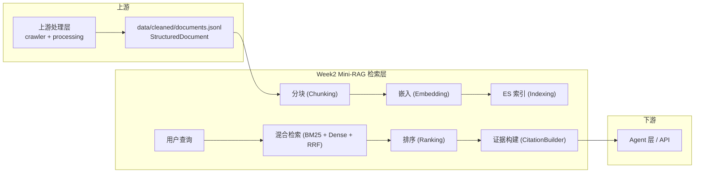

# Week2：Mini-RAG 检索层——从文档到可验证证据

> 本文档详细说明 CodeRadar 项目 Week2（Mini-RAG 检索层）的**完整运行流程**，涵盖从 `documents.jsonl` 输入到可验证证据输出的每一步。
> 读者对象：接手代码的新同学、验收人员、想深入理解检索管线的开发者。
> 所有 `python -m` 命令在 `Proj/competitor-analysis-system/` 下执行，先 `conda activate CodeRadar`。

---

## 目录

1. [Week2 定位与职责](#1-week2-定位与职责)
2. [前置条件](#2-前置条件)
3. [配置详解](#3-配置详解)
4. [核心数据流总览](#4-核心数据流总览)
5. [建索引流程（离线/增量）](#5-建索引流程离线增量)
   - 5.1 文档加载与校验
   - 5.2 智能分块
   - 5.3 向量化嵌入
   - 5.4 ES 索引写入与原子别名切换
6. [检索流程（在线查询）](#6-检索流程在线查询)
   - 6.1 查询解析
   - 6.2 双路检索（BM25 + Dense）
   - 6.3 RRF 融合
   - 6.4 排序管线
   - 6.5 证据构建与冲突检测
   - 6.6 检索轨迹记录
7. [运行方法](#7-运行方法)
   - 7.1 启动 Elasticsearch
   - 7.2 审计文档
   - 7.3 建索引
   - 7.4 CLI 查询
   - 7.5 HTTP API 服务
   - 7.6 离线评测
8. [两套向量空间说明](#8-两套向量空间说明)
9. [评测流程](#9-评测流程)
10. [常见问题与排错](#10-常见问题与排错)

---

## 1. Week2 定位与职责

Week2（Mini-RAG 层）是整个系统的**检索基础设施**，处于上游处理层与 Week3 Agent 层之间：



**核心职责**：

| 维度 | 说明 |
|------|------|
| 输入 | `data/cleaned/documents.jsonl`（每行一个 `StructuredDocument`，约 867 行冻结基线） |
| 输出 | ES 版本化物理索引 + `RAGResponse`（含 `Evidence[]`、`Conflict[]`、`RetrievalTrace`） |
| 关键能力 | 混合检索（BM25 词法 + 稠密向量语义）、RRF 融合、多阶段排序、可验证证据引用 |
| 服务门面 | `MiniRAGService`，工厂 `create_service()` 按配置装配全部组件 |

---

## 2. 前置条件

### 2.1 环境

```powershell
# 确认 Python 版本
conda activate CodeRadar
python --version    # 应为 3.11.9

# 安装依赖（注意：sentence-transformers 只在正式评测时需要）
python -m pip install -r requirement.txt
python -m pip check
```

### 2.2 数据

Week2 的唯一数据输入是 `data/cleaned/documents.jsonl`。这份文件来自上游处理层的产出，可以通过两种方式获得：

- **方式 A（推荐）**：直接使用已交付的基线文件（867 行冻结基线）。
- **方式 B（重新生成）**：运行完整的数据采集+处理管线：
  ```powershell
  python -m scripts.data_pipeline doctor
  python -m scripts.data_pipeline all --competitors all --since-days 90
  ```

### 2.3 Elasticsearch

Mini-RAG 的索引后端是 Elasticsearch 9.4.1，通过 docker-compose 启动：

```powershell
# 启动 ES（单节点，端口 9200，1g 堆内存）
docker compose up -d elasticsearch

# 确认就绪
curl http://localhost:9200/_cluster/health
# 应返回 {"status":"yellow","cluster_name":"docker-cluster",...}
```

也可使用已有的本地 ES 实例，只需在 `mini_rag.yaml` 中修改 `elasticsearch.url` 或在 `.env` 中设置 `MINIRAG_ELASTICSEARCH_URL`。

### 2.4 .env 配置（可选）

项目根 `.env`（从 `.env.example` 复制，已 gitignore）中的以下变量影响 Week2 行为：

```ini
MINIRAG_ELASTICSEARCH_URL=http://localhost:9200
MINIRAG_EMBEDDING_PROVIDER=hash              # 离线基线（默认）
MINIRAG_EMBEDDING_MODEL=BAAI/bge-m3           # 正式评测用 sentence_transformers
MINIRAG_EMBEDDING_DIMENSION=1024
MINIRAG_RERANKER_PROVIDER=lexical             # 默认词项重叠，正式用 cross_encoder
MINIRAG_MODEL_CACHE_DIR=.cache/models
MINIRAG_CONFIG_PATH=config/mini_rag.yaml      # 配置文件路径
```

---

## 3. 配置详解

Week2 的完整配置由 `config/mini_rag.yaml`（或 `config/mini_rag.formal.yaml`）定义，所有参数都支持通过 `MINIRAG_*` 环境变量覆盖。

```yaml
# config/mini_rag.yaml —— 离线基线默认配置
version: 1

data:
  documents_path: data/cleaned/documents.jsonl   # 输入文档路径
  evaluation_path: data/samples/测试数据集.csv   # 评测集路径
  trace_path: data/runtime/retrieval_traces.jsonl # 检索轨迹持久化路径

chunking:
  target_characters: 1200    # 目标分块字符数
  maximum_characters: 1800   # 最大单块字符数（超出则强制切分）
  overlap_characters: 160    # 相邻块重叠字符数（保证跨块语义不丢失）
  minimum_characters: 80     # 最小单块字符数（低于此值丢弃）

embedding:
  provider: hash             # hash = 离线确定性基线；sentence_transformers = BGE-M3
  model: BAAI/bge-m3
  dimension: 1024            # 向量维度（两套配置相同，但向量空间不同）
  normalize: true            # 计算向量后 L2 归一化
  batch_size: 16             # 嵌入批大小
  cache_dir: .cache/models   # 模型缓存目录

elasticsearch:
  url: http://localhost:9200
  index_prefix: coderadar_chunks           # 物理索引前缀
  read_alias: coderadar_chunks_current     # 读别名（API 查询时透明引用）
  request_timeout_seconds: 30
  verify_certs: false
  number_of_shards: 1
  number_of_replicas: 0

retrieval:
  bm25_candidates: 20        # BM25 检索返回候选数
  dense_candidates: 20       # 稠密检索返回候选数
  fused_candidates: 30       # RRF 融合后保留候选数
  rerank_candidates: 20      # 送入排序管的候选数
  default_top_k: 8           # 最终返回证据数（默认）
  maximum_top_k: 50          # top_k 上限
  rrf_k: 60                  # RRF 融合参数 k（越小越强调排名的头部差异）

reranker:
  provider: lexical          # lexical = TermOverlapReranker（离线）
  model: BAAI/bge-reranker-v2-m3   # 仅 provider=cross_encoder 时使用
  batch_size: 8
  strict: false              # true 时 reranker 加载失败直接报错；false 回退 lexical

ranking:
  semantic_weight: 0.70      # 语义/重排序分数权重
  temporal_weight: 0.12      # 时间新鲜度权重
  version_weight: 0.08       # 版本权重
  evidence_weight: 0.10      # 证据等级权重
  temporal_half_life_days: 180   # 时间衰减半衰期

service:
  trace_retention: 1000      # 检索轨迹保留条数
  fail_on_missing_index: true    # 索引不存在时是否报错
  current_only_for_current_intent: true  # 查询默认只搜 current 版本
```

### 两份配置的差异

| 字段 | `mini_rag.yaml`（默认） | `mini_rag.formal.yaml`（正式评测） |
|------|------------------------|-----------------------------------|
| `embedding.provider` | `hash` | `sentence_transformers` |
| `reranker.provider` | `lexical` | `cross_encoder` |
| `reranker.model` | —（不生效） | `cross-encoder/mmarco-mMiniLMv2-L12-H384-v1` |
| `reranker.strict` | `false` | `true` |

**重要**：两份配置的向量维度都是 1024，但向量空间**完全不同**！`hash` 产生确定性哈希向量，BGE-M3 产生语义向量。**切换配置后必须全量重建索引**，否则 API `/ready` 会返回 `degraded` 状态。

---

## 4. 核心数据流总览

Week2 的数据流分为两条主线：**离线建索引**（一次性/增量）和**在线查询**（每次都执行）。

### 离线建索引

```
documents.jsonl
  └→ DocumentLoader.load()           读取、校验 StructuredDocument（拒绝重复 version_id 与多版本 current）
  └→ ChunkingDispatcher.chunk()      按来源类型分块成 Chunk（含 chunk_id/heading_path/字符区间/标签）
  └→ EmbeddingService.embed()        对每个 Chunk 计算向量
  └→ IndexBuilder.build()            Bulk 写入 ES 物理索引
  └→ IndexManager.activate()         原子切换读别名 coderadar_chunks_current
```

### 在线查询

```
RAGQuery (question + optional filters)
  └→ QueryParser.parse()             从问题文本中提取竞品/事件/维度/版本/相对时间
  └→ BM25Retriever.search()          词法检索（ES `multi_match` query）
  └→ DenseRetriever.search()         向量检索（ES `knn` query）
  └→ RRFFusion.fuse()                Reciprocal Rank Fusion 合并两路结果
  └→ RankingPipeline.rank()          三阶段排序：
       ├─ reranker (lexical / cross_encoder)
       ├─ TemporalVersionRanker (时间衰减 + 版本偏好)
       └─ EvidenceRanker (证据等级加权)
  └→ CitationBuilder.build()         生成 Evidence（含 quote/URL/字符区间/分数）
  └→ ConflictDetector.detect()       检冲突（同字段不同值）
  └→ RAGResponse + TraceStore 持久化
```

---

## 5. 建索引流程（离线/增量）

统一入口是 `scripts/build_index.py`，或通过 HTTP API `POST /api/rag/rebuild` / `POST /api/rag/index/incremental`。

### 5.1 文档加载与校验

**组件**：`mini_rag/ingestion/document_loader.py` → `DocumentLoader`

`DocumentLoader` 从 `documents.jsonl` 逐行读取 `StructuredDocument`（Pydantic 模型），执行以下校验：

- 每行必须是合法的 JSON，且能解析为 `StructuredDocument`
- 不允许重复的 `version_id`（全局唯一）
- 对于同一个 `document_id`，最多只能有一条记录的 `is_current=true`
- 跳过空白行

校验通过后返回完整的 `list[StructuredDocument]`，并计算统计信息（总数、current 数、各竞品/来源/语言分布）。

```powershell
# 单独审计文档
python -m scripts.audit_documents
# 输出示例：
# {
#   "total": 867,
#   "current": 726,
#   "historical": 141,
#   "competitors": {"cursor": 195, "github_copilot": 148, ...},
#   "sources": {"official_changelog": 312, "github_release": 289, ...}
# }
```

### 5.2 智能分块

**组件**：`mini_rag/chunking/` → `ChunkingDispatcher` + 五个专用 Chunker

`ChunkingDispatcher` 根据文档的 `source_type` 字段，将文档路由到对应的 Chunker：

| 来源类型 | Chunker | 分块策略 |
|----------|---------|---------|
| `official_page` / `product_docs` / `security_privacy` 等 | `OfficialPageChunker` | 按标题层级（h1→h2→h3）切分，heading_path 保留层级信息 |
| `official_changelog` / `rss` | `ChangelogChunker` | 按版本号或发布日期分割，每条变更条目一个块 |
| `pricing` | `PricingChunker` | 按套餐/定价表切分，保留 plan_name/price/currency 等定价字段 |
| `github_release` / `github_issue` | `GitHubChunker` | 按 Release Note 章节或 Issue 讨论切分，保留 repository/github_kind 等元数据 |

每个生成的 `Chunk`（`mini_rag/models.py:110-160`）包含：

| 字段 | 说明 |
|------|------|
| `chunk_id` | 确定性 ID：`chunk_<sha256(document_id+version_id+heading_path+section_type+char_range)>` |
| `document_id` / `version_id` | 来源文档标识符 |
| `content` / `char_start` / `char_end` | 原文片段 + 字符区间（精确到源字符串位置） |
| `heading_path` | 标题层级路径，如 `["Release Notes", "v2.0", "New Features"]` |
| `competitor` / `source_type` | 竞品名 + 来源类型 |
| `evidence_level` | 证据等级 A/B/C/D（从上游继承） |
| `event_type` / `dimension_tags` | 事件标签 E1-E3 + 能力标签 D1-D7 |
| `publish_time` / `valid_from` / `valid_to` | 时间与版本有效区间 |
| `embedding` | 向量（在后续步骤填写） |

分块参数来自配置：
- 目标块大小 1200 字符
- 最大块 1800 字符（超出会强行切分）
- 块间重叠 160 字符（防止主题被截断）
- 最小块 80 字符（小于此值丢弃）

### 5.3 向量化嵌入

**组件**：`mini_rag/embedding/` → `EmbeddingService` + `EmbeddingProvider`

`EmbeddingService` 是统一门面，底层使用可插拔的 `EmbeddingProvider`：

#### hash 模式（默认，离线确定性）

适用于开发、测试和无模型环境。**不产生语义向量，只生成确定性哈希向量**，确保相同输入始终输出相同向量。这使 BM25 成为去重后的唯一有效排序信号，但 RRF 融合仍能工作。

```python
# mini_rag/embedding/hash_embedding.py
# 使用文本内容的 SHA-256 投影到 1024 维向量
# 每个维度取值 -1 或 1，确保 L2 范数为 sqrt(dim)
```

#### sentence_transformers 模式（BGE-M3，正式评测）

使用时下载 BGE-M3 模型约 2.2GB，模型文件缓存在 `MINIRAG_MODEL_CACHE_DIR`（默认 `.cache/models`）。

```powershell
# 首次使用会自动下载模型到缓存目录
# 也可以手动设定缓存路径：
set MINIRAG_MODEL_CACHE_DIR=D:\models\cache
```

**重要限制**：
- 不同向量空间的索引**不可混用**，切换 provider 必须全量重建
- API 服务启动时通过 `/ready` 端点校验索引向量维度/模型与当前 provider 是否一致

### 5.4 ES 索引写入与原子别名切换

**组件**：`mini_rag/indexing/` → `IndexManager` + `IndexBuilder` + `elasticsearch_client`

#### 全量重建（默认）

```powershell
python -m scripts.build_index
# 或指定配置
python -m scripts.build_index --config config\mini_rag.formal.yaml
# 或通过 HTTP API
curl -X POST http://localhost:8000/api/rag/rebuild
```

全量重建流程：

1. **创建版本化物理索引**：`IndexManager.versioned_name()` 以 UTC 时间戳生成索引名，如 `coderadar_chunks_v20260720120000000000`
2. **定义索引映射**：`build_index_mapping()` 创建 ES 索引映射，包含：
   - `dense_vector` 字段存储 1024 维嵌入（配置了 `cosine` 相似度）
   - 各过滤字段（competitor/source_type/event_type/dimension_tags 等）设置 keyword 类型
   - `publish_time` 等时间字段设为 `date` 类型
   - mapping 元信息记录 embedding 模型名与维度（用于 `/ready` 校验）
3. **批量写入**：`IndexBuilder.build()` 将 Chunk 列表分 batch 通过 ES Bulk API 写入（每批 500 条）
4. **原子切换别名**：写入成功后，`IndexManager.activate()` 执行**原子别名切换**：
   ```
   POST /_aliases
   {
     "actions": [
       {"remove": {"alias": "coderadar_chunks_current", "index": "<旧索引>"}},
       {"add": {"alias": "coderadar_chunks_current", "index": "<新索引>"}}
     ]
   }
   ```
   - 旧索引不会被删除，只是从别名中移除；可以通过 `coderadar_chunks_v*` 前缀直接查询
   - 切换发生在索引写入**完成后**，查询端在切换期间最多丢失一个批次的延迟更新
5. **输出报告**：`IndexBuilder` 返回 `IndexingReport`：
   ```json
   {
     "index_name": "coderadar_chunks_v20260720120000000000",
     "input_count": 867,
     "indexed_count": 2633,
     "skipped_count": 0,
     "deleted_count": 0,
     "failed_count": 0,
     "embedding_model": "hash",
     "embedding_dimension": 1024,
     "created_index": true,
     "alias": "coderadar_chunks_current"
   }
   ```

#### 增量更新

```powershell
python -m scripts.build_index --incremental
# 或
python -m scripts.build_index --incremental --delete-missing
# 或通过 HTTP API
curl -X POST http://localhost:8000/api/rag/index/incremental
```

增量模式与全量重建的区别：

- 不创建新物理索引，而是**在已有索引上追加/更新/删除** Chunk
- 通过 Chunk 的 `chunk_id` 判断幂等性：已存在的 chunk_id 跳过，新 chunk_id 插入
- `--delete-missing` 选项：删除在新数据中不再出现的 Chunk（注意：会物理删除文档）
- 如果不传 `--delete-missing`，旧 Chunk 会留在索引中（但查询时可以通过 `is_current=true` 过滤）
- 要求读别名已存在，否则报错（`fail_on_missing_index=true` 时）

#### 索引状态查询

```powershell
python -m scripts.build_index          # 不传参数？自动全量重建
# 或通过 HTTP API：
curl http://localhost:8000/api/rag/index/status
# 返回：
# {
#   "status": "ready",
#   "index": "coderadar_chunks_current",
#   "physical_index": "coderadar_chunks_v20260720120000000000",
#   "indexed_chunks": 2633,
#   "embedding_model": "hash",
#   "embedding_dimension": 1024,
#   "embedding_compatible": true
# }
```

---

## 6. 检索流程（在线查询）

每次查询走 `MiniRAGService._run_query()`（`mini_rag/api/rag_service.py:103-260`），固定六步流水线。

### 6.1 查询解析

**组件**：`mini_rag/retrieval/query_parser.py` → `QueryParser`

`QueryParser.parse()` 从用户提问中自动提取结构化过滤条件：

```python
# 输入："Cursor 最近有哪些 Agent 能力更新"
# 解析结果：
competitor = "Cursor"
event_type_hint = ["product_release"]
dimension_hint = ["agent_context"]
relative_time_window = 30  # 天（默认近 30 天）
```

解析规则：

| 场景 | 匹配方式 | 示例关键词 |
|------|----------|-----------|
| 竞品 | 精确匹配预定义别名 | `cursor`、`copilot`、`通义灵码`、`codegeex` |
| 事件类型 | 事件关键词检测 | `price`/`pricing` → E1；`release`/`update`/`发布` → E2；`risk`/`bug`/`故障` → E3 |
| 能力维度 | 维度关键词检测 | `agent`/`context` → D2；`model`/`MCP`/`extension` → D4；`security`/`privacy` → D6 |
| 相对时间 | 正则匹配 | `最近 30 天`、`last 3 months`、`近一周` |
| 产品版本 | 版本号正则 | `v2.0.1`、`2.5.0` |

**优先级规则**（`:126-129`）：API 显式传入的过滤参数（如 `competitor=Cursor`）**优先级最高**，覆盖从问题文本自动解析出的值。

### 6.2 双路检索（BM25 + Dense）

#### BM25 词法检索

**组件**：`mini_rag/retrieval/bm25_retriever.py` → `BM25Retriever`

- 底层：Elasticsearch `multi_match` query，对 Chunk 的 `content`、`title`、`heading_path` 字段做 BM25 全文搜索
- 可选的 `query_rewriter` 对问题进行同义词扩展（如 "agent" → "智能体 agent"）
- 配置参数：ES 的 `number_of_shards`、`number_of_replicas` 影响 BM25 的词项统计精度与检索延迟
- 默认候选数：`bm25_candidates = 20`

ES Query DSL 示意：

```json
{
  "query": {
    "bool": {
      "must": [
        { "multi_match": {
          "query": "Cursor Agent 能力更新",
          "fields": ["content^2", "title^1.5", "heading_path^1.2"],
          "type": "best_fields"
        }}
      ],
      "filter": [
        { "term": { "competitor": "Cursor" }},
        { "term": { "is_current": true }}
        // ... 其他过滤条件
      ]
    }
  }
}
```

#### 稠密向量检索

**组件**：`mini_rag/retrieval/dense_retriever.py` → `DenseRetriever`

- 对用户问题进行同样的向量化（通过相同的 `EmbeddingService`）
- 使用 ES `knn`（k-nearest neighbor）查询，相似度指标为 `cosine`
- 默认候选数：`dense_candidates = 20`

ES Query DSL 示意：

```json
{
  "knn": {
    "field": "embedding",
    "query_vector": [0.012, -0.034, ...],
    "k": 20,
    "num_candidates": 100,
    "filter": [
      { "term": { "competitor": "Cursor" }}
    ]
  }
}
```

### 6.3 RRF 融合

**组件**：`mini_rag/ranking/rrf_fusion.py` → `RRFFusion`

RRF（Reciprocal Rank Fusion）将 BM25 和 Dense 两路的排序结果合并：

```
RRF_score(d) = 1/(k + rank_bm25(d)) + 1/(k + rank_dense(d))

其中 k = 60（可配置）
```

- 融合窗口：`fused_candidates = 30`（保留前 30 位）
- 如果某路未启用（相应 ablation flag 为 false），则只使用另一路
- 产生 `SearchCandidate`，携带 `bm25_rank`、`dense_rank`、`rrf_score`、`retrieval_methods` 等元数据

### 6.4 排序管线

**组件**：`mini_rag/ranking/pipeline.py` → `RankingPipeline`

排序管线是**三阶段串联**，各阶段可按 ablation 开关独立启用：

#### 阶段一：Reranker

| Provider | 行为 |
|----------|------|
| `lexical`（默认） | `TermOverlapReranker`：计算问题与每个 Chunk 内容的重叠词项数，完全离线、零模型依赖 |
| `cross_encoder`（正式评测） | `CrossEncoderReranker`：使用 Cross-Encoder 模型（mmarco-mMiniLMv2-L12-H384-v1）对（问题，chunk）对打分。`strict=true` 时模型加载失败直接报错，不回退 |

#### 阶段二：TemporalVersionRanker

- **时间分数**：按 `publish_time` 计算指数衰减，半衰期 180 天
  ```
  temporal_score = exp(-days_since_publish * ln(2) / half_life_days)
  ```
- **版本分数**：有明确产品版本的 Chunk 获得额外加分（版本越新越高）
- 这两个分数分别乘以 `temporal_weight` 和 `version_weight`

#### 阶段三：EvidenceRanker

- 按 Chunk 的 `evidence_level`（A/B/C/D）加权
- A 级（官网一手）权重最高，D 级（线索/推测）权重最低
- 分数乘以 `evidence_weight`

#### 加权求和

```
final_score = 0.70 * semantic_score    # 来自 reranker 的语义/词项重叠分
             + 0.12 * temporal_score   # 时间新鲜度（衰减后归一化）
             + 0.08 * version_score    # 版本新旧分
             + 0.10 * evidence_score   # 证据等级分
```

**权重和必须为 1.0**，构造时校验（`pipeline.py:33-34`）。

最终按 `final_score` 降序排列，取 top_k（默认 8）。

### 6.5 证据构建与冲突检测

#### CitationBuilder

**组件**：`mini_rag/evidence/citation_builder.py` → `CitationBuilder`

将排序后的 `SearchCandidate` 转换为 `Evidence` 对象：

```python
class Evidence:
    citation_id: str       # 唯一引用 ID
    chunk_id: str          # 指向 ES chunk
    content: str           # 完整 chunk 原文
    quote: str | None      # 智能选取的引用片段的摘要/节选
    url: str               # 来源 URL
    char_start: int        # 字符起始位置
    char_end: int          # 字符结束位置
    evidence_level: EvidenceLevel  # A/B/C/D
    final_score: float     # 最终排序分
    # ... 各阶段得分与元数据
```

Quote 选择逻辑：当内容超过 `max_quote_characters`（未配置则用全文）时，按段落边界分割后选择语义最相关的段落作为 quote。

#### ConflictDetector

**组件**：`mini_rag/evidence/conflict_detector.py` → `ConflictDetector`

对返回的 evidence 列表，检测同一竞品下同一字段（如 `pricing` 中的价格/套餐名）是否存在不同取值，生成 `Conflict` 对象：

```python
class Conflict:
    field: str             # 冲突字段
    competitor: str        # 竞品
    values: list[str]      # 冲突的不同取值
    chunk_ids: list[str]   # 对应的来源 chunk
    preferred_chunk_id: str | None  # 按证据等级/时间选出的推荐值来源
    conflict_id: str       # 确定性 ID
```

冲突检测的结果随 `RAGResponse` 返回，Agent 层可据此标记 `review_required`。

### 6.6 检索轨迹记录

**组件**：`mini_rag/api/trace_store.py` → `TraceStore`

每次查询的完整 `RAGResponse`（含中间候选数、各阶段延迟、配置快照）通过 `TraceStore.put()` 持久化到 `data/runtime/retrieval_traces.jsonl`，保留最近 1000 条。

```json
{
  "query_id": "qry_a1b2c3d4...",
  "query": "Cursor 最近有哪些 Agent 能力更新",
  "retrieval_trace": {
    "bm25_candidates": 20,
    "dense_candidates": 20,
    "fused_candidates": 30,
    "reranked_candidates": 20,
    "returned_candidates": 8,
    "latency_ms": 245.671,
    "stage_latency_ms": {
      "bm25": 45.231,
      "dense": 89.452,
      "fusion": 2.103,
      "ranking": 78.453,
      "evidence": 0.432
    },
    "retrieval_config": {
      "index": "coderadar_chunks_current",
      "embedding_model": "hash",
      "rrf_k": 60,
      "reranker_provider": "lexical"
    }
  }
}
```

可通过 `GET /api/rag/trace/{query_id}` 查阅历史查询的完整响应。

---

## 7. 运行方法

### 7.1 启动 Elasticsearch

```powershell
docker compose up -d elasticsearch
# 等待就绪（约 10-30 秒）
do {
  Start-Sleep -Seconds 2
  $status = curl -s http://localhost:9200/_cluster/health | ConvertFrom-Json
} while ($status.status -eq "red")
Write-Host "ES ready: $($status.status)"
```

### 7.2 审计文档

```powershell
python -m scripts.audit_documents
# 输出统计：总数、current 数、竞品分布、来源分布、语言分布、缺失字段统计
```

如果 `documents.jsonl` 格式错误，会输出具体的行号和错误原因。

### 7.3 建索引

#### 全量重建（默认配置）

```powershell
# 使用默认 config/mini_rag.yaml（hash 嵌入 + lexical reranker）
python -m scripts.build_index
```

#### 正式评测配置（BGE-M3 + Cross-Encoder）

```powershell
# 首次使用会自动下载模型（约 2.2GB）
python -m scripts.build_index --config config\mini_rag.formal.yaml
```

#### 增量更新

```powershell
# 只更新新增/变化的文档
python -m scripts.build_index --incremental

# 增量更新 + 删除缺失文档
python -m scripts.build_index --incremental --delete-missing
```

#### 指定 documents.jsonl 路径

```powershell
python -m scripts.build_index --documents data/cleaned/documents.jsonl
python -m scripts.build_index --incremental --documents data/cleaned/documents.new.jsonl
```

### 7.4 CLI 查询

```powershell
# 基础查询
python rag_query.py "Cursor 最近有哪些 Agent 能力更新"

# 带过滤条件
python rag_query.py "价格变动" --competitor github_copilot --top-k 5

# 多过滤条件
python rag_query.py "安全合规更新" --competitor cursor --source-types official_changelog,github_release --top-k 10

# 时间范围
python rag_query.py "最近发布的版本" --start-time 2026-01-01 --end-time 2026-07-20

# 指定配置文件
python rag_query.py "Agent 上下文能力对比" --config config\mini_rag.formal.yaml
```

### 7.5 HTTP API 服务

```powershell
# 启动 API 服务
python -m uvicorn backend.main:app --host 127.0.0.1 --port 8000
```

#### 可用端点

| 端点 | 方法 | 说明 |
|------|------|------|
| `/api/rag/query` | POST | 检索查询，返回证据列表 |
| `/api/rag/evidence/{chunk_id}` | GET | 按 chunk_id 获取单条证据 |
| `/api/rag/trace/{query_id}` | GET | 按 query_id 获取历史检索轨迹 |
| `/api/rag/index/status` | GET | 索引健康状态 |
| `/api/rag/rebuild` | POST | 全量重建索引 |
| `/api/rag/index/incremental` | POST | 增量更新索引 |
| `/api/rag/evaluate` | POST | 运行离线评测 |
| `/api/rag/citations/validate` | POST | 验证据引用有效性 |
| `/health` | GET | 存活检查 |
| `/ready` | GET | 就绪检查（含 ES 连接、索引存在性、向量一致性） |

#### 查询示例

```powershell
curl -X POST http://localhost:8000/api/rag/query `
  -H "Content-Type: application/json" `
  -d '{\"question\": \"Cursor Agent 能力更新\", \"competitor\": \"Cursor\", \"top_k\": 5}'
```

响应结构：

```json
{
  "query_id": "qry_a1b2c3d4e5f6...",
  "query": "Cursor Agent 能力更新",
  "parsed_filters": {
    "competitor": "Cursor",
    "is_current": true
  },
  "evidence": [
    {
      "citation_id": "cite_...",
      "chunk_id": "chunk_...",
      "content": "新增项目级 Agent，支持跨文件上下文感知...",
      "quote": "新增项目级 Agent",
      "url": "https://cursor.sh/changelog/2026-06",
      "evidence_level": "A",
      "competitor": "Cursor",
      "final_score": 0.892,
      "publish_time": "2026-06-15T00:00:00Z",
      "dimension_tags": ["agent_context"],
      "event_type": "product_release"
    }
  ],
  "conflicts": [],
  "retrieval_trace": { "...阶段候选数与延迟..." }
}
```

### 7.6 离线评测

```powershell
# 基本评测（使用默认评测集 data/samples/测试数据集.csv）
python -m scripts.evaluate_rag --output data/runtime/mini_rag_evaluation.json

# 指定评测集
python -m scripts.evaluate_rag --dataset data/samples/测试数据集.csv --output result.json

# 运行 A-F 六组消融实验（需要 Cross-Encoder）
python -m scripts.evaluate_rag --config config\mini_rag.formal.yaml --ablations --output data/runtime/mini_rag_ablations.json

# 静默模式（只写文件不打印）
python -m scripts.evaluate_rag --quiet --output result.json

# 合并多轮评测结果
python -m scripts.summarize_rag_benchmark run1.json run2.json run3.json
```

---

## 8. 两套向量空间说明

Mini-RAG 支持两套嵌入方案，它们**不互不兼容，索引不能混用**。

| 对比项 | hash（默认） | sentence_transformers（正式） |
|--------|-------------|------------------------------|
| 配置 | `mini_rag.yaml` | `mini_rag.formal.yaml` |
| provider | `hash` | `sentence_transformers` |
| 模型 | 无（确定性哈希） | BAAI/bge-m3（多语言语义向量） |
| 维度 | 1024 | 1024 |
| 模型下载 | 无需 | 首次自动下载 ~2.2GB |
| 速度 | 极快（纯 CPU） | 较慢（建议 GPU，但 CPU 可用） |
| 语义理解 | 无（只用于通过 RRF 获得去重效果） | 完整语义 |
| 适用场景 | 开发、测试、无密钥演示 | 正式评测、生产 |

### 切换操作

```powershell
# 1. 停止 API 服务（如果有）
# 2. 修改配置或设置环境变量
$env:MINIRAG_EMBEDDING_PROVIDER = "sentence_transformers"
$env:MINIRAG_RERANKER_PROVIDER = "cross_encoder"
$env:MINIRAG_RERANKER_STRICT = "true"

# 3. 全量重建索引（必须！）
python -m scripts.build_index --config config\mini_rag.formal.yaml

# 4. 启动服务
python -m uvicorn backend.main:app --host 127.0.0.1 --port 8000

# 5. 验证一致性
curl http://localhost:8000/ready
# {"status": "ready", "embedding_compatible": true}
```

**恢复默认哈希配置**也要全量重建一次：

```powershell
$env:MINIRAG_EMBEDDING_PROVIDER = "hash"
$env:MINIRAG_RERANKER_PROVIDER = "lexical"
python -m scripts.build_index
```

### 安全机制

API 的 `/ready` 端点会检查：
1. 读别名是否存在
2. 物理索引的 embedding 模型名是否与当前 provider 一致
3. 向量维度是否一致

不一致时返回 `{"status": "degraded", "embedding_compatible": false}`，此时 API 查询返回 503。

---

## 9. 评测流程

### 9.1 评测集结构

金标评测集是 `data/samples/测试数据集.csv`，每行一个评测用例：

| 列 | 说明 |
|----|------|
| `case_id` | 用例唯一 ID |
| `question` | 检索查询问题 |
| `relevant_document_ids` | 相关的 document_id 列表（分号或逗号分隔） |
| `relevant_chunk_ids` | 相关的 chunk_id 列表 |
| `relevance_grades` | JSON 对象：chunk_id → 相关性分（0-3） |
| `expected_competitor` | 期望的竞品过滤结果 |
| `expected_event_type` | 期望的事件类型 |
| `expected_dimension_tags` | 期望的能力维度标签 |
| `query_filters` | JSON 对象：应施加的过滤条件 |

### 9.2 人工复核流程

```powershell
# Step 1: 从金标集生成候选，标注为 pending
python -m scripts.prepare_evaluation_set

# Step 2: 人工编辑 data/samples/评测集人工复核.csv
# 填写 human_grade/quote_valid 等字段

# Step 3: 将人工复核结果提升为金标
python -m scripts.finalize_evaluation_review

# Step 4: 校验金标集完整性
python -m scripts.validate_evaluation_set
```

### 9.3 运行评测

```powershell
# 基本评测
python -m scripts.evaluate_rag --output data/runtime/mini_rag_evaluation.json

# 输出指标
# - recall@1 / recall@3 / recall@5 / recall@10：不同深度下的召回率
# - MRR：平均倒数排名
# - nDCG@K：归一化折损累计增益
# - metadata_filter_accuracy：过滤条件准确率
# - citation_correctness：引用正确率
# - old_version_false_recall_rate：历史版本误召回率
# - query_success_rate：查询成功率
# - latency_ms / p95_latency_ms：延迟指标
```

### 9.4 六组消融配置（A-F）

```powershell
# 需要 Cross-Encoder 模型
python -m scripts.evaluate_rag --config config\mini_rag.formal.yaml --ablations --output data/runtime/mini_rag_ablations.json
```

| 配置 | BM25 | Dense | Rerank | Temporal | Evidence | 说明 |
|------|------|-------|--------|----------|----------|------|
| A (full) | ✓ | ✓ | ✓ | ✓ | ✓ | 完整管线 |
| B (no-dense) | ✓ | ✗ | ✓ | ✓ | ✓ | 仅词法 |
| C (no-bm25) | ✗ | ✓ | ✓ | ✓ | ✓ | 仅语义 |
| D (raw-hybrid) | ✓ | ✓ | ✗ | ✗ | ✗ | 无排序/无时序 |
| E (no-temporal) | ✓ | ✓ | ✓ | ✗ | ✓ | 无时间衰减 |
| F (no-reranker) | ✓ | ✓ | ✗ | ✓ | ✓ | 无 Cross-Encoder |

---

## 10. 常见问题与排错

### Q1: 索引重建失败 `failed_count > 0`

常见原因：
- ES 未就绪或连接超时：检查 `curl http://localhost:9200/`
- 某些 Chunk 的向量维度与映射不符：检查 `mini_rag.yaml` 中 `embedding.dimension` 是否与索引一致
- ES 磁盘空间不足：检查 ES 日志

### Q2: API 返回 503 degraded

原因：查询端的 embedding 配置与索引的 embedding 不一致。
解决方案：要么重建索引，要么恢复原配置。

### Q3: BM25 或 Dense 检索返回 0 结果

排查步骤：
1. 确认索引有数据：`curl http://localhost:9200/coderadar_chunks_current/_count`
2. 确认过滤条件正确：检查 `parsed_filters` 中的字段值与索引中的 Chunk 字段值是否匹配
3. 手工验证 ES 查询：
   ```powershell
   curl -X POST "http://localhost:9200/coderadar_chunks_current/_search" `
     -H "Content-Type: application/json" `
     -d '{\"query\": {\"match\": {\"competitor\": \"Cursor\"}}}'
   ```

### Q4: 查询结果全是旧的/当前版本文档没出来

- 检查是否启用了 `current_only` 过滤（默认 `current_only_for_current_intent=true`）
- 检查 `documents.jsonl` 中的 `is_current` 字段是否正确设置

### Q5: 增量更新报错 "read alias does not exist"

先运行一次全量重建创建初始索引：
```powershell
python -m scripts.build_index
```

### Q6: 切换配置后查询结果奇怪

确认你已经**全量重建了索引**。只改配置不重建会导致索引中的向量与查询端的向量不兼容。

### Q7: 检索速度太慢

- 增加 ES 分片数：`number_of_shards: 3`
- 缩小 `bm25_candidates` / `dense_candidates`（但会影响召回）
- 确认 ES 堆内存足够（docker-compose 默认 1g）
- BGE-M3 模式下考虑 GPU 加速

### Q8: 查询轨迹文件（retrieval_traces.jsonl）太大

`trace_retention: 1000` 限制最大 1000 条，超出的旧记录自动截断。可通过配置调整。

---

## 附录：关键代码文件索引

| 模块 | 文件路径 | 职责 |
|------|---------|------|
| 服务门面 | `mini_rag/api/rag_service.py` | `MiniRAGService` + `create_service()` 工厂 |
| 数据模型 | `mini_rag/models.py` | Chunk、RAGQuery、RAGResponse、Evidence 等 Pydantic 模型 |
| 配置 | `mini_rag/config.py` | `MiniRAGSettings` + `load_settings()` |
| 文档加载 | `mini_rag/ingestion/document_loader.py` | `DocumentLoader` |
| 分块分发 | `mini_rag/chunking/dispatcher.py` | `ChunkingDispatcher` |
| 各来源分块器 | `mini_rag/chunking/changelog_chunker.py` 等 | 按来源类型分块 |
| 嵌入服务 | `mini_rag/embedding/embedding_service.py` | `EmbeddingService` |
| 哈希嵌入 | `mini_rag/embedding/hash_embedding.py` | hash provider（离线基线） |
| BGE 嵌入 | `mini_rag/embedding/sentence_transformer.py` | BGE-M3 provider |
| ES 客户端 | `mini_rag/indexing/elasticsearch_client.py` | ES 底层 CRUD + Bulk |
| 索引构建 | `mini_rag/indexing/index_builder.py` | `IndexBuilder` |
| 索引管理 | `mini_rag/indexing/index_manager.py` | `IndexManager`（版本化+别名切换） |
| 索引映射 | `mini_rag/indexing/index_mapping.py` | ES mapping 定义 |
| 查询解析 | `mini_rag/retrieval/query_parser.py` | `QueryParser` |
| 查询重写 | `mini_rag/retrieval/query_rewriter.py` | `QueryRewriter` 同义词扩展 |
| BM25 检索 | `mini_rag/retrieval/bm25_retriever.py` | `BM25Retriever` |
| 稠密检索 | `mini_rag/retrieval/dense_retriever.py` | `DenseRetriever` |
| RRF 融合 | `mini_rag/ranking/rrf_fusion.py` | `RRFFusion` |
| 排序管线 | `mini_rag/ranking/pipeline.py` | `RankingPipeline` |
| 重排序 | `mini_rag/ranking/reranker.py` | TermOverlapReranker / CrossEncoderReranker |
| 时间排序 | `mini_rag/ranking/temporal_ranker.py` | `TemporalVersionRanker` |
| 证据排序 | `mini_rag/ranking/evidence_ranker.py` | `EvidenceRanker` |
| 证据构建 | `mini_rag/evidence/citation_builder.py` | `CitationBuilder` |
| 冲突检测 | `mini_rag/evidence/conflict_detector.py` | `ConflictDetector` |
| 引用校验 | `mini_rag/evidence/citation_validator.py` | `CitationValidator` |
| 检索轨迹 | `mini_rag/api/trace_store.py` | `TraceStore` |
| 评测指标 | `mini_rag/evaluation/metrics.py` | Recall/MRR/nDCG 等 |
| 评测器 | `mini_rag/evaluation/evaluator.py` | `RetrievalEvaluator` |
| 消融配置 | `mini_rag/evaluation/ablation.py` | A-F 消融规格 |
| 后端单例 | `backend/services/rag_service.py` | `get_rag_service()` lazy 单例 |
| RAG 路由 | `backend/routers/rag.py` | HTTP API 端点 |
| 建索引脚本 | `scripts/build_index.py` | CLI 建索引入口 |
| CLI 查询 | `rag_query.py` | CLI 查询入口 |
| 审计脚本 | `scripts/audit_documents.py` | 文档完整性检查 |
| 评测脚本 | `scripts/evaluate_rag.py` | 离线评测入口 |
| 评测集准备 | `scripts/prepare_evaluation_set.py` | 生成人工复核候选 |
| 评测集校验 | `scripts/validate_evaluation_set.py` | 金标集校验 |
| 评测汇总 | `scripts/summarize_rag_benchmark.py` | 多轮评测结果汇总 |
| 配置 YAML | `config/mini_rag.yaml` | 默认离线配置 |
| 配置 YAML | `config/mini_rag.formal.yaml` | 正式评测配置 |
| 环境变量 | `.env.example` | 所有 `MINIRAG_*` 环境变量 |
