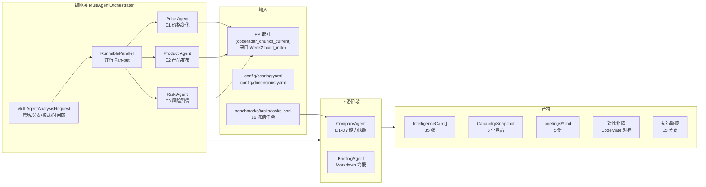

# Week3 运行全流程：LangChain Multi-Agent 情报分析层

> 面向想理解「CodeRadar 的 Week3 如何端到端运行」的读者（验收老师 / 新接手同学 / 自己）。
>
> 本文以 main 分支实际代码为准，覆盖 **第三周（Week3）** 的全部代码文件、运行流程与核心逻辑。
> 前置阅读：`docs/项目运行全流程-Week2-4输入输出.md` 的 Week2 部分。

---

## 目录

1. [Week3 一句话职责与三周衔接](#1-week3-一句话职责与三周衔接)
2. [核心架构总览](#2-核心架构总览)
3. [三大专家 Agent：Price / Product / Risk](#3-三大专家-agent)
4. [多 Agent 编排器 MultiAgentOrchestrator](#4-多-agent-编排器)
5. [能力快照构建 CompareAgent](#5-能力快照构建)
6. [Markdown 简报生成 BriefingAgent](#6-简报生成)
7. [维度标签 DimensionTaggingAgent](#7-维度标签)
8. [基准测评 BenchmarkAgent](#8-基准测评)
9. [三种 Agent 模式：rules / hybrid / llm](#9-三种-agent-模式)
10. [离线基线生成与验收](#10-离线基线生成与验收)
11. [完整运行指南](#11-完整运行指南)
12. [关键配置参考](#12-关键配置参考)

---

## 1. Week3 一句话职责与三周衔接

| 周 | 一句话职责 | 核心产出 |
|---|---|---|
| 上游（Week1-2 采集） | 从竞品官网、GitHub、RSS 等采集公开数据，清洗成结构化文档 | `data/cleaned/documents.jsonl`（867 行 StructuredDocument） |
| **Week2（Mini-RAG）** | 把文档切 Chunk、构建 ES 索引，提供带引用证据的混合检索 | ES 版本化索引 + `RAGResponse`（evidence / conflicts / retrieval_trace） |
| **Week3（本期）** | 用 **LangChain Multi-Agent** 把检索证据加工成情报卡片、能力快照、Markdown 简报和基准对比 | `IntelligenceCard` / `CapabilitySnapshot` / 简报 / 对比矩阵 / benchmark CSV |
| Week4 | 把 Week3 产物落 SQLite、异步化 Worker、收口正式 API、前端展示 | SQLite 库 / FastAPI / Vue 3 / docker-compose |

**关键衔接点**：Week3 不直接读 `documents.jsonl`，它读的是 **Week2 已建成并可供查询的 ES 索引**——`MiniRAGService`（`mini_rag/api/rag_service.py`）。每个 Agent 内部的 `StructuredTool` 在 LCEL 链中实时调 `MiniRAGService.query()` 获取证据。

---

## 2. 核心架构总览



### 2.1 核心文件一览

| 文件 | 行数 | 职责 |
|---|---|---|
| `agents/base.py` | ~560 | 证据驱动 Agent 基类 `EvidenceBackedAgent`——LCEL pipeline、证据守卫、事件聚类、情报卡片构建 |
| `agents/price_agent.py` | 43 | Price Agent——价格/商业化配置 |
| `agents/product_agent.py` | 44 | Product Agent——产品/技术配置 |
| `agents/risk_agent.py` | 44 | Risk Agent——风险/舆情配置 |
| `agents/orchestrator.py` | ~480 | 多 Agent 编排器 `MultiAgentOrchestrator`——并行 fan-out、容错、缓存、重试 |
| `agents/compare_agent.py` | ~1140 | 能力快照构建 + 跨产品对比矩阵（D1-D7 评分核心） |
| `agents/briefing_agent.py` | ~530 | Markdown 简报生成（LCEL 流水线） |
| `agents/dimension_tagging_agent.py` | ~320 | E1-E3 + D1-D7 混合规则/LLM 标签器 |
| `agents/benchmark_agent.py` | ~480 | 基准任务加载、手工运行 CSV 导入与对比 |
| `agents/llm.py` | ~310 | LangChain LLM 适配器——DeepSeek `with_structured_output`、模式管理 |
| `agents/callbacks.py` | ~190 | 真实 `BaseCallbackHandler`——追踪链/工具/模型各阶段耗时与 token 用量 |
| `agents/lcel.py` | 60 | LCEL 原语封装——`runnable_lambda` / `structured_tool` |
| `schemas/orchestration.py` | ~260 | 编排请求/结果契约——`MultiAgentAnalysisRequest` / `MultiAgentAnalysisResult` |
| `schemas/intelligence_card.py` | ~477 | 情报卡片全套模型——`IntelligenceCard` / `EvidenceReference` / `PriorityBreakdown` |
| `schemas/capability_snapshot.py` | ~250 | 能力快照模型——`CapabilitySnapshot` / `CapabilityScore` / `EvidenceContribution` |
| `schemas/comparison.py` | ~300 | 对比矩阵模型——`CapabilityComparisonMatrix` / `CapabilityMatrixRow` |
| `config/scoring.yaml` | 33 | 评分版本 `week3-evidence-v2`：证据/基准权重、证据等级权重、新鲜度衰减 |
| `config/dimensions.yaml` | 130 | D1-D7 关键词规则，中英双语 |
| `prompts/` | 7 文件 | 各 Agent 的 Prompt 模板（详见 12.2 节） |
| `scripts/generate_week3_baseline.py` | ~610 | 离线基线生成——遍历 5 竞品跑完整编排器，写 `artifacts/week3/` |
| `scripts/generate_week3_comparison.py` | ~430 | 读取基线快照，调用 `CompareAgent.compare_snapshots` 生成对比矩阵 |
| `scripts/verify_week3_delivery.py` | ~1220 | 一键验收——检查 LangChain 组件、16 任务、基线产物一致性 |

### 2.2 数据流：一张卡片的生命周期

```
MultiAgentAnalysisRequest
  └─(1) _prepare_query
      └─RAGQuery(competitor=cursor, event_types=[PRICING_CHANGE], top_k=8)
  └─(2) _retrieve_evidence  [StructuredTool -> MiniRAGService.query()]
      └─RAGResponse(query_id, evidence[8], conflicts[], retrieval_trace)
  └─(3) _compose_result
      ├─ CitationValidator 校验证据白名单
      ├─ 事件聚类 (document_id + version_id 分组)
      ├─ 计算置信度、优先级 (35/25/20/20 公式)
      ├─ _build_card → IntelligenceCard (规则版)
      ├─ 可选 LLM 润色 → LLMCardDraft → 证据守卫校验 → 合并
      └─ AgentRunResult(cards=IntelligenceCard[], warnings, trace)
  └─(4) 编排器汇总三分支 cards
  └─(5) CompareAgent.build_snapshot → CapabilitySnapshot
  └─(6) BriefingAgent.generate → Markdown 简报
```

---

## 3. 三大专家 Agent

### 3.1 Agent 基类 `EvidenceBackedAgent`

文件：`agents/base.py` L78

三个专家 Agent（Price / Product / Risk）共享基类 `EvidenceBackedAgent`。每个 Agent 是一条**真实 LangChain LCEL 链**：

```python
self.pipeline = (
    runnable_lambda(self._prepare_query, name="price_prepare")           # 步骤1
    | runnable_lambda(self._retrieve_evidence, name="price_rag_tool")    # 步骤2
    | runnable_lambda(self._compose_result, name="price_guard_and_structure")  # 步骤3
).with_config({"tags": ["week3", "price", "evidence-backed"]})
```

#### 步骤 1：`_prepare_query`（base.py L176-195）

- 接收 `AgentAnalysisRequest`
- 构造 `RAGQuery`：竞品、事件类型（与 Agent 绑定）、D1-D7 维度过滤、产品版本、时间窗、`top_k`
- 如果没有明确时间范围，只查 `current_only=True` 的文档版本

#### 步骤 2：`_retrieve_evidence`（base.py L197-204）

- 通过 `StructuredTool` 包装的 `self._query_rag` 调 `MiniRAGService.query()`
- 带 2 次指数退避重试（`ConnectionError` / `TimeoutError`）
- 返回完整的 `RAGResponse`（8 条 evidence 默认）

#### 步骤 3：`_compose_result`——证据守卫（base.py L206-294）

这是 Week3 **最核心的安全约束**，按顺序做 6 件事：

**① 证据引用校验（base.py L211-221）**

```python
references = [EvidenceReference.from_evidence(item) for item in response.evidence]
validation = CitationValidator().validate(
    references, response,
    allowed_chunk_ids=[item.chunk_id for item in response.evidence],
    require_quote=True,
)
```
- 只允许引用本次检索返回的 `chunk_id`
- 强制要求证据必须有原文引用（`require_quote=True`）
- 检查冲突（同一字段不同值）、版本一致性

**② 事件聚类（base.py L374-389）**

按 `(document_id, version_id)` 元组分组——同一个文档版本的多条 chunk 聚为一簇。这是 Week3 中"一张情报卡片对应一次事件"的基本粒度。

**③ 置信度计算（base.py L391-397）**

```
confidence = 0.24 + avg(evidence_level_weights) * 0.55 + volume_bonus(min(chunk_count,5)*0.045)
```
- 证据等级权重：A=1.0, B=0.82, C=0.62, D=0.36
- volume_bonus 最多 5 条 chunk × 0.045 = 0.225
- 最终 cap 0.95；无证据时 return 0.12

**④ 优先级公式（base.py L399-433）**

```python
score = 35 * event_impact + 25 * urgency + 20 * evidence_confidence + 20 * product_relevance
```
- `event_impact`：Agent 预设（Price=0.66, Product=0.68, Risk=0.68）
- `urgency`：按最新证据距今天数——≤30 天=0.95, ≤120 天=0.72, 否则 0.45
- `product_relevance`：维度和 Agent 关注维度的重叠程度

**⑤ 规则版卡片构建 `_build_card`（base.py L442-524）**

代码控制以下**不允许模型修改**的字段：
- `card_id`——按竞争+事件+证据哈希生成
- `evidence`——证据对象，模型只读
- `priority_score` 和 `priority_breakdown`
- `alert_level`（由优先级分数映射为 blue/yellow/orange/red）
- `agent_kind`、`event_type`、`analysis_mode`

**⑥ 可选 LLM 润色（base.py L251-268）**

仅 `hybrid`/`llm` 模式有效（详见[第 9 节](#9-三种-agent-模式)）：
- 模型只能输出 `LLMCardDraft`（`agents/llm.py L58-77`）——含 event_title、summary、findings、impact_details 等散文字段
- 模型引用的 `evidence_chunk_ids` 必须在白名单内，越界即报错
- 模型失败时 `hybrid` 模式回退到规则版并记 warning；`llm` 模式直接抛异常

### 3.2 三种 Agent 的配置差异

每个 Agent 通过 `AgentConfig` 数据类（`base.py L40-53`）定义差异化配置：

| 配置项 | Price Agent | Product Agent | Risk Agent |
|---|---|---|---|
| `kind` | `PRICE` | `PRODUCT` | `RISK` |
| `event_type` | `PRICING_CHANGE` | `PRODUCT_RELEASE` | `RISK_EXPERIENCE` |
| `prompt_file` | `price_prompt.md` | `product_prompt.md` | `risk_prompt.md` |
| `default_question` | 价格/套餐/额度变化 | 产品/技术发布更新 | 开发者体验/风险事件 |
| `dimension_focus` | D5+D4+D6+D7 | D1+D2+D3+D4 | D2+D5+D6+D7 |
| `base_impact` | 0.66 | 0.68 | 0.68 |
| `event_label` | 商业化与价格变化 | 产品与技术更新 | 舆情与体验风险 |

### 3.3 Agent `run()` 方法的执行入口（base.py L132-162）

```python
def run(self, request: AgentAnalysisRequest | dict[str, Any]) -> AgentRunResult:
    parsed = AgentAnalysisRequest.model_validate(request)
    callback = AgentTraceCallback()
    result = self.pipeline.invoke(
        {"request": parsed, "trace_callback": callback},
        config={"callbacks": [callback], "metadata": {...}},
    )
    trace = callback.finish(agent_kind=self.config.kind, ...)
    return AgentRunResult({**result, "trace": trace})
```

三个关键点：
1. 每个 `run()` 调用创建独立的 `AgentTraceCallback`，跟踪链执行的各阶段
2. 配置中的 `callbacks` 是真实的 LangChain 回调机制，记录所有 chain/tool/llm 事件
3. 返回的 `AgentRunResult` 包含 `trace`（`AgentExecutionTrace`，`agents/callbacks.py L170-189`），记录了各阶段耗时、llm_used、fallback_used、token 用量

---

## 4. 多 Agent 编排器

### 4.1 `MultiAgentOrchestrator`（`agents/orchestrator.py L53`）

编排器是 Week3 的**顶层入口**，职责：
- 接收 `MultiAgentAnalysisRequest`
- 按 `branches` 字段并行调用 1–3 个专家 Agent
- 聚合卡片结果
- 依次触发下游阶段（Compare → Briefing）
- 缓存相同请求

### 4.2 并行 Fan-out（orchestrator.py L198-209）

```python
def _selected_pipeline(self, branches) -> RunnableParallel:
    return RunnableParallel({
        branch.value: self._branch_runnables[branch.value]
        for branch in branches
    })
```

三个分支通过 `RunnableParallel` **并发执行**。每个分支跑自己的 `RunnableLambda`（`_run_branch`），单分支异常被捕获为 `BranchError`，不阻塞其他分支：

```python
def _run_branch(self, branch, request, *, observer=None) -> BranchOutcome:
    try:
        result = self._agents[branch].run(branch_request)
        return BranchOutcome(branch=branch, status=SUCCESS, result=result, ...)
    except Exception as exc:
        return BranchOutcome(branch=branch, status=FAILED, error=structured_error(exc))
```

### 4.3 `_execute()` 完整流程（orchestrator.py L296-456）

```
1. 准备：分离 reusable_outcomes（用于重试）
2. 并行执行 active_branches  → 原始 outcomes
   └─ 基础设施异常时，所有 active 分支标记 FAILED
3. 汇总成功分支的 cards → 去重（按 card_id）
4. 可选：加载 benchmark 数据（BenchmarkAgent.load_tasks/load_runs）
5. 可选：CompareAgent.build_snapshot（如 include_snapshot=True 且至少一个分支成功）
6. 可选：BriefingAgent.generate（如 include_briefing=True 且 snapshot 成功）
7. 确定最终状态：
   └─ 0 分支成功 → FAILED
   └─ 有分支失败或下游失败 → PARTIAL_FAILURE
   └─ 全部成功 → SUCCESS
```

### 4.4 缓存与去重（orchestrator.py L115-183）

```python
self._cache_max_entries = 128  # LRU 缓存
self._cache: OrderedDict[str, MultiAgentAnalysisResult] = OrderedDict()
self._inflight: dict[str, threading.Event] = {}
```

- `stable_workflow_id` 由「correlation_id + 请求 JSON 指纹」哈希派生（`schemas/orchestration.py L55-59`）
- 相同 `stable_workflow_id` 的请求命中缓存直接返回（`model_copy(deep=True)`）
- `_inflight` 机制确保**相同请求的并发调用不会重复执行**（threading.Event 等待）

### 4.5 `run_attempt()`——Week4 Worker 的重试路径（orchestrator.py L268-294）

```python
def run_attempt(self, request, *, reusable_outcomes=None, observer=None):
    # reusable_outcomes: 已成功的分支，不再重新执行
    reusable = {branch: outcome for branch, outcome in ... if status == SUCCESS}
    return self._execute(parsed, reusable_outcomes=reusable, observer=observer)
```

这个方法是 Week4 异步 Worker 重试的**复用点**——重试时可以只补跑失败的分支，已成功的分支结果直接复用。

---

## 5. 能力快照构建

### 5.1 `CompareAgent`（`agents/compare_agent.py L98`）

负责：
1. **`build_snapshot()`**：根据情报卡片 + benchmark 数据，对单个竞品生成 D1-D7 七维能力快照
2. **`compare_snapshots()`**：消费多个竞品快照，生成跨产品对比矩阵

### 5.2 评分配置 `scoring.yaml`

```yaml
version: week3-evidence-v2
neutral_baseline: 50.0          # 中性基线分
direction_points_per_magnitude: 4.0  # 每级方向偏移 4 分
evidence_share: 0.60            # 证据分占比
benchmark_share: 0.40           # 基准分占比

evidence_level_weights:          # 证据等级权重
  A: 1.00  B: 0.82  C: 0.62  D: 0.36

freshness:                       # 新鲜度衰减
  - max_days: 30   weight: 1.00   # 30 天内
  - max_days: 90   weight: 0.85   # 90 天内
  - max_days: 180  weight: 0.65   # 180 天内
  - max_days: null weight: 0.45   # 更久
```

### 5.3 单维度评分公式（compare_agent.py L847-938）

```
证据分 = clamp(50.0 + signed_magnitude * 4.0, 0, 100)
基准分 = avg(benchmark_run_scores)  # 各 benchmark 贡献的加权分
最终分 = (证据分 * 0.60 + 基准分 * 0.40) / min(1.0, 权重和)

置信度 = min(0.98, 加权平均置信度)
```

当某维度**既无证据也无 benchmark** 时，状态标记为 `INSUFFICIENT_EVIDENCE`，不给推测分。

### 5.4 证据贡献计算（compare_agent.py L940-991）

从卡片中提取与维度匹配的 `CapabilityImpact`，按 `chunk_id` 去重，每个证据贡献带三个权重：
- `authority_weight`：证据等级权重
- `freshness_weight`：按时间衰减
- `confidence_weight`：卡片置信度

### 5.5 跨产品对比矩阵（compare_agent.py L205-288）

```python
matrix = CompareAgent().compare_snapshots(current_snapshots, baseline_product="CodeMate Campus")
```

- 以 CodeMate Campus 为基线
- 每行一个 D1-D7 维度，每列一个竞品
- 计算每个单元格的 `gap_to_baseline`（与基线的差距）和 `delta_from_previous`（与上期的变化）
- 分析最快增长维度、差距趋势、行业标配（Table Stakes）

---

## 6. 简报生成

### 6.1 `BriefingAgent`（`agents/briefing_agent.py L61`）

LCEL 流水线：

```python
self.pipeline = (
    RunnableLambda(self._prepare, name="briefing_prepare")           # 校验/过滤卡片
    | RunnableLambda(self._build_sections, name="briefing_sections") # 构建 9 个变量
    | self.prompt_template                                           # LangChain PromptTemplate
    | RunnableLambda(_prompt_value_to_text)                          # 渲染 Markdown
    | RunnableLambda(lambda value: value.strip())
)
```

### 6.2 模板变量（`prompts/briefing_prompt.md`）

| 变量 | 内容来源 | 示例 |
|---|---|---|
| `{competitor}` | 竞品名 | Cursor |
| `{briefing_meta}` | 快照日期/窗口/评分版本 | 快照日期 2026-07-20；... |
| `{executive_summary}` | 卡片数、证据数、复核项数、最高优先级动态 | 纳入 8 张情报卡片... |
| `{latest_changes}` | 按优先级降序排列的情报卡片详情 | 1. Cursor 商业化与价格变化... |
| `{capability_observations}` | 各卡片的 impact_analysis 去重 | - Cursor 产品与技术更新... |
| `{risk_signals}` | 风险等级 + 置信度 + 冲突 | 风险等级 medium；置信度 0.72 |
| `{capability_snapshot}` | D1-D7 得分表格 | 见下文 |
| `{evidence_index}` | 全部证据的引用表 | chunk_id \| 标题 \| URL \| 等级 |
| `{review_items}` | 低置信度/无证据/冲突/快照不足的复核项 | Cursor... 置信度 0.34 低于 0.55 |

### 6.3 安全约束

- 简报模板本身是 **LangChain PromptTemplate**，**只渲染结构化字段**，不包含证据原文
- 证据原文不进入简报正文，只有 `chunk_id`、URL、证据等级等元数据进入证据索引表
- 低置信度、冲突、无证据、不安全 URL 全部进入复核项，不隐蔽

---

## 7. 维度标签

### 7.1 `DimensionTaggingAgent`（`agents/dimension_tagging_agent.py L57`）

对单条内容（title + content）打 E1-E3 事件标签和 D1-D7 能力标签。支持两种策略：

- **纯规则**：通过 `RuleLabeler`（`processing/labeling.py`）按 `config/dimensions.yaml` 的关键词匹配
- **混合（hybrid）**：规则 + DeepSeek `with_structured_output` 独立判断 → 共识/并集合并

### 7.2 合并策略（dimension_tagging_agent.py L215-320）

| 策略 | 行为 |
|---|---|
| `CONSENSUS` | 只保留规则和 LLM 都同意的标签 |
| `UNION`（默认） | 取规则和 LLM 的并集 |

规则和 LLM 分歧时：
- 分歧详情写入 `disagreements` 字段
- 置信度降低（取低值 × 0.8）
- `needs_review` 标记为 `True`

### 7.3 作为独立 CLI（`scripts/tag_dimensions.py`）

```powershell
# 单条打标
python -m scripts.tag_dimensions single --mode rules --source-type changelog --title "Agent update" --content "新增项目级 Agent"

# 批量打标
python -m scripts.tag_dimensions batch --mode rules --input input.jsonl --output tagged.jsonl
```

---

## 8. 基准测评

### 8.1 冻结任务协议

`benchmarks/tasks/tasks.jsonl` 包含 16 个 `week3-frozen-v2` 冻结任务，涵盖：

- **6 种编程语言**：Python / Java / C / C++ / FastAPI / 概念解释
- **4 种任务类型**：`coding` / `refactoring` / `explanation` / `security_audit`
- **所有 D1-D7 维度**至少有一个对应任务

每个任务包含 `task_fingerprint`、`validator_sha256`、`protocol_sha256`、`starter_sha256` 四个指纹，确保任务资产不可篡改。

### 8.2 `BenchmarkAgent`（`agents/benchmark_agent.py L41`）

```python
class BenchmarkAgent:
    def load_tasks(self) -> list[BenchmarkTask]   # 从 tasks.jsonl 加载
    def load_runs(self) -> list[BenchmarkRun]     # 从 manual_runs.csv 加载
    def import_csv(self, path) -> BenchmarkImportSummary  # 导入手工运行结果
    def compare(self, ...) -> list[BenchmarkComparisonRow] # 跨产品对比
```

### 8.3 运行器（`benchmarks/validators/run_task.py`）

shell-free 统一执行器，**不是 OS 级安全沙箱**：

```powershell
python -m benchmarks.validators.run_task --audit                    # 审计 16 任务资产
python -m benchmarks.validators.run_task --task-id bench_001         # 跑带缺陷的 starter
python -m benchmarks.validators.run_task --task-id bench_001 --candidate C:\path\to\candidate  # 跑候选实现
```

**公平性要求**：正式比较前必须确保 5 个 SHA-256 指纹一致（task_fingerprint / validator / protocol / starter / candidate）。不可信候选必须在一次性、禁网、最小权限容器/VM 中运行。

---

## 9. 三种 Agent 模式

由环境变量 `CODERADAR_AGENT_MODE` 控制，或通过 `LLMSettings.from_env()` 加载（`agents/llm.py L92-108`）。

| 模式 | 环境变量值 | LLM 调用 | 密钥要求 | 回退行为 | 典型用途 |
|---|---|---|---|---|---|
| `rules`（默认） | `rules` | 不构造 `LangChainLLMClient` | 不需要 | 纯确定性规则 | 开发/测试/基线生成/演示 |
| `hybrid`（推荐在线） | `hybrid` | DeepSeek `with_structured_output` 润色 | 需 `DEEPSEEK_API_KEY` | 模型失败自动回退规则，记 warning | 常规分析场景 |
| `llm`（严格） | `llm` | 同上 | 需 `DEEPSEEK_API_KEY` | 不回退，直接报错 | 要求必须 LLM 输出的场景 |

**安全设计**（`agents/llm.py L192-201`）：
- `rules` 模式下 `from_env()` 返回 `None`——Agent 全程离线，不调任何远程模型
- 显式选 `llm`/`hybrid` 但缺 `DEEPSEEK_API_KEY` 会立即 `raise ValueError`，不会静默回退到 rules 模式而把离线结果误记为在线分析
- 模型的 `analysis_mode` 跟随最终卡片记录（`base.py L352`：`"analysis_mode": self.llm_client.analysis_mode`）

---

## 10. 离线基线生成与验收

### 10.1 `generate_week3_baseline.py`——一键五家基线

```powershell
$env:CODERADAR_AGENT_MODE = 'rules'
python -m scripts.generate_week3_baseline --mode rules --top-k 8 --as-of 2026-07-20 --window-days 90
```

**内部流程**（L358-534）：

```
1. 读取 config/competitors.yaml → [cursor, github_copilot, trae, tongyi_lingma, codegeex]
2. 计算分析时间窗（start_time ~ end_time）
3. 计算三个输入文件的 SHA-256（tasks.jsonl / scoring.yaml / documents.jsonl）
4. 创建 MiniRAGService → 健康检查（确认 ES 已就绪）
5. 创建 MultiAgentOrchestrator（auto_configure_llm = mode in {llm, hybrid}）
6. 逐一处理 5 个竞品：
   a. MultiAgentOrchestrator.run(request) — 完整执行
   b. 校验结果（FAILED 直接抛异常，PARTIAL_FAILURE 且 !allow_partial 则抛异常）
   c. 要求 snapshot 和 briefing 均存在
7. 汇总 5 个结果 → cards + snapshots + trace_summaries
8. 原子写入 artifacts/week3/：
   ├─ manifest.json          # 清单（含输入 SHA-256，最后写入作为完成标记）
   ├─ intelligence_cards.json  # 35 张卡片
   ├─ capability_snapshots.json # 5 个快照
   ├─ workflow_summary.json    # 汇总信息
   ├─ trace_summaries.json    # 15 分支脱敏 trace
   └─ briefings/*.md         # 5 份简报
```

**manifest.json 的完整性保证**（L516-533）：
- 写入前先删除旧的 manifest（`_invalidate_commit_marker`）
- 其他产物全部写入后，**最后写入 manifest**——如果中途中断，manifest 丢失，验收会检测到不完整

### 10.2 `generate_week3_comparison.py`——对标矩阵

```powershell
python -m scripts.generate_week3_comparison
```

从 `capability_snapshots.json` 读取 5 个竞品快照 → `CompareAgent.compare_snapshots` → 输出 `artifacts/week3/comparison/` 三个文件：
- `comparison_matrix.json`：D1-D7 对标矩阵（含 gap、delta、fastest_growth、table_stakes）
- `codemate_baseline_snapshot.json`：CodeMate Campus 基线快照（当前为 0 覆盖率的 `insufficient_evidence` 占位）
- `comparison_provenance.json`：生成元信息（`official_ranking_ready=false`——因无真实 CodeMate 快照）

### 10.3 `verify_week3_delivery.py`——一键验收

```powershell
python -m scripts.verify_week3_delivery                          # 离线验收
python -m scripts.verify_week3_delivery --live-llm                # 含最小在线探针
```

验收 5 项检查（L1104-1175）：

| 检查项 | 检查内容 |
|---|---|
| `environment` | Python 版本、conda 环境 |
| `langchain_and_agents` | 8 个 Agent 类可构造、4 份核心 Prompt 可读、每个 Agent 使用真实 LCEL |
| `benchmark_assets` | 16 个任务全部存在、audit 通过 |
| `formal_manual_runs` | `manual_runs.csv` 严格格式、不含 sample_run ID |
| `week3_artifacts` | manifest 输入 SHA-256 一致、卡片/快照/workflow/trace 数量匹配、证据链可追溯、简报内容完整、对比矩阵自洽 |

---

## 11. 完整运行指南

### 11.1 前置条件

```powershell
# 1. 激活环境
conda activate CodeRadar
python --version                    # 应为 3.11.9

# 2. 安装依赖
python -m pip install -r requirement.txt
python -m pip check

# 3. 确保 Week2 ES 索引已就绪
docker compose up -d elasticsearch
python -m scripts.build_index                     # 默认 hash 模式
# 或：python -m scripts.build_index --config config\mini_rag.formal.yaml  # BGE-M3

# 4. 验证索引状态
python .\rag_query.py "Cursor agent 能力" --competitor Cursor --top-k 3
```

### 11.2 从头到尾运行 Week3

```powershell
# 步骤 1：设置为 rules 模式（离线可复现）
$env:CODERADAR_AGENT_MODE = 'rules'

# 步骤 2：生成五家基线
python -m scripts.generate_week3_baseline --mode rules --top-k 8 --as-of 2026-07-20 --window-days 90

# 步骤 3：生成对标矩阵
python -m scripts.generate_week3_comparison

# 步骤 4：一键验收
python -m scripts.verify_week3_delivery

# 步骤 5：（可选）单条维度打标测试
python -m scripts.tag_dimensions single --mode rules --source-type changelog --title "Agent update" --content "新增项目级 Agent"

# 步骤 6：（可选）Benchmark 审计
python -m benchmarks.validators.run_task --audit
```

### 11.3 在线模式（hybrid）

```powershell
# 配置 DeepSeek
# 编辑 .env 文件或直接设置环境变量：
$env:DEEPSEEK_API_KEY = 'sk-your-key-here'
$env:CODERADAR_AGENT_MODE = 'hybrid'

# 重新生成基线（会调 DeepSeek）
python -m scripts.generate_week3_baseline --mode hybrid --top-k 8 --as-of 2026-07-20 --window-days 90
```

### 11.4 启动 HTTP 服务

```powershell
# 终端 1：API 服务
$env:CODERADAR_AGENT_MODE = 'rules'
python -m uvicorn backend.main:app --host 127.0.0.1 --port 8000

# 终端 2：异步 Worker（如需 Week4 工作流）
python -m scripts.run_workflow_worker
```

然后可通过 HTTP 调 Week3 的 Agent 接口：
```powershell
# 单 Agent 分析
curl -X POST http://127.0.0.1:8000/api/agent/price -H "Content-Type: application/json" -d '{"competitor": "cursor", "top_k": 8}'

# 查看卡片
curl http://127.0.0.1:8000/api/agent/cards?competitor=cursor
```

### 11.5 产物检查

| 路径 | 内容 | 预期量 |
|---|---|---|
| `artifacts/week3/manifest.json` | 清单与输入 SHA-256 | 1 |
| `artifacts/week3/intelligence_cards.json` | 情报卡片数组 | 35（5 竞品 × ~7 张平均） |
| `artifacts/week3/capability_snapshots.json` | 能力快照数组 | 5 |
| `artifacts/week3/workflow_summary.json` | 5 个工作流摘要 | 5 |
| `artifacts/week3/trace_summaries.json` | 15 分支执行轨迹 | 15（3 分支 × 5 竞品） |
| `artifacts/week3/briefings/*.md` | 5 份 Markdown 简报 | 5 |
| `artifacts/week3/comparison/comparison_matrix.json` | 跨产品对标矩阵 | 1 |
| `artifacts/week3/acceptance_report.json` | 验收报告 | 1 |

---

## 12. 关键配置参考

### 12.1 环境变量

| 变量 | 默认值 | 说明 |
|---|---|---|
| `CODERADAR_AGENT_MODE` | `rules` | Agent 运行模式：`rules` / `hybrid` / `llm` |
| `DEEPSEEK_API_KEY` | （无） | DeepSeek API 密钥，`hybrid`/`llm` 模式必须 |
| `DEEPSEEK_BASE_URL` | `https://api.deepseek.com` | DeepSeek 端点 |
| `DEEPSEEK_MODEL` | `deepseek-chat` | 模型名 |
| `CODERADAR_LLM_TIMEOUT_SECONDS` | `45` | LLM 请求超时 |
| `CODERADAR_LLM_MAX_TOKENS` | `1600` | LLM 输出上限 |
| `CODERADAR_LLM_MAX_RETRIES` | `2` | LLM 重试次数 |
| `CODERADAR_LLM_PROVIDER` | `deepseek` | LLM 供应商 |

### 12.2 Prompt 文件速查

| 文件 | 用途 | 关键约束 |
|---|---|---|
| `prompts/price_prompt.md` | Price Agent 分析价格/套餐/额度 | 证据不可信、不能创造价格/版本/引用 |
| `prompts/product_prompt.md` | Product Agent 分析产品/技术发布 | 不能把营销承诺写成已验证能力 |
| `prompts/risk_prompt.md` | Risk Agent 分析开发者体验/风险 | 区分主动体验与被动体验 |
| `prompts/compare_prompt.md` | CompareAgent 快照聚合规则 | （较短，主要是规则说明） |
| `prompts/briefing_prompt.md` | 简报 Markdown 模板 | 只渲染结构化字段，证据原文不进正文 |
| `prompts/dimension_tagging_prompt.md` | 维度标签 | JSON 示例 + E1-E3/D1-D7 标签定义 |
| `prompts/benchmark_prompt.md` | Benchmark Agent | 任务类型与评分规则 |

### 12.3 重要数据模型

| 模型 | 文件 | 关键字段 |
|---|---|---|
| `AgentAnalysisRequest` | `schemas/intelligence_card.py:208` | competitor, event_type, dimension_tags, top_k, start_time, end_time |
| `MultiAgentAnalysisRequest` | `schemas/orchestration.py:62` | 继承上者 + branches, include_snapshot, include_briefing, analysis_mode |
| `IntelligenceCard` | `schemas/intelligence_card.py:263` | agent_kind, event_type, evidence, findings, impact_details, priority_score |
| `EvidenceReference` | `schemas/intelligence_card.py:109` | chunk_id, document_id, version_id, url, quote, evidence_level |
| `CapabilitySnapshot` | `schemas/capability_snapshot.py:115` | competitor, details[7], total_score, coverage_ratio, overall_confidence |
| `CapabilityComparisonMatrix` | `schemas/comparison.py:267` | rows[7], products[N], fastest_growth, gap_trends, table_stakes |
| `BranchOutcome` | `schemas/orchestration.py:178` | branch, status, duration_ms, result/error |
| `MultiAgentAnalysisResult` | `schemas/orchestration.py:204` | workflow_id, status, cards[], snapshot, briefing |
| `AgentExecutionTrace` | `agents/callbacks.py:170` | trace_id, duration_ms, events[], llm_used, token 统计 |

### 12.4 快速调试命令

```powershell
# 检查 Mini-RAG 是否就绪
python -c "from mini_rag.api import create_service; svc=create_service(); print(svc.health())"

# 测试单 Agent
python -c "
import os; os.environ['CODERADAR_AGENT_MODE']='rules'
from agents import PriceAgent; from mini_rag.api import create_service
agent = PriceAgent(create_service())
result = agent.run({'competitor':'cursor','top_k':3})
print(f'cards: {len(result.cards)}, warnings: {result.warnings}')
"

# 测试编排器
python -c "
import os; os.environ['CODERADAR_AGENT_MODE']='rules'
from agents.orchestrator import MultiAgentOrchestrator
from mini_rag.api import create_service
orch = MultiAgentOrchestrator(create_service())
result = orch.run({'competitor':'cursor','include_snapshot':False,'include_briefing':False,'use_cache':False})
print(f'status={result.status}, cards={len(result.cards)}')
"
```

---

## 附录 A：关键设计决策

| 决策 | 选择 | 理由 |
|---|---|---|
| Agent 基类设计 | 单继承 + LCEL pipeline | 三个 Agent 共享一致的安全校验和证据守卫，避免重复 |
| 证据守卫 | 代码层完全校验，模型只能写散文 | 防止模型编造引用或写越权字段 |
| 卡片 ID | 按证据内容哈希派生 | 幂等——相同证据产生相同 ID |
| 优先级公式 | 35/25/20/20 固定，代码计算 | 透明、可审计，模型无权修改 |
| 对比矩阵基线 | CodeMate Campus 加零覆盖占位 | 不创造推测性排名（`official_ranking_ready=false`） |
| rules 模式设计 | `from_env()` 返回 `None`，不走任何网络 | 可复现、无密钥也能完整跑通 |

## 附录 B：常见问题排查

| 问题 | 原因 | 解决 |
|---|---|---|
| `Mini-RAG is not ready` | ES 索引未建或别名未切换 | 先 `python -m scripts.build_index` |
| `DEEPSEEK_API_KEY is required` | 选择了 `hybrid`/`llm` 模式但未配密钥 | 设 `$env:CODERADAR_AGENT_MODE='rules'` 或配 `.env` |
| `all specialist branches failed` | 竞品在 ES 索引中没有匹配数据 | 检查 `scripts.audit_documents` 和索引状态 |
| manifest 校验失败 | 基线产物不完整或输入文件已变化 | 重新 `generate_week3_baseline` |
| `card_id` 冲突 | 不常见，发生在极相似的事件上 | 编排器自动去重（按 card_id 取 dict） |
| 能力快照全是 `insufficient_evidence` | 卡片证据不足或无 benchmark 数据 | 检查是否需要扩大 `--top-k` 或 `--window-days` |

---

> **文档版本**：v1.0（以 main 分支合并提交 `9022095` 后的代码为准）
> **编写日期**：2026-07-23
