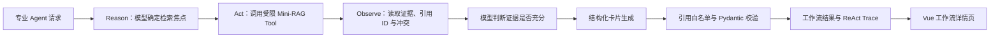

# CodeRadar 打分要求检查与 ReAct 实现说明

> 检查日期：2026-07-27  
> 评分依据：用户提供的《智能体实训项目开发答辩现场打分表》截图  
> 启动依据：`docs/Week4-启动文档-正式版.md`

## 1. 结论

评分表中的 **ReAct** 是智能体的“推理（Reason）—行动（Act）—观察
（Observe）”工作模式，不是前端框架 **React.js**。

项目原有前端是 Vue 3 + Vite，已经能够完成页面展示和前后端交互，因此没有
必要为了这一评分项把 Vue 重写为 React.js。原有后端虽然已经使用 LangChain、
RAG Tool、结构化输出和 Multi-Agent，但检索步骤是固定编排，不能充分证明模型
执行过 ReAct 工具循环。

本次已经加入真正的 LangChain 工具调用式 ReAct 检索：

1. 在线 `hybrid` 或 `llm` 模式下，模型先确定当前专业 Agent 的检索焦点；
2. 模型主动调用受限的 Mini-RAG 工具；
3. 模型读取 Tool Observation 后结束 ReAct 检索；
4. 项目继续使用原有结构化输出、引用白名单和卡片校验；
5. 执行轨迹记录 `react_used`、`react_iterations` 和
   `tool_call_count`；
6. 工作流详情页能够直接展示 ReAct 是否执行、执行轮数和工具调用数。

`rules` 模式仍保持完全离线，不调用远程模型，因此其 `react_used=false` 是
预期行为，不是故障。

## 2. ReAct 的作用

ReAct 让大模型不只是一次性生成文字，而是能够根据任务选择工具、读取真实
结果后再继续分析。对 CodeRadar 的直接价值如下：

- **检索更聚焦**：价格、产品、风险 Agent 可以分别生成适合自己的检索问题；
- **结论更可追溯**：轨迹中能看到模型调用过哪个工具以及调用次数；
- **降低直接幻觉风险**：模型必须先取得 RAG 观察结果，再生成分析；
- **保留工程安全边界**：竞品、事件、维度、版本和时间过滤条件仍由代码控制，
  模型只能改变检索焦点，不能擅自扩大证据范围；
- **便于答辩演示**：前端高级运行详情可以直接展示 ReAct 执行状态。

## 3. 当前执行链路

### 三种模式

| 模式 | ReAct 行为 | 异常处理 |
|---|---|---|
| `rules` | 不调用模型，直接执行确定性 RAG Tool | 完全离线 |
| `hybrid` | 执行 ReAct；如果模型未调用工具或在线调用失败，则回退到确定性 RAG | 保留卡片并写入 fallback warning |
| `llm` | 严格执行 ReAct | ReAct 或 DeepSeek 失败时任务失败，不静默回退 |

## 4. 实现证据

| 文件 | 作用 |
|---|---|
| `agents/react_agent.py` | 使用 `langchain.agents.create_agent` 建立有界 ReAct 工具循环 |
| `agents/base.py` | 将在线专业 Agent 接入 ReAct，并保留 hybrid/llm 的既有容错语义 |
| `agents/llm.py` | 保存工具调用模型并提供 `retrieve_with_react` |
| `agents/callbacks.py` | 采集模型、工具和 ReAct 迭代指标 |
| `schemas/intelligence_card.py` | 在 Agent Trace 中定义 ReAct 与工具调用字段 |
| `schemas/workflow.py` | 将 ReAct 指标加入工作流分支响应 |
| `backend/workflow_repository.py` | 从持久化分支结果读取并返回 ReAct 指标 |
| `frontend/src/views/AnalysisResultView.vue` | 在高级运行详情中展示 ReAct 状态 |
| `tests/test_week3_langchain_core.py` | 验证工具循环、hybrid 回退和 llm 严格失败 |

安全边界：ReAct Tool 只接收 `search_focus`。竞品、事件类型、能力维度、产品
版本、时间窗口、是否只查当前版本和 `top_k` 均来自已校验的
`RAGQuery`，模型无法通过 Tool 参数覆盖。

## 5. 本次验证结果

验证使用 Conda 环境 `CodeRadar`
（本机解释器：`D:\Miniconda\envs\CodeRadar\python.exe`）。

| 验证项 | 结果 |
|---|---|
| ReAct/LLM 专项测试 | 18 项通过 |
| Agent、API、异步工作流重点回归 | 32 项通过 |
| 后端完整离线回归 | 466 项通过，1 项 network 测试按标记跳过 |
| 前端 Vitest | 14 个测试文件、56 项测试通过 |
| 前端类型检查和生产构建 | 通过，Vite 成功构建 2281 个模块 |
| Python 编译检查 | 通过 |
| Git whitespace 检查 | 通过 |

专项测试和重点回归包含在 466 项完整后端回归中，不能重复相加。

本次没有消耗真实 DeepSeek API，也没有重新下载 BGE-M3/Cross-Encoder 模型，
因此最终答辩前仍需按正式启动文档完成一次 **Elasticsearch + BGE-M3 +
DeepSeek** 的在线验收，并保存页面截图或录屏。

## 6. 逐项评分检查

下表是代码与仓库材料的工程就绪度判断，不代替现场评委最终给分。

| 评分项 | 分值 | 当前判断 | 已有证据 | 仍需注意 |
|---|---:|---|---|---|
| 需求分析 | 10 | 基本符合 | `docs/AI编程助手.md`、阶段验收和运行流程包含目标、功能和计划 | 最终需求—功能—接口—演示用例尚未汇总成一张验收矩阵 |
| 架构设计 | 10 | 符合 | 采集、清洗、Mini-RAG、Agent、FastAPI、Worker、SQLite、Vue 分层明确，已有架构文档 | 答辩 PPT 仍需一张简化总架构图 |
| 目录配置 | 5 | 符合 | README 目录树、`.env.example`、YAML profile、Docker Compose、Alembic 齐全 | 正式演示前检查 `.env` 不含无效密钥和本机绝对路径 |
| ReAct | 10 | 已实现，待在线演示 | `create_agent`、受限 RAG Tool、ReAct Trace、三类专业 Agent 接入、自动测试 | 必须用 `hybrid/llm` 模式演示；`rules` 模式不会出现 ReAct |
| FastAPI 接口/其它 | 15 | 符合 | 认证、RAG、Ask、Agent、Benchmark、正式查询、异步 Workflow 等路由，含 OpenAPI、限流、审计 | 在线演示前确认数据库迁移、Worker 和认证状态 |
| 可选模块 | 20 | 较强 | RAG；Pydantic + `with_structured_output` 结构化输出；`create_agent` 底层 LangGraph 状态图 | 没有 Memory；若评分细则要求四项分别计分，需先向老师确认。现代结构化输出未直接使用名为 `OutputParser` 的旧类，答辩时需说明 |
| Vibe 合理性 | 3 | 基本符合 | Vue 3、Element Plus、D3、统一视觉样式和多轮 UI 测试 | 属于主观现场评分，需要准备关键页面截图和清晰演示路径 |
| 功能实现 | 10 | 符合度高 | 登录、首页、AI 随问、证据检索、深度分析、报告、能力图表、管理导入等页面 | 仍应按正式环境逐页走查，不只依赖组件测试 |
| 前后端联调 | 7 | 符合 | Axios service、Cookie 会话、工作流提交/轮询/取消/重试、RAG/Ask/管理 API；56 项前端测试通过 | 缺少 Playwright/Cypress 浏览器级 E2E |
| 代码规范 | 3 | 符合度高 | Pydantic 严格模型、服务/仓储分层、错误处理、466 项离线测试 | 未配置 Ruff/Black；应避免在交付包中携带缓存和真实 `.env` |
| 材料完整性 | 3 | **目前不完全符合** | README、API、启动、部署、测试和阶段交付文档较多 | 没有实际 PPT/PPTX；三个文档是空文件；测试报告需补充本次结果；部分阶段文档存在过时描述 |
| 答辩表现 | 4 | 无法从代码判定 | 系统具备可演示链路 | 需要准备讲稿、时间分配、常见问题、失败兜底和演示视频 |
| 进阶加分 | +5 上限 | 有潜力 | BGE-M3 + Cross-Encoder、异步可重试工作流、认证限流审计、Benchmark、证据冲突与溯源 | 需要在 PPT 中明确列为“进阶能力”，否则现场可能无法被识别 |

## 7. 尚不符合或有失分风险的事项

### P0：答辩前必须处理

1. **缺少真实结项 PPT/PPTX**
   - `docs/AI编程助手.md` 中写了“结项汇报 PPT”，但仓库没有实际
     `.ppt` 或 `.pptx` 文件。
   - 建议至少包含：需求、架构、ReAct、RAG、FastAPI、前端功能、
     测试结果、演示步骤、创新点和总结。

2. **三个交付文档是空文件**
   - `docs/用户使用手册.md`
   - `docs/能力评分规则.md`
   - `docs/AI编程助手监控维度设计.md`
   - 空文件会直接影响“材料完整性”和现场可信度，应补写或从交付目录移除。

3. **缺少真实在线 ReAct 验收证据**
   - 按正式启动文档运行 `llm` 或 `hybrid` 模式；
   - 提交一次三分支 Workflow；
   - 在前端高级运行详情确认三个成功分支显示“ReAct 已执行”；
   - 保存工作流页面、Markdown 报告和引用证据截图。

4. **需要刷新最终测试报告**
   - 记录当前后端 466 项离线测试和前端 56 项测试；
   - 单独说明 1 项 network 测试为什么跳过；
   - 增加正式环境 `/health`、`/ready`、Ask、Workflow 和前端逐页验收结果。

### P1：明显加固项

1. **缺少浏览器级 E2E**
   - 当前有 FastAPI TestClient 和 Vue 组件测试，但没有
     Playwright/Cypress；
   - 至少补一条“登录 → 提交分析 → 轮询 → 打开报告”的 E2E。

2. **前端主包体积较大**
   - 本次构建的主 JS chunk 约 1,071 kB（gzip 约 357 kB），Vite 给出
     大于 500 kB 警告；
   - 可将 Element Plus、D3 和报告页进一步按路由拆包。

3. **文档存在阶段性过时描述**
   - 例如早期交付文档仍可能描述“无持久化、无鉴权”等旧限制，而 Week4
     已有 SQLite、认证、限流和异步 Worker；
   - 建议把早期文档标为“历史阶段快照”，并指定一个唯一的最终交付入口。

4. **答辩材料未形成闭环**
   - 需要 5～8 分钟演示脚本、常见问题清单、网络/API 失败时的录屏兜底；
   - 建议准备一次 `rules` 离线演示和一次 `llm` 正式录屏。

### P2：根据老师评分口径决定

1. 如果“可选模块 20 分”要求多模块分别计分，可再考虑加入会话 Memory；
   当前业务是一次性竞品分析，Memory 不是必要设计，不能只为堆技术而加入。
2. 如果评委机械检查 `OutputParser` 类名，可增加一个独立的
   `PydanticOutputParser` 示例；当前 `with_structured_output(PydanticModel)`
   已经承担同类且更严格的结构化解析职责。
3. 可以增加覆盖率报告、依赖安全扫描和正式部署监控截图，争取进阶分。

## 8. 最终演示建议

1. 按 `docs/Week4-启动文档-正式版.md` 启动 Elasticsearch、API、Worker 和前端；
2. 使用 `hybrid` 先完成稳定演示，再用 `llm` 展示严格模式；
3. 在深度分析页选择三个专业分支并提交；
4. 展示高级运行详情中的 ReAct、工具调用和 Trace；
5. 打开 Markdown 简报，点击至少一条引用回到证据；
6. 展示能力图表和竞品对比；
7. 最后用测试报告和架构图说明工程质量与进阶能力。

答辩时应明确说：**前端采用 Vue 3；评分表中的 ReAct 是后端智能体模式，
两者不是同一个技术。**
