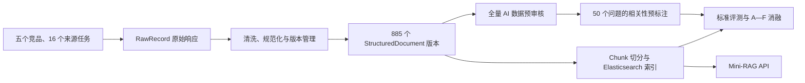

# CodeRadar 第二周主体测试报告

- 测试基准日期：2026-07-18
- 测试范围：多源数据采集、数据清洗与结构化、全量 AI 预审核、Mini-RAG 检索、应用程序编程接口（Application Programming Interface，API）
- 机器测试结论：通过
- 人工验收状态：`pending`

## 1. 测试结论

CodeRadar 第二周主体完成了五个竞品的多源采集、清洗与结构化、版本管理、全量人工智能（Artificial Intelligence，AI）数据预审核、相关性预标注、Mini 检索增强生成（Retrieval-Augmented Generation，Mini-RAG）索引和检索实验。

机器测试满足以下条件：

1. 16 个来源任务完成采集，共生成 696 条原始记录，失败数为 0；
2. 结构化语料包含 885 个文档版本，其中 881 个当前版本、4 个历史版本；
3. 885 个版本全部完成 AI 数据预审核，`FAIL` 为 0；
4. 正式索引写入 2,688 个 Chunk，写入失败数为 0；
5. 50 个评测问题与正式索引的一致性校验为 `valid=true`；
6. 标准检索评测和三次 A—F 消融的查询成功率均为 1.0000；
7. 32 个测试模块的离线测试结果为 214 项通过、1 项网络测试按标记跳过；
8. 环境检查 8 项通过，依赖检查无冲突；
9. 本地 API 为 `ready`，Elasticsearch 集群为 `green`，运行索引包含 2,688 个 Chunk。

人工验收仍需处理 268 个 `NEEDS_REVIEW` 文档版本、617 个 `PASS` 版本中的分层抽样、50 个问题的相关性确认、4 个历史版本以及敏感信息候选。机器检查通过不代表人工验收完成。

## 2. 测试对象与数据流

测试覆盖从外部来源到运行 API 的完整链路。下图展示各阶段及其主要验证点。



该流程同时验证数据可追溯性、结构化正确性、标签一致性、索引完整性、检索质量和服务可用性。每个结构化版本保留 `raw_record_id` 与 `raw_path`，检索评测文件记录语料、数据集、配置和物理索引标识。

## 3. 测试环境

| 项目 | 测试值 |
|---|---|
| 操作系统 | Windows 10.0.26200，64 位 |
| Python | 3.11.9 |
| 虚拟环境 | `D:\26Spring\project\CodeRadar\.venv` |
| CPU | Intel Core Ultra 7 155H，16 核、22 逻辑处理器 |
| 内存 | 31.5 GiB |
| PyTorch | 2.13.0+cpu |
| Sentence Transformers | 5.6.0 |
| Docker Server | 29.2.1 |
| Elasticsearch | 9.4.1，单节点 |
| 正式 Embedding | `sentence-transformers/BAAI/bge-m3`，1,024 维 |
| 正式 Reranker | `cross-encoder/mmarco-mMiniLMv2-L12-H384-v1` |
| 计算设备 | CPU，CUDA 不可用 |

## 4. 测试矩阵

| 编号 | 测试层级 | 测试对象 | 方法 | 结果 |
|---|---|---|---|---|
| T01 | 环境 | Python、虚拟环境、依赖、配置、数据目录、GitHub Token | `scripts.data_pipeline doctor` | 8 通过，0 警告，0 错误 |
| T02 | 依赖 | Python 包兼容性 | `pip check` | 无依赖冲突 |
| T03 | 真实采集 | 五个竞品、16 个来源任务 | 365 天范围强制采集 | 696 成功，0 失败 |
| T04 | 数据处理 | RawRecord 到 StructuredDocument | `process --rebuild` | 扫描 1,435，处理 1,390，跳过 45 |
| T05 | 版本结果 | 当前与历史版本 | `scripts.audit_documents` | 885 总版本，881 当前，4 历史 |
| T06 | 全量预审核 | Schema、哈希、原始链路、标签、噪声、敏感候选 | `scripts.ai_precheck_documents` | 617 `PASS`，268 `NEEDS_REVIEW`，0 `FAIL` |
| T07 | 相关性预审核 | 50 个问题的 BM25、Dense、Hybrid 候选 | `scripts.ai_review_relevance` | 948 候选对，460 正例 |
| T08 | 正式索引 | BGE-M3 Chunk 索引 | `scripts.build_index --config ...formal.yaml` | 2,688 写入，0 失败 |
| T09 | 静态校验 | 评测集、语料和正式索引 | `scripts.validate_evaluation_set` | `valid=true`，330 个去重相关 Chunk |
| T10 | 标准效果 | 完整 Mini-RAG 检索 | `scripts.evaluate_rag` | 50/50 查询成功 |
| T11 | 消融实验 | A—F 六组检索组合 | 三次重复实验 | 18 个组运行全部成功 |
| T12 | 自动化回归 | 32 个测试模块 | `pytest -m "not network" -q` | 214 通过，1 跳过，3 警告 |
| T13 | 服务健康 | API、Embedding 兼容性、Elasticsearch | `GET /ready` | ready、兼容、green、2,688 Chunk |
| T14 | API 冒烟 | 竞品过滤和证据返回 | Cursor 查询 | 返回 8 条 Cursor 证据，警告 0 |

## 5. 采集、清洗与结构化测试

### 5.1 真实采集结果

采集运行标识为 `20260717T031124Z_6bad9f7c`。16 个来源任务分别执行并落盘，合计 696 条成功记录、0 条未变化记录、0 条失败记录。

| 竞品 | 官网 | Changelog | Pricing | GitHub Release/Issue | 合计 |
|---|---:|---:|---:|---:|---:|
| Cursor | 1 | 68 | 1 | 未启用 | 70 |
| GitHub Copilot | 1 | 58 | 1 | 385 | 445 |
| Trae | 1 | 1 | 1 | 100 | 103 |
| 通义灵码 | 1 | 8 | 1 | 未启用 | 10 |
| CodeGeeX | 1 | 未独立配置 | 未启用 | 67 | 68 |
| **合计** | **5** | **135** | **4** | **552** | **696** |

采集结果表明五个竞品均产生数据，通义灵码 Changelog 产生 8 条记录。单个来源失败隔离、状态码、响应类型、缓存头、Payload 路径和散列值由 RawRecord Meta 保存。

### 5.2 处理和版本结果

结构化重建扫描 1,435 条原始记录，处理 1,390 条，生成 1,775 个候选版本，跳过 45 条；去重和版本合并后形成 885 个文档版本。结构化语料 SHA-256 为 `9780973870c4c8adade2d70b724767f342e0a46924206c6b5531d71c5cd083b0`。

| 检查项 | 结果 |
|---|---:|
| 总版本 | 885 |
| 当前版本 | 881 |
| 历史版本 | 4 |
| 中文版本 | 310 |
| 英文版本 | 575 |
| 发布时间缺失 | 7 |
| 产品版本缺失 | 322 |
| `needs_review=true` | 203 |

处理链路的离线测试覆盖 HTML 正文清洗、Unicode 与空白规范化、URL 规范化、Schema 校验、内容哈希、重复运行、内容变化、当前版本切换和有效时间区间。

## 6. 全量 AI 数据预审核测试

审核运行 `20260717-full-885-v2` 生成 885 条审核明细和 268 条人工复核队列。文档输入 SHA-256 与结构化语料一致，审核 `FAIL` 为 0。

| 决策 | 数量 | 状态解释 |
|---|---:|---|
| `PASS` | 617 | 机器规则未发现需要升级的问题 |
| `NEEDS_REVIEW` | 268 | 至少命中一项需人工上下文判断的规则 |
| `FAIL` | 0 | 未出现阻断性结构或链路错误 |

主要发现包括：无 D1—D7 能力标签 202 条、正文过短 132 条、长数字候选 19 条、邮箱候选 16 条、重复行 12 条、本机用户路径 2 条、需要浏览器渲染 1 条和电话候选 1 条。同一版本可以命中多个发现，发现计数不等于文档数量。

## 7. 相关性与检索效果测试

### 7.1 相关性预标注

50 个问题从 BM25、Dense 和 Hybrid 三组各合并 Top 20 候选，并补入种子 Chunk。本地 Cross-Encoder、词项覆盖、预期引文和召回一致性共同生成 0—3 级 AI 标签。

| 等级 | 候选对数 |
|---|---:|
| 0 | 488 |
| 1 | 332 |
| 2 | 69 |
| 3 | 59 |
| **合计** | **948** |

1—3 级正例共 460 个“问题—Chunk”对，跨问题去重后为 330 个 Chunk。评测集 SHA-256 为 `5bdff42353ad91912e75930ef9478dd663aed19f6c5704bfb9af762b79a7ce43`。`ai_review_status=complete`，`human_review_status=pending`。

### 7.2 正式索引校验

正式物理索引 `coderadar_chunks_v20260717032357564091` 使用 BGE-M3 1,024 维向量，写入 2,688 个 Chunk，失败数为 0。静态校验检查 50 个问题和 330 个去重相关 Chunk，结果为 `valid=true`、错误列表为空。

### 7.3 标准检索结果

| 指标 | 结果 |
|---|---:|
| Recall@5 | 0.685576 |
| Recall@10 | 0.826473 |
| 平均倒数排名（Mean Reciprocal Rank，MRR） | 1.000000 |
| 归一化折损累计增益（Normalized Discounted Cumulative Gain，NDCG@10） | 0.938511 |
| 引用准确率 | 0.940000 |
| 元数据过滤准确率 | 1.000000 |
| 历史版本误召回率 | 0.000000 |
| 查询成功率 | 1.000000 |
| 平均延迟 | 3,215.95 ms |
| 第 95 百分位延迟 | 5,421.44 ms |

三个引用失败问题为 `copilot_issue_custom_models`、`trae_code_folding` 和 `codegeex_rider_2026`。运行错误数为 0。详细案例诊断、指标定义和数据上限分析见 [Mini-RAG 检索评测报告](./Mini-RAG检索评测报告.md)。

### 7.4 A—F 三次重复实验

三次重复实验中，六组质量指标保持一致，查询成功率均为 1.0000。下表报告三次质量均值和第 95 百分位（P95）延迟的“均值 ± 样本标准差”。

| 组别 | 检索组合 | Recall@10 | MRR | NDCG@10 | P95 延迟 ms |
|---|---|---:|---:|---:|---:|
| A | BM25 | 0.707819 | 0.871667 | 0.699291 | 70.18 ± 25.38 |
| B | Dense | 0.756984 | 0.946667 | 0.854142 | 588.89 ± 147.18 |
| C | BM25 + Dense + 倒数排名融合 | 0.789490 | 0.950000 | 0.853616 | 587.98 ± 213.60 |
| D | C + Cross-Encoder | 0.827902 | 1.000000 | 0.937392 | 4,483.44 ± 770.79 |
| E | D + 时间/版本排序 | 0.826473 | 1.000000 | 0.938511 | 5,032.46 ± 958.95 |
| F | E + 证据排序 | 0.826473 | 1.000000 | 0.938511 | 4,815.88 ± 843.94 |

质量图与延迟图分别展示六组质量差异和本地 CPU 推理波动。图前述表格给出精确值，图后结论以同机、同索引、同模型和同候选窗口为适用条件。


质量图显示 Cross-Encoder 提供主要排序增益；时间、版本和证据排序在当前 50 个问题上的质量差异小于 0.002。


延迟图显示 Cross-Encoder 将 P95 延迟提高至秒级。该结果用于本机配置比较，不代表 GPU 或并发服务环境。

## 8. 自动化测试结果

离线测试命令为：

```powershell
.\.venv\Scripts\python.exe -m pytest -m "not network" -q
```

执行结果为：

```text
214 passed, 1 deselected, 3 warnings in 16.41s
```

32 个测试模块覆盖以下范围：

- Schema、配置和命令行接口；
- HTTP 200、304、429、超时、分页和缓存行为；
- 官网、Changelog、Pricing、GitHub Release 与 Issue Fixture；
- 阿里云 Changelog 目录与详情页适配；
- 清洗、规范化、标签、版本和端到端处理；
- 全量审核规则和敏感候选正则；
- Chunk 切分、索引别名和文档加载；
- BM25、Dense、RRF、重排、业务排序和证据回读；
- 评测集准备、AI 相关性预审核、静态校验和 A—F 汇总；
- API、查询轨迹和引用校验；
- SVG 图表生成及误差条标签布局。

三条警告来自 feedparser 对 `updated_parsed` 到 `published_parsed` 临时兼容映射的弃用提示。警告未导致测试失败。网络 Smoke Test 使用 `network` 标记，与离线回归分离，本次未执行该项。

## 9. 服务健康与 API 冒烟测试

本地运行别名 `coderadar_chunks_current` 当前指向 Hash Embedding 索引 `coderadar_chunks_v20260717053141962952`。`GET /ready` 返回以下关键状态：

| 字段 | 结果 |
|---|---|
| API 状态 | `ready` |
| 物理索引 | `coderadar_chunks_v20260717053141962952` |
| 索引 Chunk | 2,688 |
| Embedding | `hash-embedding/coderadar-v1`，1,024 维 |
| Embedding 兼容 | `true` |
| Elasticsearch | `green`，无未分配主分片 |

API 冒烟查询使用问题“Cursor 最近有哪些 Agent 能力更新”、竞品过滤 `Cursor` 和 `top_k=8`。服务返回 8 条证据，证据竞品均为 Cursor，冲突数为 0，警告数为 0。该测试验证 API 可用性、索引兼容性、过滤和证据返回，不替代 50 个问题的正式 BGE-M3 效果评测。

## 10. 已知限制与人工验收

### 10.1 相关性标签

当前 460 个正例由 AI 预审核产生，其中 332 个为弱相关。19 个问题的正例数量超过 10，导致 Recall@10 受 Top 10 容量限制。人工需要检查所有 50 个问题、正例标签和 Top-N 中的 0 级漏标候选，并由第二位复核者对至少 20% 问题进行盲审。

### 10.2 数据审核

268 个 `NEEDS_REVIEW` 版本需要逐条给出人工结论。617 个 `PASS` 版本至少分层抽查 50 个，覆盖五个竞品和实际来源类型。202 个 `NO_DIMENSION_LABEL` 版本、4 个历史版本以及敏感信息候选按人工验收清单执行专项检查。

### 10.3 历史与冲突

当前版本过滤的历史版本误召回率为 0。评测集仍需增加历史版本作为正确答案的案例。冲突准确率需要价格、版本时间或能力状态等经人工确认的冲突事实集合。

### 10.4 性能边界

正式实验在 CPU 单机、单节点 Elasticsearch 和本地模型缓存环境执行。Cross-Encoder 的 P95 延迟存在 770.79—958.95 ms 样本标准差。GPU、并发和网络部署性能需要独立测试。

人工操作步骤和留证格式见 [项目人工验收清单](../../docs/check.md)。AI 全量预审证据见 [AI 全量预核验证据](../../docs/acceptance-evidence/ai-precheck-20260717-full-885-v2/AI全量预核验证据.md)。

## 11. 可复现命令

```powershell
Set-Location D:\26Spring\project\CodeRadar

# 环境与依赖
.\.venv\Scripts\python.exe -m scripts.data_pipeline doctor
.\.venv\Scripts\python.exe -m pip check

# 离线测试
.\.venv\Scripts\python.exe -m pytest -m "not network" -q

# 语料统计
.\.venv\Scripts\python.exe -m scripts.audit_documents

# 核对已保存的正式索引静态校验证据
$Validation = Get-Content .\data\runtime\evaluation_set_validation.json -Raw |
  ConvertFrom-Json
$Validation | Select-Object `
  valid,case_count,checked_chunk_count,physical_index,indexed_chunk_count

# 本地服务状态
docker compose up -d --wait
curl.exe -sS http://localhost:8000/ready
```

当前运行别名指向 Hash Embedding 索引。重新执行正式静态校验前，需要停止 API 并构建 BGE-M3 正式索引。采集、处理、AI 预审核、正式索引、相关性预审核、静态校验和三次实验的完整顺序见 [Mini-RAG 检索评测报告](./Mini-RAG检索评测报告.md#6-可复现实验命令)。

## 12. 总体验收状态

机器测试结论为通过。数据、索引、评测和服务产物具备可复现命令与可核验哈希，自动化回归无失败。

人工验收状态为 `pending`。人工完成数据复核、相关性定级、历史与冲突样本确认后，应固化评测集并重新运行静态校验、标准评测和三次 A—F 消融，形成最终人工金标准结果。
