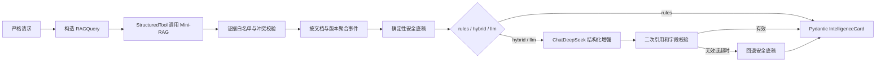

# CodeRadar 第三周完成内容

## 1. 结论

第三周“Prompt、Agent 与对标分析”已完成，并已在 Conda 环境 `CodeRadar`（Python 3.11.9）中形成可直接交付的领域核心。最终闭环为：

```text
Mini-RAG 证据
  → LangChain Price / Product / Risk 并行分析
  → 事件级 IntelligenceCard
  → D1—D7 CapabilitySnapshot
  → 跨产品 CapabilityComparisonMatrix
  → Markdown Briefing + 脱敏 Trace + 验收报告
```

本次只完成第三周范围。数据库、任务队列、完整 API、前端、部署和浏览器 E2E 仍属于第四周。

最终实测：

- 第三周专项：`99 passed`；
- 全项目离线回归：`308 passed, 1 deselected`；
- 一键离线交付验收：`5/5 passed, 0 warning`；
- 显式 DeepSeek 最小结构化调用：`6/6 passed`；
- 16 个 Benchmark 资产审计：`ready`；
- 16 个原始 starter：全部按设计因目标缺陷返回失败，没有语法、导入、收集或工具缺失错误。

## 2. 需求逐项完成情况

| `docs/AI编程助手.md` 第三周任务 | 完成情况 | 交付位置 |
|---|---|---|
| Price Prompt | 已完成，含输入、证据边界、输出契约和降级规则 | `prompts/price_prompt.md` |
| Product Intelligence Prompt | 已完成 | `prompts/product_prompt.md` |
| Sentiment & Risk Prompt | 已完成 | `prompts/risk_prompt.md` |
| 能力标签 Prompt | 已完成；另补 Compare、Benchmark、Briefing Prompt | `prompts/` |
| Pydantic 结构化输出 | 已完成严格请求、卡片、标签、快照、矩阵、工作流和基准契约 | `schemas/` |
| Multi-Agent 协作 | 已完成并行、故障隔离、缓存、稳定 ID、结构化错误和 Trace | `agents/orchestrator.py` |
| 竞品情报卡片 | 已完成事件级拆卡、引用守卫、优先级、机会/威胁与复核标记 | `schemas/intelligence_card.py`、`agents/base.py` |
| 首版能力快照 | 已完成 D1—D7 证据/基准融合、N/A、置信度、贡献明细和窗口 | `agents/compare_agent.py` |
| 12—20 个基准任务 | 已完成 16 个任务、16 个 starter、验证器、量表和 mutation set | `benchmarks/` |
| 手工测试结果导入 | 已完成严格 CSV、逐行隔离、幂等去重、原子写和比较 | `agents/benchmark_agent.py` |

额外完成了第三周范围内的 Briefing、跨产品能力矩阵、基线制品、脱敏 Trace、Dimension CLI、统一 Benchmark runner 和一键交付验收。

## 3. LangChain 实现

项目直接使用：

- `langchain 1.3.14`；
- `langchain-core 1.4.9`；
- `langchain-deepseek 1.1.0`；
- `ChatDeepSeek`、LCEL `Runnable` / `RunnableParallel`、`StructuredTool`；
- `with_structured_output(PydanticModel, method="json_mode")`。

Price、Product、Risk 共用 `EvidenceBackedAgent`，处理链为：



`MultiAgentOrchestrator` 使用真实 `RunnableParallel` 并行执行三个专业分支。单分支失败不会丢弃其他分支结果；工作流明确区分 `success`、`partial_failure`、`failed`，并保存分支耗时、RAG 查询 ID、卡片 ID、模型/回退状态和脱敏 Trace。

模式语义已收紧：

- `rules` 不访问模型，适合可重复基线；
- `hybrid` / `llm` 必须有有效 `DEEPSEEK_API_KEY`，缺 Key 会立即失败，不会把离线结果伪装成在线结果；
- 模型不能生成证据对象、卡片 ID、优先级公式或越过本次检索的 Chunk 白名单；
- 远程输出失败时保留规则底稿并写入 warning/trace。

## 4. 情报卡片与证据安全

情报卡片按 `(document_id, version_id)` 聚合：同一事件的多个 Chunk 合为一张卡，不同文档或版本分别出卡；每个分支默认最多 5 张，防止单次分析无界膨胀。

主要约束：

- 卡片竞品必须与每条证据竞品一致；
- 证据有事件类型时必须与卡片事件一致；
- 每条事实、推断和能力影响只能引用卡片内真实 `chunk_id`；
- 每张卡独立计算标签、置信度、优先级、发现和影响；
- 冲突只附着到包含相关 Chunk 的卡片；
- 无证据时只产生一张低置信降级卡，`review_required=true`，不会伪造引用；
- 检索内容始终被当作不可信数据，Prompt Injection 文本不会被执行。

优先级由代码固定计算：事件影响 35%、紧急程度 25%、证据置信度 20%、产品相关性 20%。

## 5. 能力快照与跨产品矩阵

`CompareAgent` 有两条真实 LCEL 管线：

1. `build_snapshot()`：根据证据与正式 Benchmark Run 生成 D1—D7 快照；
2. `compare_snapshots()`：生成包含 CodeMate Campus 基线的 D1—D7 跨产品矩阵。

快照能力：

- 评分版本冻结为 `week3-evidence-v2`；
- 证据分/基准分按配置的 60%/40% 融合；
- 保存证据等级、时效、置信度、正负方向及每项贡献；
- 无输入的维度输出 `insufficient_evidence`，分数在矩阵中显示 N/A；
- 快照始终保存产品版本范围，未知时显式写 `unknown`，不再使用含义模糊的 null；
- 基线生成时保存 90 天 `window_start/window_end`，快照日期取窗口截止日。

矩阵能力：

- 强制当前/历史快照使用同一 `scoring_version`；
- 基线默认 `CodeMate Campus`，缺少基线时直接校验失败；
- D1—D7 每个单元都有状态、分数/N/A、置信度、证据数和相对基线差；
- 覆盖不足时禁止排名，不用少量证据制造“冠军”；
- 可计算增长最快产品、竞争最激烈维度、差距扩大/缩小/稳定；
- “行业标配”只由显式阈值和最少有效产品数推断，规则和输入分数均写入结果；
- 代码中没有硬编码产品排名。

当前没有正式 CodeMate Campus 能力实测。因此 `artifacts/week3/comparison/` 中的 CodeMate 快照为 0 覆盖、全 N/A 的证据不足基线，`official_ranking_ready=false`。这是防止伪造内部产品分数的有意设计，不是程序缺陷。

## 6. Benchmark 完成情况

16 个任务覆盖 8 类场景，每类 2 个：completion、compile_fix、test_fix、multi_file_change、refactor、explanation、test_generation、security_review。

每个任务具备：

- 冻结的 `TASK.md` 和 starter；
- `validator.json` 1.1.0；
- `week3-frozen-v2` 协议与 SHA-256 任务指纹；
- 验证器、协议、starter 与候选目录 SHA-256 来源链；
- 统一成功标准、公平性约束、超时和无 Shell 命令数组；
- Python/C/C++/Java 自包含检查；
- 解释任务的 10 分量表、A/B 双盲模板和分歧合并规则；
- 测试生成任务的固定缺陷变体与 mutation 门槛；
- 安全任务的 CWE、攻击载荷与报告检查。

统一入口：

```powershell
python -m benchmarks.validators.run_task --audit
python -m benchmarks.validators.run_task --task-id bench_001
python -m benchmarks.validators.run_task --task-id bench_001 --candidate C:\path\candidate
```

Runner 永远使用参数数组与 `shell=False`，不会执行拼接 Shell 字符串。它会在一次性 staged copy 中恢复冻结资产、移除候选启动钩子、最小化环境，并要求退出码之外的完成证明。原始 starter 本来就应失败；候选修复后才应通过。上述防护不是 OS 沙箱，不可信候选仍须在受限容器/VM 中执行。

正式结果文件 `benchmarks/results/manual_runs.csv` 当前只有严格表头、0 条正式运行。Run 必须携带任务修订/指纹、验证器/协议/starter/candidate 哈希；导入和比较都会拒绝旧协议或混合协议。三条失败 starter 的格式演示位于 `sample_runs.csv`，明确禁止进入正式评分。

## 7. 可执行入口

### 7.1 Dimension 标签

```powershell
python -m scripts.tag_dimensions single `
  --mode rules --source-type changelog `
  --title 'Agent update' --content '新增项目级 Agent 与终端工具'

python -m scripts.tag_dimensions batch `
  --mode rules --input input.jsonl --output tagged.jsonl
```

JSONL 批处理采用全批成功后原子替换；错误包含行号并保留旧输出。

### 7.2 冻结基线

```powershell
python -m scripts.generate_week3_baseline `
  --mode rules --top-k 8 --as-of 2026-07-20 --window-days 90
```

### 7.3 跨产品矩阵

```powershell
python -m scripts.generate_week3_comparison
```

### 7.4 一键验收

```powershell
python -m scripts.verify_week3_delivery

# 显式允许一次最小真实模型调用；不会写 Key/完整 Prompt：
python -m scripts.verify_week3_delivery --live-llm `
  --output artifacts/week3/live_llm_report.json
```

## 8. 当前冻结制品

`artifacts/week3/` 当前基于实际 Elasticsearch 读取别名 `coderadar_chunks_current` 生成：

| 项目 | 数量/状态 |
|---|---:|
| Mini-RAG Chunk | 2,633 |
| 外部竞品 | 5 |
| 事件级情报卡 | 35 |
| 有证据卡片 | 26 |
| 降级复核卡 | 9 |
| 能力快照 | 5 |
| 专业分支 Trace | 15 |
| Markdown 简报 | 5 |
| Benchmark 任务 | 16 |
| 正式 Benchmark Run | 0 |
| CodeMate 正式排名 | 未就绪，基线覆盖 0% |

冻结窗口为 2026-04-21 23:59:59.999999 UTC 至 2026-07-20 23:59:59.999999 UTC。Manifest 保存任务、评分配置、清洗数据的 SHA-256，可发现交接后的输入漂移。

主要文件：

- `manifest.json`；
- `intelligence_cards.json`；
- `capability_snapshots.json`；
- `workflow_summary.json`；
- `trace_summaries.json`；
- `briefings/*.md`；
- `comparison/*.json`；
- `acceptance_report.json`；
- `live_llm_report.json`。

## 9. 仍需第四周完成的内容

以下没有冒充第三周完成项：

- 卡片、快照、Workflow、Trace 和报告的数据库持久化；
- 异步任务、队列、进度、取消、并发和重试策略；
- Multi-Agent、Dimension、矩阵和历史趋势的正式 API 合同；
- 身份认证、权限、限流、生产密钥与审计日志；
- 前端卡片、证据抽屉、雷达图、矩阵、趋势和 Benchmark 页面；
- Token/费用账本、预算熔断和线上告警；
- 完整容器编排、E2E、压力测试与发布文档；
- CodeMate Campus 的真实能力快照和 16 项正式基准运行。

完整接手资产、运行顺序、非 Git 数据和第四周前置条件见 [交付.md](./交付.md)。
