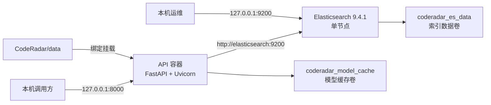

# CodeRadar Mini 检索增强生成服务部署文档

## 1. 部署范围

CodeRadar 使用 Docker Compose 在单机上编排两个服务：FastAPI 应用程序接口（Application Programming Interface，API）服务和 Elasticsearch 检索服务。API 通过 Uvicorn 运行 Mini 检索增强生成（Mini Retrieval-Augmented Generation，Mini-RAG）证据服务，Elasticsearch 保存 Chunk 文本、元数据和稠密向量。

当前 Compose 文件使用 `python:3.11.9-slim` 构建 API 镜像，未声明图形处理器（Graphics Processing Unit，GPU）运行时或设备预留。默认镜像安装 Mini-RAG API 的 CPU 基线依赖，`hash` Embedding Provider 使用确定性特征哈希，无需下载模型权重。`MINIRAG_INSTALL_ML=true` 时，Dockerfile 从 PyTorch CPU 软件源安装 Torch 与 Sentence Transformers；Sentence Transformers Embedding Provider 的服务工厂使用中央处理器（Central Processing Unit，CPU）设备参数。

## 2. 部署拓扑与存储

下图展示宿主机、容器、端口和持久化目录之间的连接关系。



API 和 Elasticsearch 对宿主机的端口均绑定到 `127.0.0.1`。API 容器使用 Compose 内部服务名 `elasticsearch` 访问检索服务。`CodeRadar/data` 绑定挂载后同时承载结构化文档、评测数据和检索轨迹；两个 Docker 命名卷分别保存 Elasticsearch 索引和模型缓存。

## 3. 安全边界

当前 Compose 配置面向可信任的本机开发环境，安全边界由以下事实构成：

- API 端口仅映射为 `127.0.0.1:8000:8000`。
- Elasticsearch 端口仅映射为 `127.0.0.1:9200:9200`。
- Elasticsearch 配置 `xpack.security.enabled=false`，当前实例不执行 Elasticsearch 身份认证。
- FastAPI 路由当前未定义身份认证、授权、速率限制和传输层安全（Transport Layer Security，TLS）终止。
- `.env` 和本地数据目录不进入 API 镜像构建上下文；Compose 在运行时挂载数据目录。

因此，当前配置的网络暴露范围应保持为本机回环地址。面向其他主机提供服务时，部署环境需在 API 之前增加 TLS、身份认证、访问控制和流量限制，并为 Elasticsearch 启用安全机制。这些网络入口组件不在当前 Compose 拓扑中。

## 4. 前置条件

部署前需要准备以下环境和数据：

1. 已启动的 Docker Engine 与可用的 `docker compose` 命令。
2. 当前工作目录为 `D:\26Spring\project\CodeRadar`。Compose 构建上下文为上一级目录，Dockerfile 读取 `CodeRadar/requirements-api.txt` 和 `CodeRadar` 源码。
3. `data/cleaned/documents.jsonl` 存在且每行可通过结构化文档模型校验。
4. Docker 可满足 Elasticsearch 容器的 `2g` 内存上限和 `-Xms1g -Xmx1g` Java 堆配置。
5. 选择 `sentence_transformers` Embedding 或 Cross-Encoder 时，首次推理需要获取所配置的模型权重，权重保存到 `coderadar_model_cache` 卷。

## 5. 配置

### 5.1 配置加载

Mini-RAG 从 `config/mini_rag.yaml` 加载默认配置，并从项目根目录的 `.env` 加载环境变量。环境变量覆盖可执行标量配置。可以先创建本地配置文件：

```powershell
Copy-Item .env.example .env
```

下表列出 Mini-RAG 运行配置环境变量及 Compose 模型依赖构建变量。

| 环境变量 | 配置字段 | 默认值或作用 |
| --- | --- | --- |
| `MINIRAG_CONFIG_PATH` | 配置文件路径 | `config/mini_rag.yaml` |
| `MINIRAG_DOCUMENTS_PATH` | `data.documents_path` | `data/cleaned/documents.jsonl` |
| `MINIRAG_EVALUATION_PATH` | `data.evaluation_path` | `data/samples/测试数据集.csv` |
| `MINIRAG_TRACE_PATH` | `data.trace_path` | `data/runtime/retrieval_traces.jsonl` |
| `MINIRAG_ELASTICSEARCH_URL` | `elasticsearch.url` | 容器内为 `http://elasticsearch:9200` |
| `MINIRAG_INDEX_PREFIX` | `elasticsearch.index_prefix` | `coderadar_chunks` |
| `MINIRAG_READ_ALIAS` | `elasticsearch.read_alias` | `coderadar_chunks_current` |
| `MINIRAG_INSTALL_ML` | Compose 构建参数 `INSTALL_ML` | `false`；设为 `true` 时在 API 镜像中安装 CPU 模型运行依赖 |
| `MINIRAG_EMBEDDING_PROVIDER` | `embedding.provider` | `hash` |
| `MINIRAG_EMBEDDING_MODEL` | `embedding.model` | `BAAI/bge-m3` |
| `MINIRAG_EMBEDDING_DIMENSION` | `embedding.dimension` | `1024`；`hash` Provider 使用该维度 |
| `MINIRAG_MODEL_CACHE_DIR` | `embedding.cache_dir` | 容器内为 `/root/.cache/huggingface` |
| `MINIRAG_RERANKER_PROVIDER` | `reranker.provider` | `lexical` |
| `MINIRAG_RERANKER_MODEL` | `reranker.model` | `BAAI/bge-reranker-v2-m3` |
| `MINIRAG_RERANKER_STRICT` | `reranker.strict` | `false` |

Compose 显式设置容器内文档路径、Elasticsearch 地址、配置路径、轨迹路径和模型缓存路径。调整 `.env` 中的 Provider 及模型变量后，需要重新创建 API 容器以生成新的进程级服务实例。

### 5.2 默认检索参数

`config/mini_rag.yaml` 当前定义以下主要参数：

- 分块目标 1200 字符，最大 1800 字符，重叠 160 字符，最小 80 字符。
- BM25 和稠密向量候选窗口均为 20，倒数排名融合（Reciprocal Rank Fusion，RRF）窗口为 30，重排序窗口为 20，`rrf_k` 为 60。
- 默认 `top_k` 为 8，服务配置上限为 50。
- 综合排序使用语义 0.70、时间 0.12、版本 0.08、证据 0.10 的权重，权重之和必须为 1.0。
- Elasticsearch 物理索引使用 1 个分片和 0 个副本。

## 6. 容器构建与启动

在 `D:\26Spring\project\CodeRadar` 中先校验 Compose 解析结果：

```powershell
docker compose config
```

构建 API 镜像并启动两个服务：

```powershell
docker compose up -d --build
docker compose ps
```

Elasticsearch 健康检查每 10 秒请求一次 `/_cluster/health?wait_for_status=yellow`，单次超时为 5 秒，最多重试 30 次。API 服务通过 `depends_on.condition=service_healthy` 等待 Elasticsearch 达到该健康状态后启动。API 容器在 10 秒启动保护期后，每 30 秒使用 Python 标准库请求一次 `http://localhost:8000/health`，单次健康检查超时为 5 秒，请求内部连接超时为 2 秒，连续失败 3 次后容器标记为不健康。两个服务的重启策略均为 `unless-stopped`。

可通过以下命令读取运行日志：

```powershell
docker compose logs --tail 200 elasticsearch
docker compose logs --tail 200 api
```

## 7. 数据校验与索引构建

### 7.1 校验结构化文档

索引构建前，可在 API 容器内加载文档并输出统计：

```powershell
docker compose exec api python -m scripts.audit_documents
```

脚本使用与索引服务相同的结构化文档加载器，格式或字段校验错误会使进程以非零状态退出。

### 7.2 全量构建

首次启动或 Embedding 索引配置变更后执行全量构建：

```powershell
docker compose exec api python -m scripts.build_index
```

全量构建依次加载文档、分块、生成 Embedding、创建 `coderadar_chunks_v<UTC时间>` 物理索引并批量写入。当 `failed_count=0` 时，索引管理器原子将 `coderadar_chunks_current` 读取别名切换到新物理索引。脚本输出 `documents`、`chunks` 和完整索引报告，报告包含失败项时脚本返回非零退出码。

也可通过 HTTP 请求执行同一全量流程：

```powershell
Invoke-RestMethod `
  -Method Post `
  -Uri http://127.0.0.1:8000/api/rag/rebuild `
  -ContentType 'application/json' `
  -Body '{}'
```

### 7.3 增量同步

当读取别名已指向物理索引时，执行幂等增量同步：

```powershell
docker compose exec api python -m scripts.build_index --incremental
```

内容哈希、文档哈希、Embedding 模型、维度和元数据全部相同的 Chunk 会跳过写入。内容未变但生命周期或证据元数据变更的 Chunk 会更新索引文档并复用已兼容的向量。

需要使当前索引与输入集合完全同步时，显式启用缺失 Chunk 删除：

```powershell
docker compose exec api python -m scripts.build_index `
  --incremental `
  --delete-missing
```

`--delete-missing` 的删除范围为当前物理索引中本次输入未包含的 Chunk。读取别名不存在且 `fail_on_missing_index=true` 时，增量流程终止并提示先执行全量构建。

## 8. 健康与就绪检查

API 实现了两层运行检查：

```powershell
Invoke-RestMethod http://127.0.0.1:8000/health
Invoke-RestMethod http://127.0.0.1:8000/ready
```

`GET /health` 只检查 FastAPI 进程是否能够响应，成功时返回 `{"status":"ok"}`。所有 JSON 响应声明 `Content-Type: application/json; charset=utf-8`。`GET /ready` 调用 Elasticsearch 健康接口，解析读取别名，统计已索引 Chunk，并核对查询端与索引端的 Embedding 模型和向量维度。后端与模型兼容性检查均成功时返回 `status="ready"`、`embedding_compatible=true` 和 HTTP `200`；检查失败时返回 `status="degraded"`、诊断对象和 HTTP `503`。

索引状态诊断接口使用相同的响应对象：

```powershell
Invoke-RestMethod http://127.0.0.1:8000/api/rag/index/status
```

该路由在 Elasticsearch 检查失败时仍使用 HTTP `200` 返回 `status="degraded"`，便于读取 `backend.error`、别名和模型诊断信息。

## 9. 查询验收

就绪检查返回 `ready` 后，可执行带过滤条件的查询：

```powershell
$body = @{
  question = 'Cursor 最近有哪些 Agent 能力更新'
  competitor = 'Cursor'
  top_k = 8
} | ConvertTo-Json

Invoke-RestMethod `
  -Method Post `
  -Uri http://127.0.0.1:8000/api/rag/query `
  -ContentType 'application/json' `
  -Body $body
```

成功响应包含 `query_id`、`parsed_filters`、`evidence`、`conflicts` 和 `retrieval_trace`。`retrieval_trace` 中的 `warnings` 用于显示已配置 Cross-Encoder 未成功运行而使用词项重叠后端的情况。

## 10. 模型配置切换

### 10.1 Embedding Provider

当前实现支持以下 Embedding Provider 名称：

- `hash`、`deterministic-hash`、`offline`：确定性特征哈希。
- `sentence_transformer`、`sentence-transformers`、`st`：Sentence Transformers 模型。

使用 Sentence Transformers 模型时，在 `.env` 中启用模型依赖构建参数并设置 Provider 和模型，然后重新构建并创建 API 容器：

```dotenv
MINIRAG_INSTALL_ML=true
MINIRAG_EMBEDDING_PROVIDER=sentence_transformers
MINIRAG_EMBEDDING_MODEL=BAAI/bge-m3
```

```powershell
docker compose up -d --build --force-recreate api
docker compose exec api python -m scripts.build_index
```

Elasticsearch 索引映射记录 Embedding 模型标识和向量维度。检索向量必须与索引向量使用相同模型和维度，因此 Embedding Provider、Embedding 模型或向量维度变更后必须执行全量构建。全量流程创建新物理索引，完成写入后切换读取别名。

### 10.2 重排序 Provider

`MINIRAG_RERANKER_PROVIDER=lexical` 使用本地词项重叠重排序。设置为 `cross_encoder` 等非 `lexical`/`term_overlap` 值时，服务使用 `MINIRAG_RERANKER_MODEL` 懒加载 Cross-Encoder。

```dotenv
MINIRAG_INSTALL_ML=true
MINIRAG_RERANKER_PROVIDER=cross_encoder
MINIRAG_RERANKER_MODEL=BAAI/bge-reranker-v2-m3
MINIRAG_RERANKER_STRICT=true
```

```powershell
docker compose up -d --build --force-recreate api
```

重排序分数在查询时计算，不写入 Chunk 索引映射，因此单独切换重排序 Provider 或模型时只需重新创建 API 容器。`strict=false` 时，Cross-Encoder 加载或推理异常会使用词项重叠后端并在检索轨迹中生成警告；`strict=true` 时，模型异常会中止该次查询。

## 11. 评测与消融实验

标准评测使用逗号分隔值（Comma-Separated Values，CSV）文件 `data/samples/测试数据集.csv`。该文件需要至少包含一个有效标注用例；用例数量为零时脚本终止。

```powershell
docker compose exec api python -m scripts.evaluate_rag `
  --output data/runtime/mini_rag_evaluation.json
```

脚本将评测 JSON 写入挂载的 `data/runtime` 目录。所有用例的 `query_success_rate` 为 1.0 时脚本返回零退出码，否则返回非零退出码。

A—F 六组消融实验中，D—F 使用真实 Cross-Encoder 重排序。消融运行会将重排序器临时设为严格模式，并在完成后检查实际后端是否为 `cross_encoder`。`lexical` 配置下调用消融实验会终止；Cross-Encoder 加载或推理失败也会终止，不会将词项重叠结果记录为 D—F 组。

```powershell
docker compose exec `
  -e MINIRAG_RERANKER_PROVIDER=cross_encoder `
  -e MINIRAG_RERANKER_STRICT=true `
  api python -m scripts.evaluate_rag `
  --ablations `
  --output data/runtime/mini_rag_ablations.json
```

消融命令传入的环境变量只作用于该次 `docker compose exec` 进程。评测结果由当前数据集、索引、模型和配置实时计算。

## 12. 停止、恢复与数据保留

停止和恢复容器：

```powershell
docker compose stop
docker compose start
```

删除容器和 Compose 网络，同时保留命名卷：

```powershell
docker compose down
```

`docker compose down` 不删除 `coderadar_es_data` 和 `coderadar_model_cache` 命名卷。`docker compose down -v` 会删除这两个卷；Elasticsearch 索引可通过挂载在 `CodeRadar/data` 中的结构化文档重新构建。检索轨迹位于 `data/runtime/retrieval_traces.jsonl`，其生命周期与宿主机 `data` 目录一致。

## 13. 运行诊断

| 现象 | 检查点 | 处理方式 |
| --- | --- | --- |
| `/ready` 返回 `degraded` | `backend.error`、Elasticsearch 日志、读取别名 | 确认 Elasticsearch 健康；别名缺失时执行全量构建。 |
| 增量构建提示读取别名不存在 | `service.fail_on_missing_index` 当前为 `true` | 执行 `python -m scripts.build_index`。 |
| 索引提示 Embedding 模型或维度不兼容 | 服务健康信息与物理索引映射 | 使用当前 Embedding 配置执行全量构建。 |
| Cross-Encoder 查询出现回退警告 | `retrieval_trace.warnings`、API 日志、模型缓存 | 检查模型权重和依赖；需要强制模型执行时设置 `MINIRAG_RERANKER_STRICT=true`。 |
| 索引接口返回 `422` | `documents_path` 和容器挂载 | 确认文档文件存在且路径位于 API 容器可见文件系统。 |
| 索引接口返回 `503` 且 `failed_count>0` | 响应 `detail.report.errors` | 按错误项修复数据或 Elasticsearch 写入状态后重新执行构建。 |

上表中的诊断入口与健康、索引报告和检索轨迹响应字段一一对应，因此可以根据响应对象定位后端连接、索引生命周期或模型运行问题。
