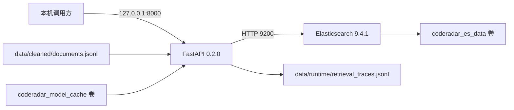

# CodeRadar 部署文档

## 1. 部署组成

CodeRadar 的容器部署包含 Elasticsearch 9.4.1 单节点和 FastAPI（基于 Python 的 Web 应用程序接口框架）服务。Elasticsearch 保存版本化 Chunk 索引，API 提供 Mini-RAG（轻量检索增强生成，Mini Retrieval-Augmented Generation）查询、证据、轨迹、索引和评测接口。

下面的部署图展示端口、数据卷和读取别名关系。



两个宿主端口只绑定回环地址。API 容器挂载 `CodeRadar/data`，因此结构化数据和检索轨迹位于工作区；Elasticsearch 索引与模型缓存位于 Docker 命名卷。

## 2. 前置条件

- Windows PowerShell；
- Docker Desktop 与 Compose；
- 本地开发使用 Python 3.11.9 和 `CodeRadar\.venv`；
- 容器构建能访问 Elasticsearch 镜像和 Python 包源；
- 正式模型模式需要可下载 Sentence Transformers 模型权重。

本地依赖安装命令：

```powershell
Set-Location D:\26Spring\project\CodeRadar
& 'D:\Python 3.11.9\python.exe' -m venv .venv
& .\.venv\Scripts\python.exe -m pip install --upgrade pip
& .\.venv\Scripts\python.exe -m pip install -r ..\docs\requirement.txt
& .\.venv\Scripts\python.exe -m playwright install chromium
& .\.venv\Scripts\python.exe -m pip check
```

Playwright 和 Chromium 用于启用浏览器回退的动态页面采集，不参与 API 容器运行。

## 3. 配置

Mini-RAG 默认配置位于 `config/mini_rag.yaml`。环境变量覆盖同名配置，主要参数如下表。

| 参数 | 默认值 | 作用 |
| --- | --- | --- |
| `MINIRAG_DOCUMENTS_PATH` | `data/cleaned/documents.jsonl` | 结构化文档输入 |
| `MINIRAG_ELASTICSEARCH_URL` | `http://localhost:9200` | Elasticsearch 地址 |
| `MINIRAG_INDEX_PREFIX` | `coderadar_chunks` | 物理索引前缀 |
| `MINIRAG_READ_ALIAS` | `coderadar_chunks_current` | 查询读取别名 |
| `MINIRAG_EMBEDDING_PROVIDER` | `hash` | 嵌入提供者 |
| `MINIRAG_EMBEDDING_DIMENSION` | `1024` | 向量维度 |
| `MINIRAG_RERANKER_PROVIDER` | `lexical` | 重排序提供者 |
| `MINIRAG_TRACE_PATH` | `data/runtime/retrieval_traces.jsonl` | 查询轨迹文件 |

默认容器使用确定性 Hash Embedding（哈希嵌入）和词项重叠重排序，适合联调与离线基线。设置 `MINIRAG_INSTALL_ML=true` 后重新构建镜像，可安装模型运行依赖。索引端和查询端必须使用相同的嵌入模型名称与维度。

## 4. 启动服务

```powershell
Set-Location D:\26Spring\project\CodeRadar
docker compose up -d --build
docker compose ps
```

当前本机两个容器均处于健康运行状态，API 监听 `127.0.0.1:8000`，Elasticsearch 监听 `127.0.0.1:9200`，集群状态为 green。

## 5. 数据审计与索引

结构化文档更新后按以下顺序校验并全量构建：

```powershell
& .\.venv\Scripts\python.exe -m scripts.audit_documents
& .\.venv\Scripts\python.exe -m scripts.build_index
```

全量构建创建新物理索引，完成全部 Chunk 写入后原子切换读取别名。仅在文档集合、切分规则和向量模型保持兼容时使用增量模式：

```powershell
& .\.venv\Scripts\python.exe -m scripts.build_index --incremental --delete-missing
```

当前结构化数据包含 1,077 个文档版本，其中 1,067 个版本带有 `is_current=true`，10 个版本属于历史版本。文件大小为 4,412,343 字节，SHA-256（Secure Hash Algorithm 256-bit，256 位安全散列算法）为 `0893637a61c62b55dcba8bb40d11bb0f38e6a7dd20eaf227eb4e8bb561c57c5f`。本机存在 3,337-Chunk 物理索引，该索引尚未切换为读取别名目标；`coderadar_chunks_current` 仍指向包含 2,688 个 Chunk 的物理索引。因此当前查询路径使用 2,688-Chunk 集合，结构化数据与读取别名尚未达到一致状态。

## 6. 健康检查

```powershell
Invoke-RestMethod http://127.0.0.1:8000/health
Invoke-RestMethod http://127.0.0.1:8000/ready
Invoke-RestMethod http://127.0.0.1:9200/_cluster/health
Invoke-RestMethod http://127.0.0.1:9200/_cat/aliases/coderadar_chunks_current?v
```

`/health` 只检查 API 进程。`/ready` 还检查 Elasticsearch、读取别名、Chunk 数量和嵌入兼容性。别名的新旧程度需要结合结构化数据哈希、物理索引和构建时间判断。

## 7. 查询验收

```powershell
$body = @{
  question = 'Cursor 最近有哪些产品更新'
  competitor = 'Cursor'
  event_types = @('product_release')
  current_only = $true
  top_k = 8
} | ConvertTo-Json

Invoke-RestMethod `
  -Method Post `
  -Uri http://127.0.0.1:8000/api/rag/query `
  -ContentType 'application/json; charset=utf-8' `
  -Body $body
```

验收记录至少包含请求、`query_id`、读取别名、物理索引、嵌入模型、返回证据和检索轨迹。无证据结果需要继续检查数据覆盖、标签、时间窗口和过滤条件。

## 8. 运维边界

`.env`、访问令牌、模型缓存和 Elasticsearch 数据卷不进入 Git。`data/raw` 和 `data/cleaned/documents.jsonl` 当前已纳入主体仓库，用于可复现采集与处理；58 MiB 的检索轨迹属于运行日志，不应作为普通文档交付。

备份前分别保存 Git 工作区、必要的数据目录和 Docker 卷。恢复后必须重新核对结构化数据哈希、读取别名和物理索引，避免服务查询与当前数据不一致的索引。
