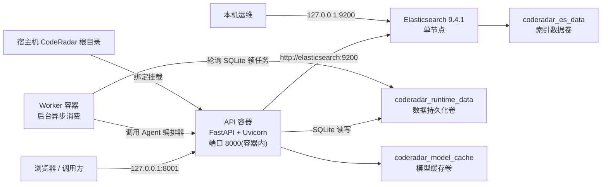

# CodeRadar 部署文档

## 1. 部署范围

CodeRadar 使用 Docker Compose 在单机上编排三个服务：

| 服务 | 容器名 | 功能 |
|------|--------|------|
| **api** | FastAPI 应用 | 承载 Mini-RAG 检索、Agent 分析、正式 API 面、认证与管理工作流 |
| **elasticsearch** | Elasticsearch 9.4.1 | Chunk 文本、元数据和稠密向量存储 |
| **worker** | 后台异步消费者 | 单例租约 + 心跳领取 SQLite 工作流任务，调用 Agent 编排器并回写进度 |

API 通过 Uvicorn 运行。默认镜像安装 Mini-RAG API 的 CPU 基线依赖，`hash` Embedding Provider 使用确定性特征哈希，无需下载模型权重。`MINIRAG_INSTALL_ML=true` 时，Dockerfile 从 PyTorch CPU 软件源安装 Torch 与 Sentence Transformers。

## 2. 部署拓扑与存储



API 和 Elasticsearch 对宿主机的端口均绑定到 `127.0.0.1`。API 容器使用 Compose 内部服务名 `elasticsearch` 访问检索服务。宿主机 `CodeRadar` 根目录绑定挂载后承载结构化文档、评测数据和数据库；三个 Docker 命名卷分别保存 Elasticsearch 索引、模型缓存和运行时数据。

## 3. 安全边界

当前 Compose 配置面向可信任的本机开发环境，安全边界由以下事实构成：

- API 端口仅映射为 `127.0.0.1:8001:8000`（宿主机 8001 → 容器 8000）。
- Elasticsearch 端口仅映射为 `127.0.0.1:9200:9200`。
- Elasticsearch 配置 `xpack.security.enabled=false`，当前实例不执行 ES 身份认证。
- FastAPI 启用**三层安全机制**：
  - **API-Key 认证**（`X-API-Key` 请求头）：`CODERADAR_AUTH_ENABLED=true` 时强制校验，演示 key 通过 `CODERADAR_API_KEY` 配置。
  - **读写限流**：读请求 `CODERADAR_READ_RATE_PER_MINUTE`（默认 120）、写请求 `CODERADAR_WRITE_RATE_PER_MINUTE`（默认 30）、认证请求 `CODERADAR_AUTH_RATE_PER_MINUTE`（默认 10）。
  - **用户认证**（JWT + HttpOnly Cookie）：`/api/auth/*` 路由提供注册/登录/登出/会话查询，前端使用 Cookie 会话，脚本和外部调用仍使用 `X-API-Key`。
- `.env` 和本地数据目录不进入 API 镜像构建上下文；Compose 在运行时挂载数据目录。

因此，当前配置的网络暴露范围应保持为本机回环地址。面向其他主机提供服务时，部署环境需在 API 之前增加 TLS、访问控制和流量限制，并为 Elasticsearch 启用安全机制。

## 4. 前置条件

部署前需要准备以下环境和数据：

1. 已启动的 Docker Engine 与可用的 `docker compose` 命令。
2. 当前工作目录为 `Proj/competitor-analysis-system`（含 `docker-compose.yml` 的目录）。
3. `data/cleaned/documents.jsonl` 存在且每行可通过结构化文档模型校验（可用 `python -m scripts.audit_documents` 校验）。
4. Docker 可满足 Elasticsearch 容器的 `2g` 内存上限和 `-Xms1g -Xmx1g` Java 堆配置。
5. 选择 `sentence_transformers` Embedding 或 Cross-Encoder 时，首次推理需要获取所配置的模型权重，权重保存到 `coderadar_model_cache` 卷。

## 5. 配置

### 5.1 配置加载

Mini-RAG 从 `config/mini_rag.yaml` 加载默认配置，并从项目根目录的 `.env` 加载环境变量。可以先创建本地配置文件：

```powershell
Copy-Item .env.example .env
```

下表列出 Mini-RAG 运行配置环境变量及 Compose 模型依赖构建变量。

| 环境变量 | 配置字段 | 默认值或作用 |
| --- | --- | --- |
| `MINIRAG_PROFILE` | 配置快捷方式（★ 推荐） | `default`（→ `config/mini_rag.yaml`）；设为 `formal` 则使用 `config/mini_rag.formal.yaml` |
| `MINIRAG_CONFIG_PATH` | 配置文件路径（显式指定） | `config/mini_rag.yaml`；设此值时 `MINIRAG_PROFILE` 不生效 |
| `MINIRAG_DOCUMENTS_PATH` | `data.documents_path` | `data/cleaned/documents.jsonl` |
| `MINIRAG_EVALUATION_PATH` | `data.evaluation_path` | `data/samples/测试数据集.csv` |
| `MINIRAG_TRACE_PATH` | `data.trace_path` | `data/runtime/retrieval_traces.jsonl` |
| `MINIRAG_ELASTICSEARCH_URL` | `elasticsearch.url` | 容器内为 `http://elasticsearch:9200` |
| `MINIRAG_INDEX_PREFIX` | `elasticsearch.index_prefix` | `coderadar_chunks` |
| `MINIRAG_READ_ALIAS` | `elasticsearch.read_alias` | `coderadar_chunks_current` |
| `MINIRAG_INSTALL_ML` | Compose 构建参数 `INSTALL_ML` | `false`；设为 `true` 时在 API 镜像中安装 CPU 模型运行依赖 |
| `MINIRAG_EMBEDDING_PROVIDER` | `embedding.provider`（可选覆盖） | 由 YAML 配置文件决定 |
| `MINIRAG_EMBEDDING_MODEL` | `embedding.model`（可选覆盖） | 由 YAML 配置文件决定 |
| `MINIRAG_EMBEDDING_DIMENSION` | `embedding.dimension`（可选覆盖） | `1024` |
| `MINIRAG_MODEL_CACHE_DIR` | `embedding.cache_dir` | 容器内为 `/root/.cache/huggingface` |
| `MINIRAG_RERANKER_PROVIDER` | `reranker.provider`（可选覆盖） | 由 YAML 配置文件决定 |
| `MINIRAG_RERANKER_MODEL` | `reranker.model`（可选覆盖） | 由 YAML 配置文件决定 |
| `MINIRAG_RERANKER_STRICT` | `reranker.strict`（可选覆盖） | 由 YAML 配置文件决定 |

下表列出认证与安全相关环境变量：

| 环境变量 | 默认值 | 说明 |
| --- | --- | --- |
| `CODERADAR_AUTH_ENABLED` | `true` | 是否启用 API-Key 认证 |
| `CODERADAR_API_KEY` | （空） | 演示 API-Key，Compose 内置演示 key |
| `CODERADAR_READ_RATE_PER_MINUTE` | `120` | 读请求限流 |
| `CODERADAR_WRITE_RATE_PER_MINUTE` | `30` | 写请求限流 |
| `CODERADAR_AUTH_RATE_PER_MINUTE` | `10` | 认证请求限流 |
| `CODERADAR_SESSION_TTL_SECONDS` | `604800` | JWT 会话有效期（7 天） |
| `CODERADAR_COOKIE_SECURE` | `false` | 本地开发设为 false，生产应设为 true |
| `CODERADAR_CORS_ORIGINS` | `http://localhost:5173` | 允许的前端源 |
| `CODERADAR_DATABASE_URL` | `sqlite:///data/runtime/coderadar.db` | SQLite 数据库路径 |

### 5.2 默认检索参数

`config/mini_rag.yaml` 当前定义以下主要参数：

- 分块目标 1200 字符，最大 1800 字符，重叠 160 字符，最小 80 字符。
- BM25 和稠密向量候选窗口均为 20，RRF 窗口为 30，重排序窗口为 20，`rrf_k` 为 60。
- 默认 `top_k` 为 8，服务配置上限为 50。
- 综合排序使用语义 0.70、时间 0.12、版本 0.08、证据 0.10 的权重，权重之和必须为 1.0。
- Elasticsearch 物理索引使用 1 个分片和 0 个副本。

## 6. 容器构建与启动

由于 API 在启动时强制校验数据库 schema（`check_migration`），部署需要分两阶段执行。

### 6.1 阶段一：构建镜像 + 启动 Elasticsearch

```powershell
docker compose build
docker compose up -d elasticsearch
```

Elasticsearch 健康检查每 10 秒请求一次 `/_cluster/health?wait_for_status=yellow`，单次超时为 5 秒，最多重试 30 次。

### 6.2 阶段二：初始化数据库

```powershell
docker compose run --rm api python -m alembic upgrade head
docker compose run --rm api python -m scripts.init_database
docker compose run --rm api python -m backend.seed_demo_users
```

`docker compose run --rm` 创建临时容器执行命令，**不触发健康检查**，执行完自动删除。这避免了 API 因数据库不存在而崩溃的鸡和蛋问题。

### 6.3 阶段三：启动剩余服务

```powershell
docker compose up -d api worker frontend
```

API 服务通过 `depends_on.condition=service_healthy` 等待 Elasticsearch 达到健康状态后启动。API 容器在 10 秒启动保护期后，每 30 秒请求一次 `http://localhost:8000/health`，单次健康检查超时为 5 秒，连续失败 3 次后标记为不健康。Worker 容器等待 API 健康后启动。重启策略均为 `unless-stopped`。

可通过以下命令读取运行日志：

```powershell
docker compose logs --tail 200 elasticsearch
docker compose logs --tail 200 api
docker compose logs --tail 200 worker
```

## 7. 数据库初始化

首次启动后需要初始化 SQLite 数据库并导入演示账号：

```powershell
docker compose run --rm api python -m scripts.init_database
docker compose run --rm api python -m backend.seed_demo_users
```

`init_database` 会执行 Alembic 迁移创建全部业务表，并幂等导入 `artifacts/week3/` 基线产物到 SQLite。`seed_demo_users` 创建两个本地演示账号：

| 账号 | 密码 |
|------|------|
| `coderadar_test1` | `CodeRadar@2026-1` |
| `coderadar_test2` | `CodeRadar@2026-2` |

> 使用 `docker compose run --rm` 而不是 `exec`，因为 `exec` 要求目标容器正在运行，而数据库初始化需要在 API 容器启动前完成。

## 8. 数据校验与索引构建

### 8.1 校验结构化文档

索引构建前，可在 API 容器内加载文档并输出统计：

```powershell
docker compose exec api python -m scripts.audit_documents
```

脚本使用与索引服务相同的结构化文档加载器，格式或字段校验错误会使进程以非零状态退出。

### 8.2 全量构建

首次启动或 Embedding 索引配置变更后执行全量构建：

```powershell
docker compose exec api python -m scripts.build_index
```

全量构建依次加载文档、分块、生成 Embedding、创建 `coderadar_chunks_v<UTC时间>` 物理索引并批量写入。当 `failed_count=0` 时，索引管理器原子将 `coderadar_chunks_current` 读取别名切换到新物理索引。

也可通过 HTTP 请求执行同一全量流程：

```powershell
Invoke-RestMethod `
  -Method Post `
  -Uri http://127.0.0.1:8001/api/rag/rebuild `
  -ContentType 'application/json' `
  -Body '{}'
```

### 8.3 增量同步

当读取别名已指向物理索引时，执行幂等增量同步：

```powershell
docker compose exec api python -m scripts.build_index --incremental
```

需要使当前索引与输入集合完全同步时，显式启用缺失 Chunk 删除：

```powershell
docker compose exec api python -m scripts.build_index `
  --incremental `
  --delete-missing
```

## 9. 健康与就绪检查

API 实现了两层运行检查：

```powershell
Invoke-RestMethod http://127.0.0.1:8001/health
Invoke-RestMethod http://127.0.0.1:8001/ready
```

`GET /health` 只检查 FastAPI 进程存活。`GET /ready` 调用 Elasticsearch 健康接口、解析读取别名、统计已索引 Chunk，并核对 Embedding 模型和向量维度兼容性。全部成功时返回 `status="ready"`、`embedding_compatible=true` 和 HTTP `200`；否则返回 `status="degraded"` 和 HTTP `503`。

索引状态诊断接口：

```powershell
Invoke-RestMethod http://127.0.0.1:8001/api/rag/index/status
```

## 10. 查询验收

就绪检查返回 `ready` 后，可执行带过滤条件的查询（需要带上 API-Key）：

```powershell
$headers = @{ "X-API-Key" = "coderadar-phase3-local-demo" }
$body = @{
  question = 'Cursor 最近有哪些 Agent 能力更新'
  competitor = 'Cursor'
  top_k = 8
} | ConvertTo-Json

Invoke-RestMethod `
  -Method Post `
  -Uri http://127.0.0.1:8001/api/rag/query `
  -Headers $headers `
  -ContentType 'application/json' `
  -Body $body
```

成功响应包含 `query_id`、`parsed_filters`、`evidence`、`conflicts` 和 `retrieval_trace`。

## 11. 用户认证 API 验收

```powershell
# 注册
$body = @{ username = "testuser"; password = "Test@2026" } | ConvertTo-Json
Invoke-RestMethod -Method Post -Uri http://127.0.0.1:8001/api/auth/register `
  -ContentType 'application/json' -Body $body

# 登录（返回 HttpOnly Cookie）
$session = Invoke-RestMethod -Method Post -Uri http://127.0.0.1:8001/api/auth/login `
  -ContentType 'application/json' -Body $body -SessionVariable sessionVar

# 查询当前用户
Invoke-RestMethod -Method Get -Uri http://127.0.0.1:8001/api/auth/me `
  -WebSession $sessionVar
```

## 12. 模型配置切换

### 12.1 Embedding Provider

支持以下 Provider 名称：

- `hash`、`deterministic-hash`、`offline`：确定性特征哈希。
- `sentence_transformer`、`sentence-transformers`、`st`：Sentence Transformers 模型。

使用 Sentence Transformers 时，在 `.env` 中启用模型依赖构建参数并设置 Provider：

```dotenv
MINIRAG_INSTALL_ML=true
MINIRAG_EMBEDDING_PROVIDER=sentence_transformers
MINIRAG_EMBEDDING_MODEL=BAAI/bge-m3
```

```powershell
docker compose up -d --build --force-recreate api
docker compose exec api python -m scripts.build_index
```

Embedding Provider、模型或向量维度变更后必须执行全量构建，否则向量空间不兼容。

### 12.2 重排序 Provider

`MINIRAG_RERANKER_PROVIDER=lexical` 使用本地词项重叠重排序。设置为 `cross_encoder` 时懒加载 Cross-Encoder。

```dotenv
MINIRAG_INSTALL_ML=true
MINIRAG_RERANKER_PROVIDER=cross_encoder
MINIRAG_RERANKER_MODEL=cross-encoder/mmarco-mMiniLMv2-L12-H384-v1
MINIRAG_RERANKER_STRICT=true
```

```powershell
docker compose up -d --build --force-recreate api
```

## 13. 评测与消融实验

```powershell
docker compose exec api python -m scripts.evaluate_rag `
  --output data/runtime/mini_rag_evaluation.json
```

消融实验（D–F 组需要 Cross-Encoder）：

```powershell
docker compose exec `
  -e MINIRAG_RERANKER_PROVIDER=cross_encoder `
  -e MINIRAG_RERANKER_STRICT=true `
  api python -m scripts.evaluate_rag `
  --ablations `
  --output data/runtime/mini_rag_ablations.json
```

## 14. 停止、恢复与数据保留

```powershell
docker compose stop
docker compose start
docker compose down          # 保留命名卷
docker compose down -v       # 删除全部命名卷（索引数据、模型缓存、SQLite 丢失）
```

## 15. 运行诊断

| 现象 | 检查点 | 处理方式 |
| --- | --- | --- |
| `/ready` 返回 `degraded` | `backend.error`、Elasticsearch 日志、读取别名 | 确认 ES 健康；别名缺失时执行全量构建 |
| 增量构建提示读取别名不存在 | `service.fail_on_missing_index` | 执行全量构建 |
| 索引提示 Embedding 不兼容 | 服务健康信息与物理索引映射 | 使用当前 Embedding 配置执行全量构建 |
| API 返回 `401` | `X-API-Key` 请求头 | 确认 `CODERADAR_AUTH_ENABLED` 和 `CODERADAR_API_KEY` 配置 |
| Worker 未处理工作流 | Worker 日志 | 确认 worker 容器已启动且 SQLite 可写 |
| 登录提示 `403` | 用户名或密码 | 确认已运行 `seed_demo_users` |
