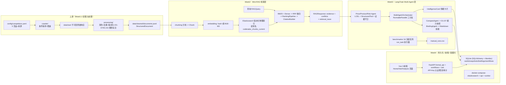

# 项目运行全流程：Week2–Week4 输入、处理与输出

> 面向想理解「CodeRadar 如何端到端运行」的读者（验收老师 / 新接手同学）。
> 本文以 main 分支实际代码为准（合并提交 `9022095`），每条关键结论标注来源文件与行号。
> 运行环境：conda 环境 `CodeRadar`（Python 3.11.9），所有 `python -m` 命令在项目根 `Proj/competitor-analysis-system/` 下执行。

## 0. 一页总览



| 周 | 一句话职责 | 核心输入 | 核心输出 |
|---|---|---|---|
| 上游 | 采集竞品公开数据并清洗成结构化文档 | `config/competitors.yaml`、网络来源 | `data/cleaned/documents.jsonl` |
| Week2 | 把文档切成 Chunk 建 ES 索引，提供带引用证据的混合检索 | documents.jsonl、`RAGQuery` | ES 版本化索引 + `RAGResponse`（evidence/conflicts/trace） |
| Week3 | 用 LangChain Multi-Agent 把证据变成情报卡片/快照/简报 | 编排请求 + Mini-RAG 证据 | `IntelligenceCard`、`CapabilitySnapshot`、对比矩阵、简报、benchmark CSV |
| Week4 | 把产物落库、异步化、收口 API、提供前端与容器部署 | Week3 产物 + HTTP 请求 | SQLite 数据库、正式 API、Vue 前端、3 服务 docker-compose |

## 1. 上游背景（一段带过）

`scripts/data_pipeline.py` 是采集与处理的统一 CLI（`doctor`/`crawl`/`process`/`all` 子命令），固定 5 个竞品 ID（`scripts/data_pipeline.py:24-30`）。`crawler/` 按 `config/competitors.yaml` 生成采集任务，`http_client.py` 做 ETag 条件请求、按域名限速与指数退避，原始响应不可变写入 `data/raw/<competitor>/<source>/<crawl_run_id>/`。`processing/pipeline.py` 的 `ProcessingPipeline` 重放 raw，经规范化、按「竞品+来源+规范 URL+内容哈希」去重与 `VersionStore` 版本化、`RuleLabeler` 按 `config/dimensions.yaml` 打 D1–D7 / E1–E3 / 证据等级标签，产出 `data/cleaned/documents.jsonl`——每行一个 `StructuredDocument`（`schemas/document.py:242-276`，含 `document_id`/`version_id`/有效区间/`is_current`）。**raw 不可变，处理可重放**（`process --rebuild` 原子重建）。这份 jsonl 就是 Week2 的唯一数据输入。

## 2. Week2：Mini-RAG 检索层

### 2.1 输入

1. **数据**：`data/cleaned/documents.jsonl`（配置项 `data.documents_path`，`config/mini_rag.yaml:4`）。
2. **配置**：`config/mini_rag.yaml`（默认 hash 基线）或 `config/mini_rag.formal.yaml`（BGE-M3 正式评测），支持 `MINIRAG_*` 环境变量覆盖。两份配置只有两处实质差异：embedding provider（`hash` vs `sentence_transformers`，`mini_rag.yaml:15` / `mini_rag.formal.yaml:15`）和 reranker provider（`lexical` vs `cross_encoder` + `strict: true`，`mini_rag.yaml:40-44` / `mini_rag.formal.yaml:40-44`）。两者向量维度同为 1024，但**向量空间不同，索引不可混用**。
3. **查询**：`RAGQuery`（`mini_rag/models.py:301-316`）：`question` + 可选过滤（competitor/event_types/dimension_tags/product_versions/evidence_levels/source_types/时间窗/`current_only`/`top_k`）。

### 2.2 处理

统一门面是 `MiniRAGService`，工厂函数 `create_service()`（`mini_rag/api/rag_service.py:504-578`）按配置装配全部组件（模型 lazy 加载）：

- **建索引**（`build_index`，`rag_service.py:343-408`）：`DocumentLoader` 读 jsonl -> `ChunkingDispatcher` 按来源类型分块成 `Chunk`（`mini_rag/models.py:110-138`，携带 document_id/version_id/稳定 chunk_id/字符区间/来源/版本/标签/证据等级）-> `IndexManager` 创建 `coderadar_chunks_v<UTC时间>` 物理索引并批量写入（含向量），`failed_count=0` 后**原子切换读别名** `coderadar_chunks_current`（`config/mini_rag.yaml:24-25`）；增量模式幂等更新，可选 `--delete-missing`。分块参数：目标 1200 字符 / 最大 1800 / 重叠 160 / 最小 80（`config/mini_rag.yaml:8-12`）。索引映射会记录 embedding 模型与维度，`/ready` 据此拒绝跨向量空间查询（`rag_service.py:294-341`）。
- **查询**（`_run_query`，`rag_service.py:103-260`），固定六步流水线：
  1. `QueryParser.parse` 解析问题中的竞品/事件/维度/版本/相对时间，显式过滤参数优先级最高（`:126-129`）；`top_k` 上限校验（`:117-121`）。
  2. `BM25Retriever` 词法检索（默认候选 20，`:146-155`）。
  3. `DenseRetriever` 向量检索（候选 20，`:157-167`）。
  4. RRF 融合（`rrf_k=60`，融合窗口 30，`:170-185`）。
  5. `RankingPipeline`：reranker（`lexical` -> `TermOverlapReranker`，否则 `CrossEncoderReranker`）-> `TemporalVersionRanker`（时间半衰期 180 天 + 版本）-> `EvidenceRanker`，加权求和 semantic 0.70 / temporal 0.12 / version 0.08 / evidence 0.10（`config/mini_rag.yaml:46-51`，构造时校验和为 1）。
  6. `CitationBuilder` 生成 `Evidence`（chunk_id/原文区间/URL/引用/证据等级/各阶段分数），`ConflictDetector` 检冲突（`:210-217`），结果写入 `TraceStore`。

### 2.3 输出

- **ES 索引**：版本化物理索引 + 读别名（当前冻结数据 2,633 chunks，见 `docs/交付.md:19`）。
- **`RAGResponse`**（`mini_rag/models.py:602-621`）：`query_id`、`parsed_filters`、`evidence[]`、`conflicts[]`、`retrieval_trace`（各阶段候选数、分阶段延迟、索引/模型/权重快照、warnings）。
- **HTTP API**（`backend/routers/rag.py`）：`POST /api/rag/query`（`:84`）、`GET /api/rag/evidence/{chunk_id}`（`:95`）、`GET /api/rag/trace/{query_id}`（`:109`）、`GET /api/rag/index/status`（`:120`）、`POST /api/rag/rebuild`（`:127`）、`POST /api/rag/index/incremental`（`:146`）、`POST /api/rag/evaluate`（`:169`）、`POST /api/rag/citations/validate`（`:182`）。
- **评测产物**：`scripts/evaluate_rag.py` 输出 Recall@K/MRR/nDCG/过滤准确率/引用正确率/历史版本误召回率/延迟与 P95 等 JSON，并支持 A–F 六组消融（D–F 强制真实 Cross-Encoder，`rag_service.py:443-501`）；金标评测集是 `data/samples/测试数据集.csv`（`config/mini_rag.yaml:5`）。评测集走「候选 -> 人工复核 -> 金标」流程（`scripts/prepare_evaluation_set.py` / `finalize_evaluation_review.py` / `validate_evaluation_set.py`）。
- **检索轨迹**：每次查询的完整 `RAGResponse` 落 `data/runtime/retrieval_traces.jsonl`（容量 1000，`config/mini_rag.yaml:53-56`），供 `GET /api/rag/trace/{query_id}` 与引用校验复查。

补充：reranker 配置为 `lexical` 以外的 provider 但模型加载失败时，默认回退词项重叠后端并在 `retrieval_trace.warnings` 留痕；`strict=true`（formal 配置）则直接让查询失败，避免把词法分记成模型分（`rag_service.py:199-208`）。

### 2.4 怎么跑起来

```powershell
conda activate CodeRadar
docker compose up -d elasticsearch            # 本地起 ES（docker-compose.yml:1-19）
python -m scripts.audit_documents             # 校验 documents.jsonl
python -m scripts.build_index                 # 全量构建 + 原子切别名（scripts/build_index.py:34-44）
python -m scripts.build_index --incremental   # 幂等增量
python -m scripts.build_index --config config\mini_rag.formal.yaml  # 切 BGE-M3（须全量重建）
python .\rag_query.py "Cursor 最近有哪些 Agent 能力更新" --competitor Cursor --top-k 8  # CLI 查询（rag_query.py:49-71）
python -m uvicorn backend.main:app --host 127.0.0.1 --port 8000     # HTTP 服务
```

## 3. Week3：LangChain Multi-Agent 层

### 3.1 输入

- **编排请求**：`MultiAgentAnalysisRequest`（`schemas/orchestration.py:62-156`）：竞品、可选 event_type（E1/E2/E3，只能匹配单一分支，`:111-118`）、branches（price/product/risk，1–3 个）、`analysis_mode`（rules/hybrid/llm）、时间窗、`include_snapshot`/`include_briefing`/`include_benchmark_data` 等。`stable_workflow_id` 由「correlation_id + 请求指纹」哈希派生（`:55-59`），相同请求天然幂等。
- **Mini-RAG 证据**：即 Week2 的 `RAGResponse`，通过 StructuredTool 在链内实时检索。
- **配置**：`config/scoring.yaml`（能力快照评分，版本 `week3-evidence-v2`：证据/基准按 60%/40% 合并，中性基线 50，证据等级权重 A=1.00/B=0.82/C=0.62/D=0.36，新鲜度分档，`config/scoring.yaml:1-33`）、`prompts/` 下 7 份 Prompt。
- **Benchmark 资产**：`benchmarks/tasks/tasks.jsonl` 16 项 `week3-frozen-v2` 冻结任务 + `benchmarks/repositories/` starter + `benchmarks/validators/run_task.py` shell-free 执行器（`run_task.py:1-10` 明确声明**不是 OS 级沙箱**）。

### 3.2 处理

**三个专家 Agent**（Price=E1 价格 / Product=E2 发布 / Risk=E3 风险）共享基类 `EvidenceBackedAgent`（`agents/base.py:78`）。每个 Agent 是一条真实 LCEL 链（`base.py:111-126`）：

```
_prepare_query（构造带过滤的 RAGQuery）
  -> _retrieve_evidence（Mini-RAG StructuredTool，带重试，base.py:98-110）
  -> _compose_result（引用守卫 + 事件聚合 + 规则底稿 + 可选 LLM 润色）
```

**证据守卫**（`base.py:206-294`、`:296-357`）是 Week3 的核心约束：

- 检索证据先过 `CitationValidator` 白名单校验，不合法直接报错（`:211-221`）。
- 证据按事件聚类，每簇生成一张规则底稿卡片；`card_id`、证据对象、优先级公式、预警等级**全部由确定性代码决定**。
- 优先级公式透明固定：35% 事件影响 + 25% 紧急程度 + 20% 证据置信度 + 20% 产品相关性（`schemas/intelligence_card.py:81-106`）。
- LLM 只允许起草散文与判断（`LLMCardDraft`，`agents/llm.py:58-77`）；其引用的 chunk_id 必须在本次检索白名单内，越界即拒绝（`base.py:328-333`）；模型输出整体再过一次完整 Pydantic 校验（`base.py:357`）；Prompt 明确隔离证据中的指令（`agents/llm.py:111-126`）。
- 无证据不伪造结论：降低置信度与优先级（上限 39，`schemas/intelligence_card.py:386`）并标 `review_required`。

**编排器** `MultiAgentOrchestrator`（`agents/orchestrator.py`）用 `RunnableParallel` 并行跑选中分支（`:198-209`）：单分支异常被捕获为结构化 `BranchError`，不影响其他分支（`:211-244`）；随后依次跑 Compare 阶段（`build_snapshot`，`:386-404`）与 Briefing 阶段（`:409-429`）；全部失败 = `failed`，有分支或下游失败 = `partial_failure`（`:433-439`）。进程内还有按 workflow_id 的有界 LRU 缓存与相同请求去重（`:139-183`）。`run_attempt()`（`:268-294`）支持只补跑缺失分支——这是 Week4 异步 Worker 重试的复用点。

**其余 Agent**：`CompareAgent` 按 scoring.yaml 由卡片证据 + benchmark 结果合成 D1–D7 快照，无证据维度标 `insufficient_evidence`，跨产品矩阵与趋势推断都保留规则依据；`BriefingAgent` 用 LCEL（PromptTemplate + RunnableLambda）生成可审阅 Markdown（`agents/briefing_agent.py:1-11`）；`DimensionTaggingAgent` 做规则/模型混合 E1–E3 + D1–D7 打标，规则与模型结果分别保留，支持共识/并集策略与分歧复核标记（`agents/dimension_tagging_agent.py`；CLI：`scripts/tag_dimensions.py`，批量输出全部行成功后才原子替换目标文件）；`BenchmarkAgent` 加载冻结任务、导入手工运行 CSV（逐行错误隔离、幂等去重、原子写回）、生成跨产品汇总（`agents/benchmark_agent.py`）。`AgentTraceCallback`（`agents/callbacks.py`）是真实 LangChain `BaseCallbackHandler`，记录链/工具/模型各阶段、耗时、token 用量与回退状态，最终汇总为 `AgentExecutionTrace` 附在 `AgentRunResult` 上（`agents/base.py:154-162`）。

### 3.3 三种 Agent 模式（`agents/llm.py:80-108`、`:192-201`）

| 模式 | 行为 | 密钥要求 |
|---|---|---|
| `rules`（默认） | `LangChainLLMClient` 不构造（`from_env` 返回 None），仍跑真实 LCEL + StructuredTool，只是不调远程模型；完全离线、确定性 | 不需要 |
| `hybrid` | 规则底稿 + DeepSeek `with_structured_output(LLMCardDraft, method="json_mode")` 润色；模型失败自动回退规则并记 warning（`base.py:262-268`），卡片记 `analysis_mode="hybrid"`（`llm.py:144`） | 需要 `DEEPSEEK_API_KEY`，缺失立即报错 |
| `llm` | 与 hybrid 同链但 `strict=True`：模型调用/校验失败直接报错，不静默回退（`llm.py:201`、`base.py:263-264`） | 同上 |

### 3.4 输出

- **`IntelligenceCard`**（`schemas/intelligence_card.py`）：事件级卡片，每条 finding/影响必须引用卡片证据内已存在的 chunk_id。
- **`CapabilitySnapshot`**：D1–D7 分数 + 状态 + 证据/基准贡献 + `coverage_ratio` + `previous_snapshot_id` 链。
- **对比矩阵 / Markdown 简报 / benchmark CSV**（`benchmarks/results/manual_runs.csv`）。
- **HTTP API**：`/api/agent/price|product|sentiment-risk`、`/api/agent/cards`、`/api/agent/compare`、`/api/agent/snapshots`、`/api/agent/briefing`（`backend/routers/agents.py:43-122`）；`/api/benchmarks/tasks|results|runs/import|compare`（`backend/routers/benchmarks.py:42-73`）。
- **基线产物** `artifacts/week3/`：`manifest.json`（含 tasks/scoring/cleaned-data 三个输入 SHA-256 与冻结窗口）、`intelligence_cards.json`（35 张）、`capability_snapshots.json`（5 竞品）、`workflow_summary.json`、`trace_summaries.json`（15 分支脱敏 trace）、`briefings/*.md`（5 份）、`acceptance_report.json`（离线验收 5/5）、`live_llm_report.json`（在线探针 6/6）、`comparison/`（CodeMate 对标矩阵，`official_ranking_ready=false`，因无真实 CodeMate 快照，见 `docs/交付.md:24`）。基线生成脚本走与线上完全相同的编排器路径（`scripts/generate_week3_baseline.py:1-44`），Manifest 最后原子写入作为整套制品完成标记。
- **验收**：`scripts/verify_week3_delivery.py` 离线核对 LangChain 组件可构造、8 个 Agent、4 份核心 Prompt、16 个 benchmark 资产、正式 CSV 无 sample 混入、全部产物严格解析、输入哈希一致（`scripts/verify_week3_delivery.py:1-20`）。

### 3.5 怎么跑起来

```powershell
$env:CODERADAR_AGENT_MODE = 'rules'      # 离线可复现；在线用 hybrid 并配 DEEPSEEK_API_KEY
python -m scripts.generate_week3_baseline --mode rules --top-k 8 --as-of 2026-07-20 --window-days 90
python -m scripts.generate_week3_comparison
python -m scripts.verify_week3_delivery            # 一键离线验收（--live-llm 跑最小在线探针）
python -m scripts.tag_dimensions single --mode rules --source-type changelog --title 'Agent update' --content '新增项目级 Agent'
python -m benchmarks.validators.run_task --audit   # 16 任务资产审计
```

## 4. Week4：持久化、异步工作流、正式 API、前端与容器化

> 第四周代码来自 `wzq_week3/4` 分支的独立实现；早先 `feature/db-frontend-design` 分支的暂停决策已作废（`docs/第四周前端数据库分支暂停记录.md:119-127`）。

### 4.1 数据库持久化（输入：Week3 产物与 API 写入；输出：SQLite 库）

- **引擎**：SQLAlchemy 2.x + SQLite（WAL、`foreign_keys=ON`、`busy_timeout=5000`，`backend/database.py:76-83`），默认路径 `sqlite:///data/runtime/coderadar.db`（`backend/config.py:13`），`CODERADAR_DATABASE_URL` 可覆盖。API 启动时 fail-fast 校验连接与 Alembic 版本（`backend/main.py:43-53`、`backend/database.py:54-70`）。
- **迁移**：`alembic/versions/0001_sqlite_persistence.py`（cards/evidence/snapshots/briefings/workflows/traces/competitors）、`0002_async_workflows.py`（异步队列/租约/attempt）、`0003_api_closure.py`（对比矩阵/审计事件/竞品管理）；head = `0003_api_closure`（`backend/database.py:16`）。
- **入库数据**（`backend/models.py` 各 Record 类；写路径在 `backend/repositories.py` 的 `AnalysisStore`/`AnalysisRepository`，`:59`、`:373`）：

| 表（ORM 类） | 内容 |
|---|---|
| `CompetitorRecord` | 竞品配置快照（含 config_version） |
| `IntelligenceCardRecord` + `CardEvidenceRecord` | 情报卡片（payload JSON 存完整 Schema）+ 证据链接 |
| `CapabilitySnapshotRecord` + `SnapshotCardRecord` | D1–D7 快照 + 快照-卡片关联 |
| `BriefingRecord` | Markdown 简报（内容哈希派生 briefing_id，`repositories.py:50-56`） |
| `WorkflowRecord` / `WorkflowBranchRecord` / `WorkflowAttemptRecord` / `WorkflowBranchAttemptRecord` / `WorkflowWorkerLeaseRecord` | 异步工作流队列、分支、尝试与单例租约 |
| `AgentTraceRecord` | Agent 执行 trace |
| `ComparisonMatrixRecord` / `ComparisonSnapshotRecord`（api_repository 引用） | 对比矩阵与输入快照 provenance |
| `ApiAuditEventRecord` | API 写操作与敏感读审计 |
| `ArtifactImportRecord` | 基线产物导入批次（幂等） |
- **关键变化**：Week3 的 `AgentService` 现在**每次分析都落库**——`analyze_price/product/risk` 经 `_persist_agent_result` 写卡片（`backend/services/agent_service.py:86-93`、`:166-169`），`list_cards`/`list_snapshots` 从 DB 读（`:111-130`），`generate_briefing` 存快照 + 简报（`:132-164`）。**卡片与快照不再是进程内存，重启不丢**（这与项目根 CLAUDE.md 的旧描述相反，以代码为准）。
- **初始化**：`python -m alembic upgrade head` 建表；`python -m scripts.init_database --seed-competitors --import-artifacts artifacts\week3 [--seed-codemate]` 幂等导入竞品配置与已验收的 Week3 基线产物（`scripts/init_database.py:54-76`、`backend/artifact_import.py`）。

### 4.2 异步工作流（输入：`WorkflowSubmitRequest`；输出：可轮询的持久工作流）

- `POST /api/workflows` 提交 -> SQLite 幂等插入（重复请求返回同一 workflow_id，`backend/workflow_repository.py:96-130`），202 + `status_url`（`backend/routers/workflows.py:42-54`）。
- 独立 Worker 进程（`python -m scripts.run_workflow_worker`，`scripts/run_workflow_worker.py:14-34`）：单例租约 -> `claim_next` 领取任务 -> 心跳续租（`backend/workflow_worker.py:124-186`）-> 调 `MultiAgentOrchestrator.run_attempt` 执行 -> 分支级进度/结果实时写库（`DatabaseWorkflowObserver`，`:51-82`）-> `finalize_result/stopped/exception`。支持取消、超时、按 attempt 有界重试（默认 2 次，`backend/services/workflow_service.py:20-21`），重试只补跑失败分支（`reusable_outcomes`，`agents/orchestrator.py:268-294`）。
- `GET /api/workflows/{id}` 返回进度、分支状态、card_ids/snapshot_id/briefing_id 及完整 `MultiAgentAnalysisResult`（`schemas/workflow.py:125-147`）。

### 4.3 正式 API 收口（输入：HTTP + API Key；输出：分页查询/管理接口）

- **安全中间件**（`backend/main.py:80-162`）：`/api/*` 强制 `X-API-Key` 认证（hmac 比较，`backend/api_security.py:85-89`）、读 120/写 30 次每分钟滑动窗口限流（`api_security.py:62-78`）、写操作与证据/简报查看落审计事件（失败不污染响应，`main.py:159-161`）、统一 RFC7807 Problem Details 错误（`api_security.py:31-59`）、请求 ID 透传。默认 `CODERADAR_AUTH_ENABLED=true`（`backend/config.py:49-51`）。
- **正式查询 API**（`backend/routers/formal_api.py`，全部走 `FormalApiRepository` 读 DB）：`/api/cards`（分页 + 竞品/事件/预警/证据等级/置信度过滤，`:43`）、`/api/cards/{id}` + `/evidence`、 `/api/evidence/{chunk_id}`（`:91`）、`/api/snapshots`、`/api/comparisons`（含 `POST` 幂等创建与 `/latest`，`:132-156`）、`/api/briefings` + Markdown 下载（`:159-194`）、`/api/workflows` 列表、`/api/competitors` CRUD（`:221-246`）、`/api/dimensions`（实时读 `config/dimensions.yaml` + `scoring.yaml`，`:249-267`）。
- **Ask 一次性问答**（`POST /api/ask`，`backend/routers/ask.py:16-29`）：`AskService` 先跑 Mini-RAG 检索，再有密钥时调 DeepSeek 生成带 `[n]` 引用的中文回答并校验引用编号，失败回退规则摘要（`backend/services/ask_service.py:63-158`）；`answer_mode` 区分 `hybrid`/`rules_fallback`。

### 4.4 前端（输入：正式 API；输出：浏览器页面）

- **技术栈**：Vue 3.5 + Vite 7 + TypeScript + Pinia + vue-router + Element Plus + d3 + marked/dompurify + axios（`frontend/package.json:14-37`）；Vitest 单测 10 个 spec 文件（`frontend/src/test/`）。
- **页面**（`frontend/src/router/index.ts:5-18`）：`/` 首页（系统状态 + 卡片/快照/矩阵总览）、`/ask` 问答、`/analysis` 提交并轮询工作流、`/analysis/:workflowId` 结果页、`/analysis/:workflowId/report` 简报页；Briefings/Cards/Capabilities 等旧路径 302 归并。
- **组件**：雷达图 `RadarChart.vue`、能力矩阵 `CapabilityMatrix.vue`、差距图 `GapChart.vue`、趋势图 `TrendChart.vue`、事件流 `EventStream.vue`、评分表 `CapabilityScoreTable.vue`、简报产物 `ReportArtifacts.vue`（`frontend/src/components/`），N/A / `review_required` / 冲突 / `partial_failure` 等降级语义在 UI 上有专门呈现（对应 `docs/交付.md:541-554` 的前端状态语义要求）。
- **API 客户端**（`frontend/src/api/services.ts`）：只调 Week4 正式面——`/health`、`/ready`、`/api/ask`、`/api/competitors`、`/api/cards`、`/api/evidence`、`/api/snapshots`、`/api/comparisons/latest`、`/api/workflows`（submit/detail/cancel/retry）、`/api/briefings` + 下载；**不直接调** Week3 的 `/api/agent/*`（那些保留给联调）。
- **关键交互**：Agent 模式（rules/hybrid/llm）存 sessionStorage 并随提交下发（`frontend/src/stores/app.ts:6-44`）；工作流 1.5s 轮询直到终态（`frontend/src/composables/workflowPolling.ts:7-42`）。Vite dev 把 `/api`、`/health`、`/ready` 代理到 `VITE_API_TARGET`（默认 `http://127.0.0.1:8001`，`frontend/vite.config.ts`、`frontend/.env.example`），与 compose 的 API 端口映射一致（`docker-compose.yml:53`）。开发命令：`npm run dev` / `npm run test` / `npm run build`（`frontend/package.json:6-13`）。

### 4.5 容器化与发布

`docker-compose.yml` 三个服务（`docker-compose.yml:1-125`）：

| 服务 | 镜像/命令 | 职责 |
|---|---|---|
| `elasticsearch` | ES 9.4.1，1g 堆，健康检查 | 检索后端（`:1-19`） |
| `api` | 本地 `Dockerfile` 构建，`uvicorn backend.main:app` | FastAPI；发布 `127.0.0.1:${CODERADAR_API_PORT:-8001}:8000`（`:52-53`）；`CODERADAR_AUTH_ENABLED` 默认 true、演示 Key `coderadar-phase3-local-demo`（`:29-30`） |
| `worker` | 同一镜像，`python -m scripts.run_workflow_worker` | 异步工作流执行（`:78-119`） |

`Dockerfile`：`python:3.11.9-slim` + `requirements-api.txt` 精简依赖；`INSTALL_ML=true` 构建参数才安装 CPU torch + sentence-transformers（`Dockerfile:17-21`）。数据卷：`./data` 绑定挂载 + ES 数据、模型缓存、runtime（含 SQLite 库）三个命名卷。启动顺序：`docker compose up -d --build` -> 容器内 `python -m alembic upgrade head` -> `python -m scripts.init_database --seed-competitors --import-artifacts /app/CodeRadar/artifacts/week3` -> `python -m scripts.build_index`。

### 4.6 测试与验收

- 后端契约/持久化测试：`tests/test_phase3_api.py`（正式 API + 认证限流审计 + OpenAPI，5 组用例）、`tests/test_async_workflows.py`（提交幂等、Worker 执行、分支级重试、取消、租约恢复、超时，9 组用例，`tests/test_async_workflows.py:145-494`）、`tests/test_ask_api.py`、`tests/test_sqlite_persistence.py`。
- 前端 Vitest：`frontend/src/test/`（client/services/workflowPolling/charts 等）。
- **没有浏览器级 E2E**（无 Playwright/Cypress 依赖）；端到端验证止步于 FastAPI TestClient 与前端组件级单测。全量离线回归仍是 `python -m pytest -m "not network" -q`。

### 4.7 Week4 真实完成度（以代码为准）

已落地：SQLite 持久化 + Alembic 迁移；异步工作流队列 + Worker；正式 API（认证/限流/审计/Problem Details）；Ask 问答；Vue 3 前端（5 主页面 + 图表组件 + dist 已构建）；3 服务 compose；DB 初始化与基线产物导入脚本。

仍是占位/未做：`backend/routers/{competitors,dashboard,documents,reports}.py` 与 `backend/services/{crawl,report,scoring}_service.py` 依旧是 0B 空文件（功能实际由 `formal_api.py` 承担）；`schemas/{competitor,report}.py` 也是 0B；正式 Benchmark Run 仍为 0 条、CodeMate 正式排名仍关闭（`docs/交付.md:634-635`）；无浏览器 E2E；无生产级 TLS/多租户（部署文档的边界声明仍有效，`docs/部署文档.md:27-35`）。

## 5. 周与周之间的衔接契约

```
crawler RawRecord
  -> processing StructuredDocument   (schemas/document.py:242)   [data/cleaned/documents.jsonl]
  -> chunking Chunk                  (mini_rag/models.py:110)    [ES 物理索引 + 读别名]
  -> retrieval Evidence              (mini_rag/models.py:430)    [RAGResponse.evidence]
  -> agents EvidenceReference        (schemas/intelligence_card.py:109) [卡片上的不可变来源指针]
  -> IntelligenceCard                (schemas/intelligence_card.py)
  -> CapabilitySnapshot              (schemas/capability_snapshot.py)
  -> Briefing markdown / ComparisonMatrix (schemas/comparison.py)
  -> Week4 ORM Record                (backend/models.py)         [payload JSON 列保留完整 Schema]
```

要点：Schema 全程 `extra="forbid"` 严格校验；DB 落库时整卡/整快照以 JSON 列原样保存（`backend/repositories.py:88-105` 的 `payload`），同时把常用过滤字段（竞品/事件/预警/置信度/时间）提升为列；证据可追溯链是 `card -> evidence.chunk_id -> ES 原文区间 + URL`。

### 5.1 数据目录与产物速查

| 路径 | 归属 | 说明 | 是否入 Git |
|---|---|---|---|
| `data/raw/` | 上游 | 不可变原始响应 + `.meta.json` | 否 |
| `data/cleaned/documents.jsonl` | 上游 -> Week2 | StructuredDocument 逐行 JSON（冻结基线 867 行） | 否（单独移交，`docs/交付.md:118`） |
| `data/runtime/retrieval_traces.jsonl` | Week2 | 检索轨迹 | 否 |
| `data/runtime/coderadar.db` | Week4 | SQLite 业务库（compose 中为命名卷） | 否 |
| `data/samples/测试数据集.csv` | Week2 评测 | 人工复核后的金标评测集 | 是 |
| `artifacts/week3/` | Week3 | 冻结基线全套产物 + manifest + 验收报告 | 是 |
| `benchmarks/results/manual_runs.csv` | Week3 | 正式手工 Run（当前仅表头） | 是 |
| `frontend/dist/` | Week4 | 前端构建产物 | 是 |

### 5.2 首次跑通全链路（顺序）

```powershell
conda activate CodeRadar
python -m pip install -r requirement.txt
docker compose up -d elasticsearch
python -m scripts.data_pipeline doctor                 # 只读体检
python -m scripts.data_pipeline all --competitors all --since-days 90   # 可选：重新采集+处理
python -m scripts.build_index                          # Week2 索引
python -m alembic upgrade head                         # Week4 建库
python -m scripts.init_database --seed-competitors --import-artifacts artifacts\week3
$env:CODERADAR_AGENT_MODE = 'rules'
python -m uvicorn backend.main:app --host 127.0.0.1 --port 8000     # 终端 1：API
python -m scripts.run_workflow_worker                               # 终端 2：Worker
cd frontend; npm install; npm run dev                               # 终端 3：前端 http://127.0.0.1:5173
```

或直接 `docker compose up -d --build`（api + worker + elasticsearch 一体，API 在 `127.0.0.1:8001`，容器内仍需先执行 alembic 迁移与 build_index）。

## 6. 两个端到端链路示例

### 6.1 一次 RAG 查询

`python .\rag_query.py "Cursor 最近有哪些 Agent 能力更新" --competitor Cursor --top-k 8`：

1. CLI 构造 `RAGQuery`（`rag_query.py:68`）-> `create_service(settings)` 装配组件（`rag_query.py:52`）。
2. `QueryParser` 解析出 competitor=Cursor + 「最近」相对时间 + Agent 相关维度（`rag_service.py:126`）。
3. BM25（20 候选）+ Dense（20 候选）-> RRF（30）-> RankingPipeline（rerank 20 -> 语义/时间/版本/证据加权）-> CitationBuilder 取 top 8（`rag_service.py:140-215`）。
4. 返回 JSON：`query_id` + 8 条 evidence（每条含 chunk_id、quote、URL、证据等级、各阶段分数）+ conflicts + trace；同一响应被 `TraceStore` 留存，可经 `GET /api/rag/trace/{query_id}` 复查。

### 6.2 一次 Agent 编排（异步工作流路径）

`POST /api/workflows {"competitor": "cursor", "analysis_mode": "rules", "start_time": ..., "end_time": ...}`：

1. API 层校验为 `WorkflowSubmitRequest` -> 转 `MultiAgentAnalysisRequest`（禁 benchmark 字段，`schemas/workflow.py:77-86`）-> SQLite 幂等入队，返回 202 + `workflow_id=workflow_<hash24>`（`workflow_repository.py:96-130`）。
2. Worker 领取任务，按 `analysis_mode` 选/建编排器（`scripts/run_workflow_worker.py:21-24`），`run_attempt` 并行触发 price/product/risk 三分支；每分支内部走 6.1 的检索链 + 证据守卫 + 规则底稿（rules 模式无 LLM）。
3. 分支结果实时写库（`branch_started/completed`）；编排器汇总去重卡片 -> CompareAgent 生成 D1–D7 快照 -> BriefingAgent 生成 Markdown（`orchestrator.py:347-429`）。
4. `finalize_result` 把工作流状态、卡片、快照、简报一次事务落库；前端 `/analysis/:workflowId` 轮询到 `success`/`partial_failure` 后展示卡片与雷达图，报告页按 `briefing_id` 拉取 Markdown。

## 7. 关键运行模式速查

- **两套向量空间**：`hash`（默认，离线确定性，测试/开发）vs `mini_rag.formal.yaml` 的 BGE-M3（正式评测）。切换必须全量重建索引；`/ready` 会校验查询端与索引端模型/维度一致性，不一致返回 503 degraded（`rag_service.py:294-341`）。
- **三种 Agent 模式**：`rules` 离线确定性（测试与基线默认）；`hybrid` 模型润色 + 失败回退规则；`llm` 严格模式不回退。显式选 `llm`/`hybrid` 但缺 `DEEPSEEK_API_KEY` 会立即报错，不会把离线结果误记为在线分析（`agents/llm.py:192-201`）。
- **基准公平性**：正式比较前须核对 task_fingerprint/validator/protocol/starter/candidate 五个 SHA-256 一致；runner 不是沙箱，不可信候选须在一次性禁网容器/VM 中跑（`benchmarks/validators/run_task.py:1-10`）。

## 8. 附：本文与项目根 CLAUDE.md / 旧文档的差异（以代码为准）

阅读仓库根 `CLAUDE.md`（第三周末快照）时请注意以下已被 main 代码推翻的描述：

1. 「`frontend/` 仅有空 `package.json`」——实际已是完整 Vue 3 应用（源码 + 10 个 Vitest spec + 已构建 `dist/`），见 4.4。
2. 「情报卡片与能力快照只存 API 进程内存，重启丢失」——实际已落 SQLite（`backend/services/agent_service.py:166-169`），见 4.1。
3. 「`docker-compose.yml` 假设目录名为 `CodeRadar`（`context: ..`）需调整后才能 build」——实际已改为 `context: .` + 根级 `Dockerfile`，且从 2 服务扩到 3 服务（api + worker + elasticsearch），可直接 `docker compose build`（`docker-compose.yml:21-119`）。
4. 「一个中间件强制 JSON charset」——该中间件仍在（`backend/main.py:164-175`），但其前面新增了安全/审计中间件（认证、限流、审计、Problem Details，`main.py:80-162`）。
5. `backend/routers/{competitors,dashboard,documents,reports}.py` 与 `backend/services/{crawl,report,scoring}_service.py` 的 0B 占位描述**仍然属实**；但这些能力实际由新文件 `backend/routers/formal_api.py`、`workflows.py`、`ask.py` 承担，CLAUDE.md 未提及这三个路由、DB 层与 alembic。
6. `docs/部署文档.md` 是第二周视角：只描述了 ES + API 两个服务、无鉴权、API 端口 8000——与当前 compose（3 服务、默认开启 API Key、宿主端口 8001）不一致，其安全边界声明（仅绑定 127.0.0.1、ES 无认证）仍然有效。
7. `docs/API接口文档.md` 只覆盖 Mini-RAG 接口；正式 API 面以 `backend/routers/formal_api.py` 与 `/openapi.json` 实际输出为准。
